# Database Architecture for ebank Monolithic Project

## Table of Contents

1. [Single DB vs Multiple DBs](#single-db-vs-multiple-dbs)
2. [Data Ownership in Modular Monolith](#data-ownership-in-modular-monolith)
3. [Handling High Read Operations](#handling-high-read-operations)
4. [Handling High Write Operations](#handling-high-write-operations)
5. [Database Backup Strategy](#database-backup-strategy)
6. [Database Shutdown & Resilience](#database-shutdown--resilience)
7. [Architecture Recommendation for ebank](#architecture-recommendation-for-ebank)

---

## Single DB vs Multiple DBs

### Quick Comparison

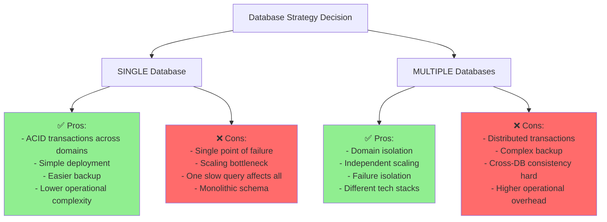

### Monolith Architecture Options

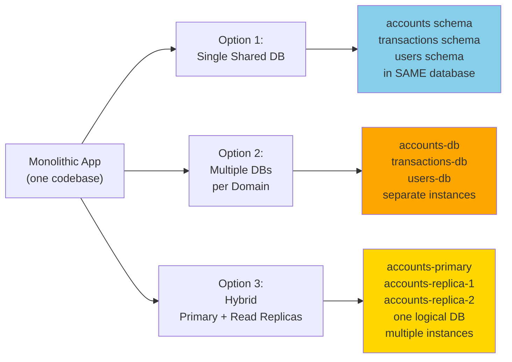

---

## Data Ownership in Modular Monolith

### Domain-Based Schema Isolation (Single DB)

Even with ONE database, use **schema-based isolation** to maintain domain boundaries:

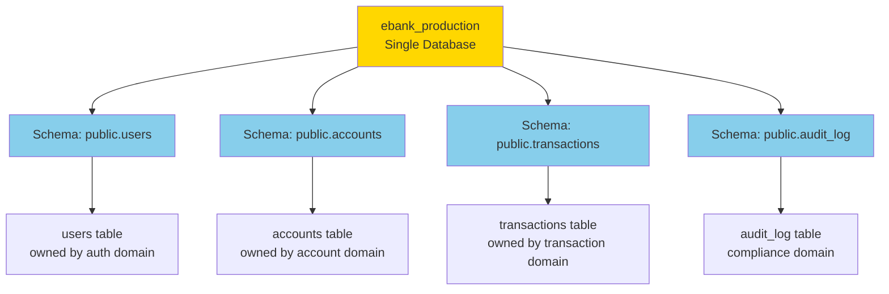

### Directory Structure (Single DB + Modular Code)

```
ebank-monolith/
├── src/main/java/com/ebank/
│   ├── auth/
│   │   ├── service/AuthService.java
│   │   ├── repository/UserRepository.java     # Accesses public.users
│   │   └── entity/User.java
│   │
│   ├── account/
│   │   ├── service/AccountService.java
│   │   ├── repository/AccountRepository.java  # Accesses public.accounts
│   │   └── entity/Account.java
│   │
│   └── transaction/
│       ├── service/TransactionService.java
│       ├── repository/TransactionRepository.java  # Accesses public.transactions
│       └── entity/Transaction.java
│
├── src/main/resources/db/migration/
│   ├── V1__create_users_schema.sql
│   ├── V2__create_accounts_schema.sql
│   └── V3__create_transactions_schema.sql
```

### Data Ownership Rules

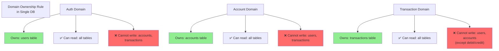

### Implementation: Database Constraints

```
USE ROLE-BASED ACCESS CONTROL in PostgreSQL:

1. Create role per domain:
   CREATE ROLE auth_user LOGIN;
   CREATE ROLE account_user LOGIN;
   CREATE ROLE transaction_user LOGIN;

2. Grant selective permissions:
   GRANT SELECT ON public.users TO auth_user;
   GRANT INSERT, UPDATE ON public.accounts TO account_user;

3. App connects with appropriate role per service
```

---

## Handling High Read Operations

### Read Scaling Architecture

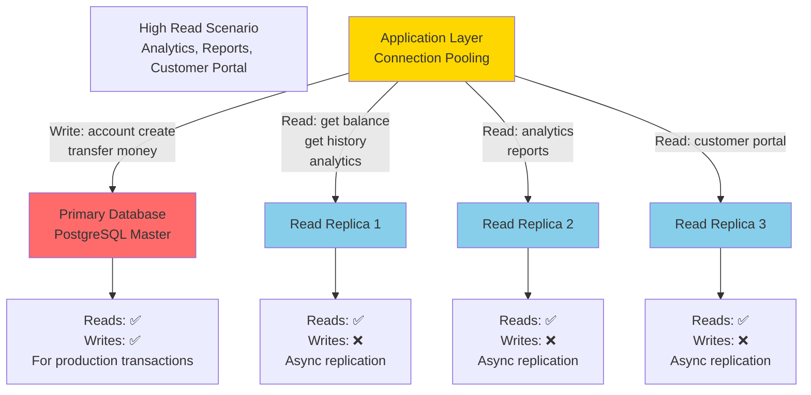

### Read/Write Split Implementation

```
APPLICATION LAYER ROUTING:

Write Operations (Primary):
├─ POST /accounts (create)
├─ POST /transactions/transfer
├─ PUT /accounts/{id} (update balance)
└─ Direct to: Primary DB

Read Operations (Replicas):
├─ GET /accounts/{id} (balance)
├─ GET /transactions (history)
├─ GET /accounts/analytics
└─ Route to: Load-balanced replicas
   (Round-robin or least-connections)

Implementation:
spring:
  datasource:
    # Primary (writes)
    write-url: jdbc:postgresql://primary-db:5432/ebank
    # Replicas (reads)
    read-urls:
      - jdbc:postgresql://replica1:5432/ebank
      - jdbc:postgresql://replica2:5432/ebank
      - jdbc:postgresql://replica3:5432/ebank
```

### Replication Lag Handling

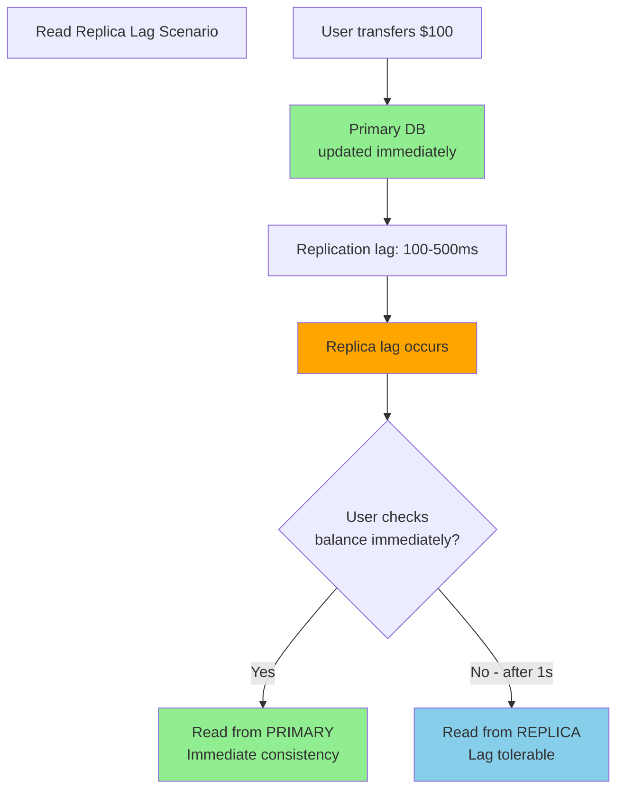

### When to Use Read Replicas

| Scenario | Use Replicas? | Why |
|----------|---|---|
| **High read volume (1000s/sec)** | ✅ Yes | Distribute read load |
| **Analytics queries** | ✅ Yes | Don't slow primary |
| **Customer portal (display data)** | ✅ Yes | Tolerate small lag |
| **Transactions (balance after transfer)** | ❌ No | Need immediate consistency |
| **Account creation verification** | ❌ No | Must read own write |

---

## Handling High Write Operations

### Write Scaling Strategies

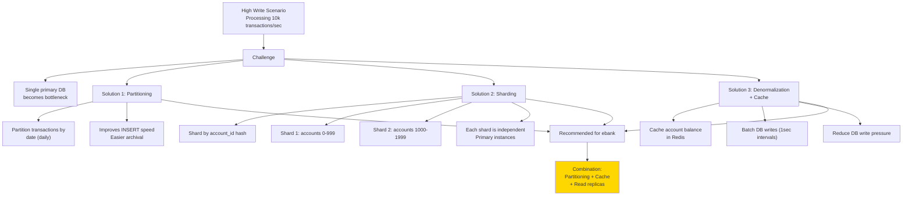

### Partitioning Strategy (Simple, Recommended)

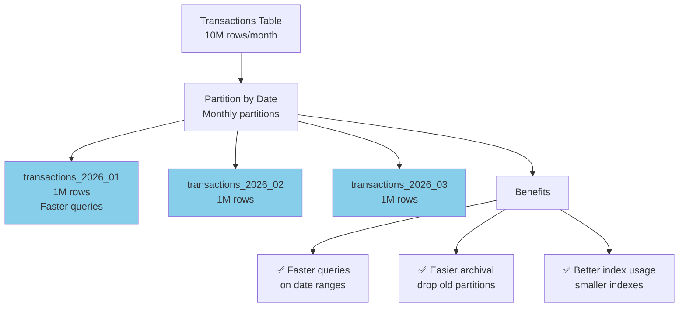

### Flyway Migration for Partitioning

```
Create partitioned table in V5__partition_transactions.sql:

CREATE TABLE transactions (
    id BIGSERIAL,
    account_id BIGINT,
    amount NUMERIC(19,2),
    created_at TIMESTAMP,
    ...
) PARTITION BY RANGE (DATE_TRUNC('month', created_at));

CREATE TABLE transactions_2026_01 
    PARTITION OF transactions
    FOR VALUES FROM ('2026-01-01') TO ('2026-02-01');

CREATE TABLE transactions_2026_02
    PARTITION OF transactions
    FOR VALUES FROM ('2026-02-01') TO ('2026-03-01');
```

### Write-Through Cache Pattern

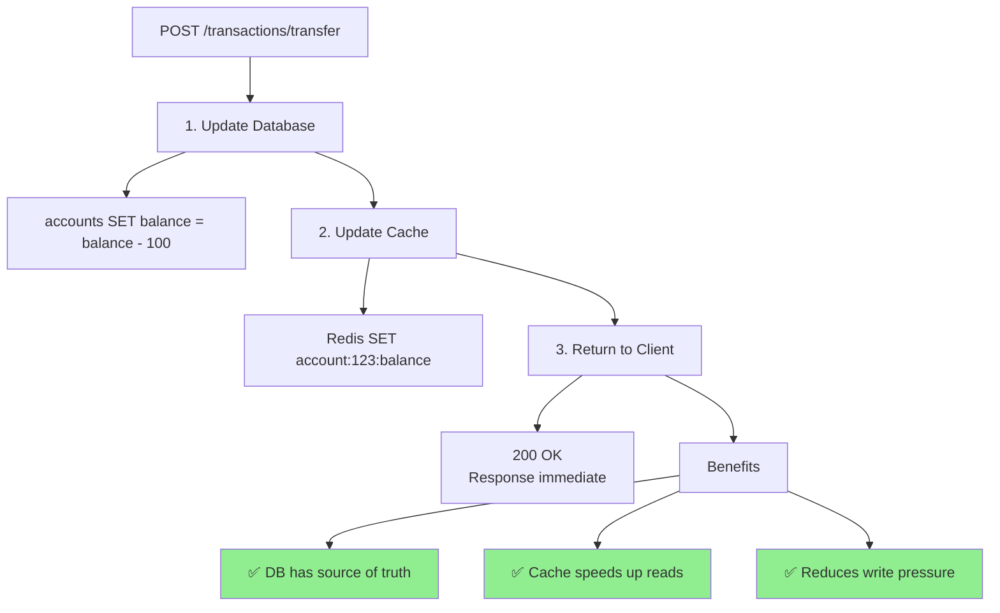

---

## Database Backup Strategy

### Multi-Layer Backup Architecture

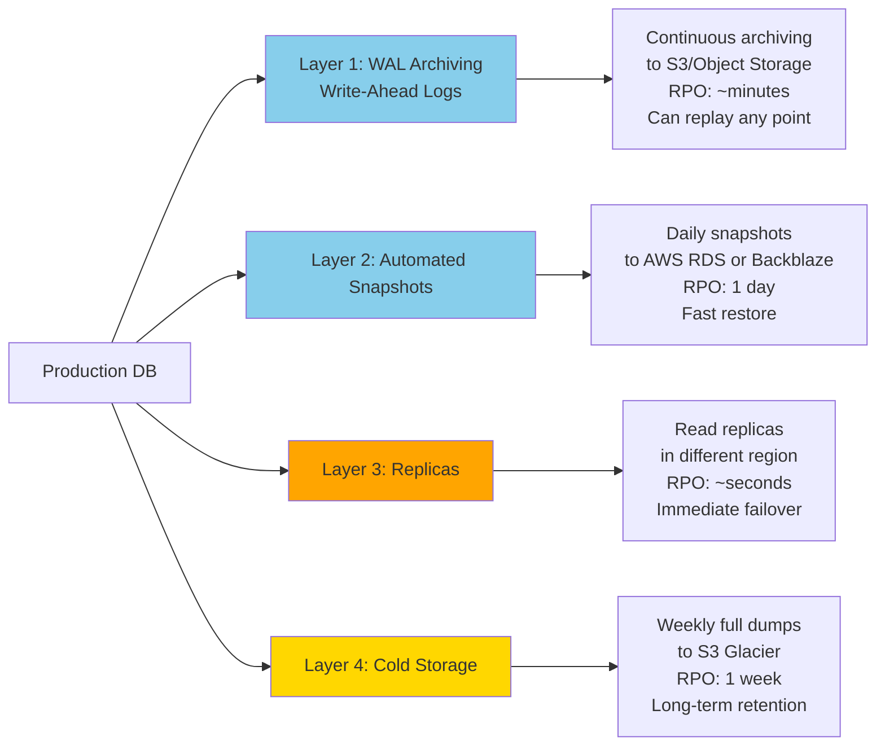

### Backup Strategy by Use Case

| Recovery Need | Strategy | RTO | RPO | Cost |
|---|---|---|---|---|
| **Recent error** | WAL replay | Minutes | Seconds | Low |
| **Daily disaster** | Automated snapshot | 10-30 min | 24 hours | Medium |
| **Region failure** | Read replica | 1 min | 10 sec | Medium |
| **Compliance/audit** | Cold storage | Hours | 1 week | Low |
| **Full recovery plan** | All layers | Varies | Minimal | High |

### Backup Testing Schedule

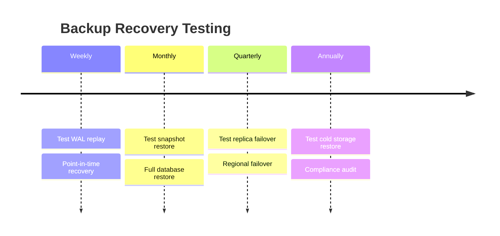

### Backup Configuration

```
Application config for automated backups:

# application-prod.yml

spring:
  datasource:
    # Connection pooling
    hikari:
      maximum-pool-size: 20
      minimum-idle: 5

# PostgreSQL backup settings
database:
  backup:
    # Continuous WAL archiving
    wal-archiving:
      enabled: true
      archive-to: s3://ebank-backups/wal/
      
    # Automated snapshots
    snapshots:
      enabled: true
      schedule: "0 2 * * *"  # 2 AM daily
      retention-days: 30
      
    # Point-in-time recovery
    pitr:
      enabled: true
      retention-days: 7
```

---

## Database Shutdown & Resilience

### Graceful Shutdown Flow

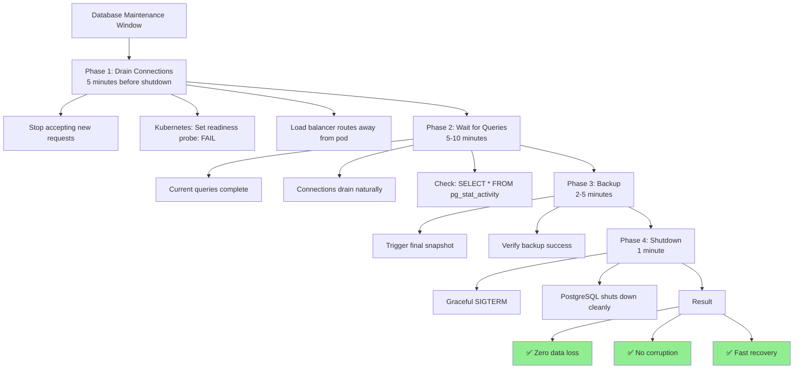

### High Availability Setup (Production)

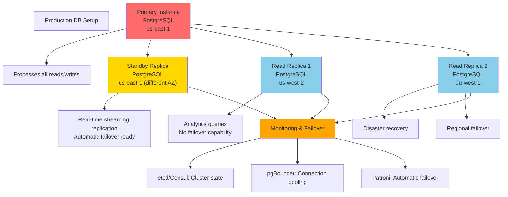

### Handling Database Shutdown Scenarios

```mermaid
graph TD
    A["Database Unavailable"]
    
    B["Brief Outage<br/>< 1 minute"]
    B --> B1["Connection pool retries"]
    B --> B2["Circuit breaker opens"]
    B --> B3["Return cached data"]
    B --> B4["User sees stale data<br/>but no error"]
    
    C["Extended Outage<br/>1-5 minutes"]
    C --> C1["Failover to standby"]
    C --> C2["DNS updated"]
    C --> C3["App reconnects"]
    C --> C4["Service resumes<br/>no code changes"]
    
    D["Full Outage<br/>> 5 minutes"]
    D --> D1["Manual intervention"]
    D --> D1a["Investigate root cause"]
    D --> D1b["Restore from backup"]
    D --> D1c["Rebuild if needed"]
    D --> D2["Service restored"]
    
    E["Mitigation Strategies"]
    E --> E1["✅ Read replicas (async)"]
    E --> E2["✅ Cache layer (Redis)"]
    E --> E3["✅ Circuit breakers"]
    E --> E4["✅ Automatic failover"]
    E --> E5["✅ Multi-region setup"]
    
    A --> B
    A --> C
    A --> D
    A --> E
    
    style E1 fill:#90EE90
    style E2 fill:#90EE90
    style E3 fill:#90EE90
    style E4 fill:#90EE90
    style E5 fill:#90EE90
```

### Application Resilience Pattern

```
Resilience Layer in Spring Boot:

1. Connection Pool Timeout
   hikari:
     maximum-pool-size: 20
     connection-timeout: 5000  # 5 sec

2. Circuit Breaker (Spring Cloud Resilience4j)
   @CircuitBreaker(name="database", fallbackMethod="getCachedBalance")
   public BigDecimal getAccountBalance(Long accountId) {
     return accountRepository.findBalance(accountId);
   }

3. Fallback (Return Cache)
   private BigDecimal getCachedBalance(Long accountId) {
     return redisService.getBalance(accountId);  // Stale OK
   }

4. Retry Logic
   @Retry(name="database", fallbackMethod="getCachedBalance")
   public void transfer(...) { ... }
```

### Health Checks & Monitoring

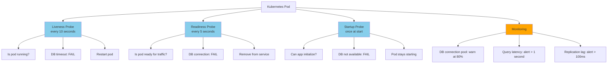

---

## Architecture Recommendation for ebank

### Recommended Setup (Single DB + Replicas)

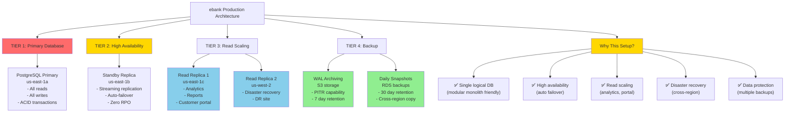

### Configuration for ebank

```yaml
# application-prod.yml

spring:
  datasource:
    # PRIMARY (writes + consistency-critical reads)
    url: jdbc:postgresql://ebank-primary.rds.amazonaws.com:5432/ebank
    username: ${DB_USER}
    password: ${DB_PASSWORD}
    
    hikari:
      maximum-pool-size: 20
      minimum-idle: 5
      connection-timeout: 5000
      idle-timeout: 600000
      max-lifetime: 1800000
  
  jpa:
    hibernate:
      ddl-auto: validate  # Flyway handles schema
    show-sql: false

# READ REPLICAS (analytics, reporting)
database:
  read-replicas:
    - url: jdbc:postgresql://ebank-replica-1.rds.amazonaws.com:5432/ebank
      purpose: analytics
    - url: jdbc:postgresql://ebank-replica-2.rds.amazonaws.com:5432/ebank
      purpose: dr-site

# BACKUP CONFIGURATION
backup:
  wal-archiving:
    enabled: true
    s3-bucket: ebank-backups
    retention-days: 7
  
  snapshots:
    enabled: true
    daily-at: "02:00"  # 2 AM UTC
    retention-days: 30
    copy-to-region: us-west-2

# MONITORING
monitoring:
  db-metrics:
    enabled: true
    connection-pool-threshold: 0.8  # warn at 80% usage
    query-timeout-ms: 5000
    replication-lag-threshold-ms: 100
```

### Migration Strategy: Single DB to HA Setup

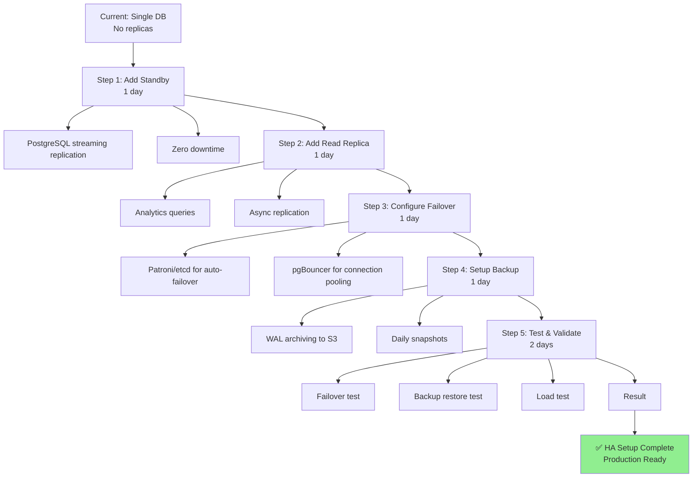

---

## Summary: Single DB vs Multiple DBs for ebank

### Decision Matrix

| Criterion | Single DB | Multiple DBs |
|-----------|---|---|
| **Consistency** | ✅ ACID transactions | ❌ Eventually consistent |
| **Complexity** | ✅ Simple | ❌ Complex |
| **Failure Isolation** | ❌ One failure affects all | ✅ Domain isolation |
| **Scaling Reads** | ✅ Replicas possible | ✅ Independent scaling |
| **Scaling Writes** | ⚠️ Partitioning needed | ✅ Sharding possible |
| **Operational Overhead** | ✅ Low | ❌ High |
| **Backup/Recovery** | ✅ Simple | ❌ Complex |
| **Cost** | ✅ Lower | ❌ Higher |
| **Recommended for ebank** | ✅ **YES** | ❌ **Later (if needed)** |

### Recommendation: **Single Database + Replicas**

**Why for ebank:**
```
✅ Banking requires ACID transactions (across domains)
✅ Modular monolith: one codebase = one DB makes sense
✅ Simple operational complexity (important for banking)
✅ Easy backup/recovery (critical for compliance)
✅ Read scaling via replicas handles most use cases
✅ Can evolve to microservices + multiple DBs later if needed
```

**Evolution Path:**
```
Phase 1 (Now):     Single DB + Standby + Read replicas
                   → Handles 100k+ transactions/day

Phase 2 (Growth):  Add partitioning + caching
                   → Handles 1M+ transactions/day

Phase 3 (Scale):   Microservices + DB per service
                   → Only if single DB truly becomes bottleneck
```

---

## Implementation Checklist

```bash
# SINGLE DB SETUP (Recommended)
☐ PostgreSQL 15+ primary in us-east-1a
☐ Streaming replication standby in us-east-1b
☐ Read replica for analytics in us-east-1c
☐ Read replica for DR in us-west-2

# HA & FAILOVER
☐ Patroni cluster for auto-failover
☐ pgBouncer for connection pooling
☐ VIP/DNS for seamless failover
☐ Health check monitoring

# BACKUP & RECOVERY
☐ WAL archiving to S3 (7-day retention)
☐ Daily automated snapshots (30-day retention)
☐ Cross-region snapshot copies
☐ Monthly restore test (compliance)

# RESILIENCE
☐ Circuit breaker in app (Resilience4j)
☐ Connection pool timeouts (5 sec)
☐ Cache fallback layer (Redis)
☐ Query timeout (5 sec max)

# MONITORING
☐ Connection pool usage alerts
☐ Query latency monitoring
☐ Replication lag monitoring
☐ Backup success verification
☐ Daily health checks
```

---

**Single Database with replicas is the sweet spot for ebank monolith.** It provides high availability, disaster recovery, and read scaling without the complexity of distributed databases. 🎯
