# ebank Development Guide

## Table of Contents

1. [Exception & Error Handling](#exception--error-handling)
2. [Environment & Profile Management](#environment--profile-management)
3. [API Versioning Strategy](#api-versioning-strategy)
4. [Database Migrations with Flyway](#database-migrations-with-flyway)
5. [Spring Boot Migration (3 → 4)](#spring-boot-migration-3--4)
6. [Java Version Migration (21 → 25)](#java-version-migration-21--25)
7. [Cache & Database Versioning](#cache--database-versioning)

---

## Exception & Error Handling

### Overview

Implement centralized, secure exception handling. Provide useful debugging info to logs (ELK) while exposing only safe information to clients.

### Architecture Flow

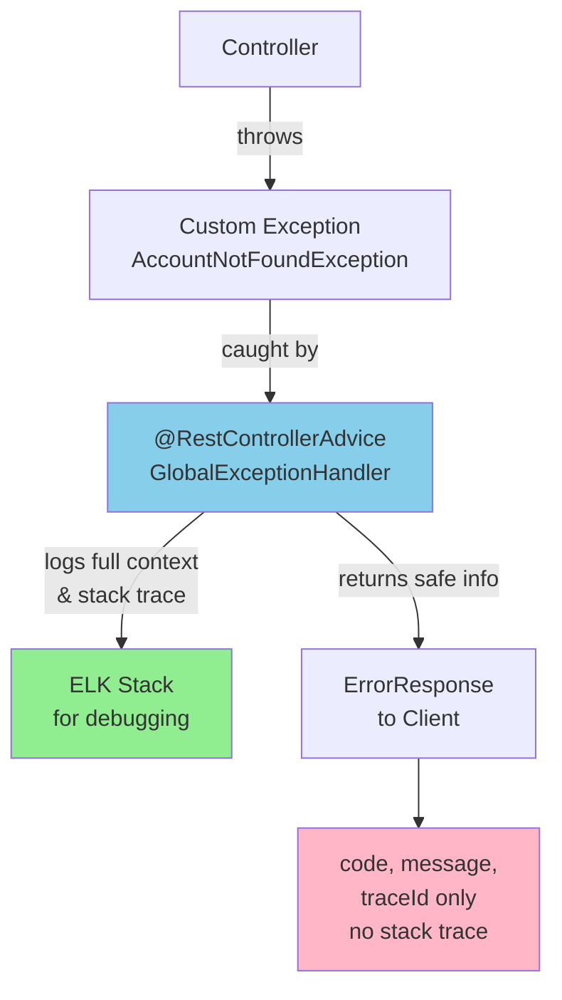

### Exception Hierarchy

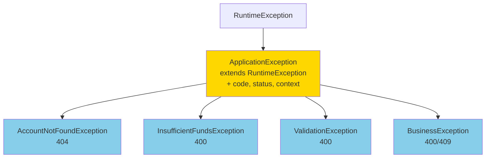

### Implementation Checklist

**Files to create:**
- `common/exception/ApplicationException.java` — Base exception class
- `common/exception/[DomainException].java` — Specific exceptions (AccountNotFoundException, etc.)
- `common/dto/ErrorResponse.java` — Standardized error response format
- `common/exception/GlobalExceptionHandler.java` — Central handler with @RestControllerAdvice

**Handler methods in GlobalExceptionHandler:**
- `handleApplicationException()` — All custom exceptions
- `handleValidationError()` — Spring validation errors
- `handleDataIntegrityViolation()` — Database constraint violations
- `handleUnexpected()` — Catch-all for 500 errors

### Response Format to Client

```json
{
  "code": "ACCOUNT_NOT_FOUND",
  "message": "Account not found",
  "timestamp": 1716547200000,
  "path": "/api/v1/accounts/999",
  "traceId": "550e8400-e29b-41d4-a716-446655440000"
}
```

### Handled HTTP Status Codes

| Code | Exception Type | Example |
|------|---|---|
| **400** | Bad Request | Validation error, invalid input |
| **401** | Unauthorized | Missing/invalid auth token |
| **403** | Forbidden | Insufficient permissions |
| **404** | Not Found | Resource doesn't exist |
| **409** | Conflict | Constraint violation, duplicate |
| **500** | Server Error | Unexpected failure |

### Key Principles

✅ **Do:**
- Log full stack trace + context to ELK
- Include `traceId` in all responses
- Anonymize sensitive data in logs
- Use structured JSON logging

❌ **Don't:**
- Expose stack traces to clients
- Include internal system details in error messages
- Hardcode error messages
- Log passwords, tokens, or PII

---

## Environment & Profile Management

### Overview

Use Spring profiles to manage environment-specific configurations without hardcoding secrets.

### Environment Flow

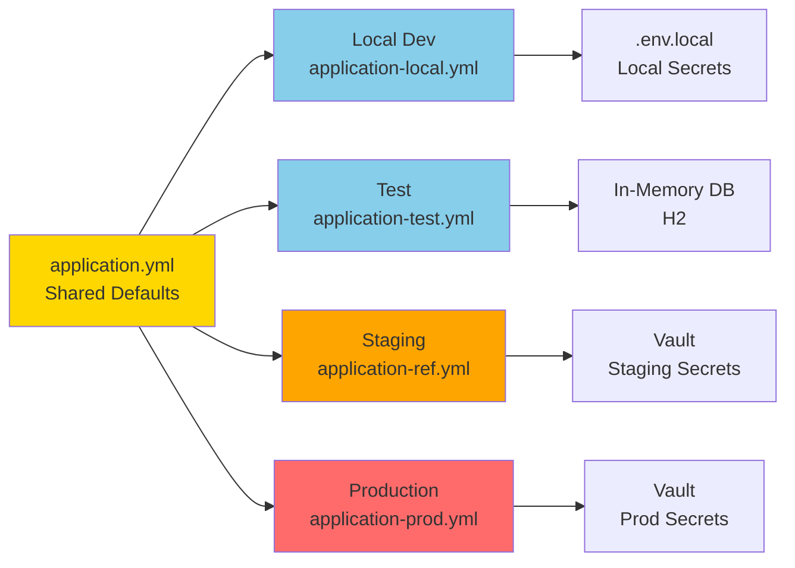

### Profile Files

| Environment | Profile | Database | Vault | Secrets |
|---|---|---|---|---|
| **Local** | `local` | PostgreSQL (localhost) | Disabled | `.env.local` file |
| **Test** | `test` | H2 In-Memory | Disabled | Hardcoded defaults |
| **Staging** | `ref` | PostgreSQL RDS | Enabled | Vault |
| **Production** | `prod` | PostgreSQL RDS | Enabled | Vault (K8s Auth) |

### Directory Structure

```
ebank-monolith/
├── src/main/resources/
│   ├── application.yml              # Defaults (all environments)
│   ├── application-local.yml        # Local development
│   ├── application-test.yml         # Testing
│   ├── application-ref.yml          # Staging
│   └── application-prod.yml         # Production
├── .env.local.example               # Template (commit this)
├── .env.local                       # Local secrets (in .gitignore)
└── .gitignore                       # Exclude .env.local
```

### Local Development Setup

```bash
# 1. Copy template
cp .env.local.example .env.local

# 2. Update with your values
DB_PASSWORD=dev-password
JWT_SECRET=dev-secret
REDIS_URL=redis://localhost:6379

# 3. Load and run
export $(cat .env.local | xargs)
java -jar app.jar --spring.profiles.active=local
```

### Configuration Overrides by Environment

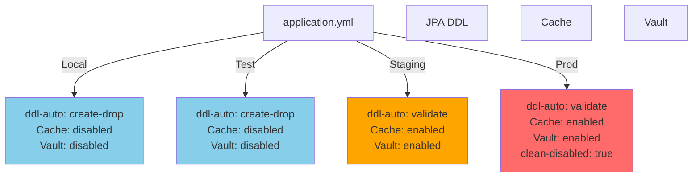

### .gitignore Rules

```bash
# Environment files (NEVER commit!)
.env.local
.env.*.local
.env

# But DO commit the template
!.env.local.example
```

### Activation Methods

```bash
# Command line
java -jar app.jar --spring.profiles.active=local

# Environment variable
export SPRING_PROFILES_ACTIVE=prod
java -jar app.jar

# Docker
docker run -e SPRING_PROFILES_ACTIVE=prod ebank:latest
```

### Key Principles

✅ **Do:**
- Keep `.env.local` in `.gitignore`
- Use environment variables for secrets
- Provide `.env.local.example` template
- Use Vault for staging/prod secrets

❌ **Don't:**
- Commit `.env.local` files
- Hardcode secrets in application.yml
- Mix secrets with configuration
- Use different code paths per environment

---

## API Versioning Strategy

### Overview

Support multiple API versions simultaneously to enable gradual client migration without breaking existing integrations.

### Multi-Version Architecture

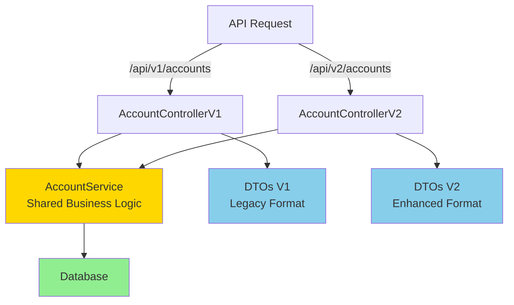

### Directory Structure

```
account/
├── controller/
│   ├── AccountControllerV1.java    # /api/v1/accounts
│   └── AccountControllerV2.java    # /api/v2/accounts
├── dto/
│   ├── v1/
│   │   ├── AccountResponseV1.java
│   │   └── TransferRequestV1.java
│   └── v2/
│       ├── AccountResponseV2.java
│       └── TransferRequestV2.java
└── service/
    └── AccountService.java         # Shared logic (no duplication)
```

### V1 vs V2 Comparison

| Aspect | V1 | V2 |
|--------|----|----|
| **URL** | `/api/v1/accounts` | `/api/v2/accounts` |
| **Response** | `{id, number, type, balance}` | `{id, number, type, balance, interestRate, lastActivity}` |
| **Validation** | Basic | Enhanced (daily limits) |
| **Status** | Deprecated | Current |

### Controller Routing Pattern

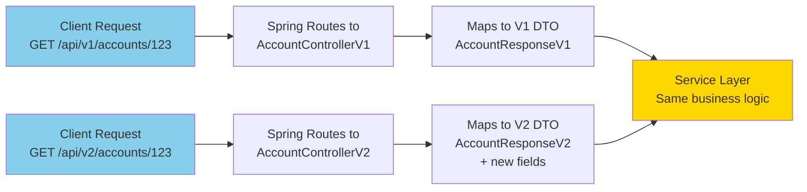

### Deprecation Timeline

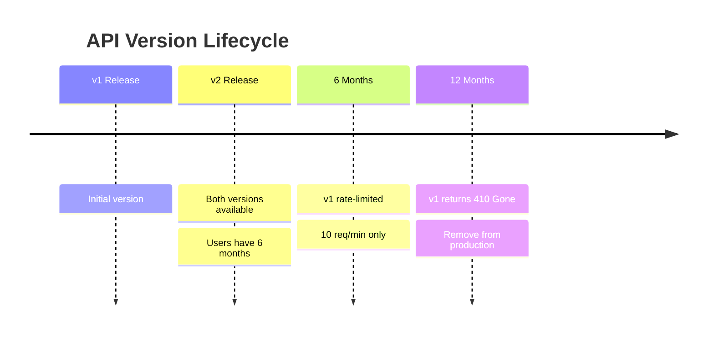

### Implementation Notes

**Controller level:**
- Use separate files for v1 and v2
- Both inherit from same service
- Map service response to version-specific DTO

**Service level:**
- Core business logic (no duplication)
- Both versions call same methods
- Service doesn't know about API versions

**DTO level:**
- v1: Legacy format
- v2: Extended format with new fields
- Optional backward compat mapping

---

## Database Migrations with Flyway

### Overview

Version control for database schema. Critical for consistency, auditing, and reproducibility in banking apps.

### Migration Flow

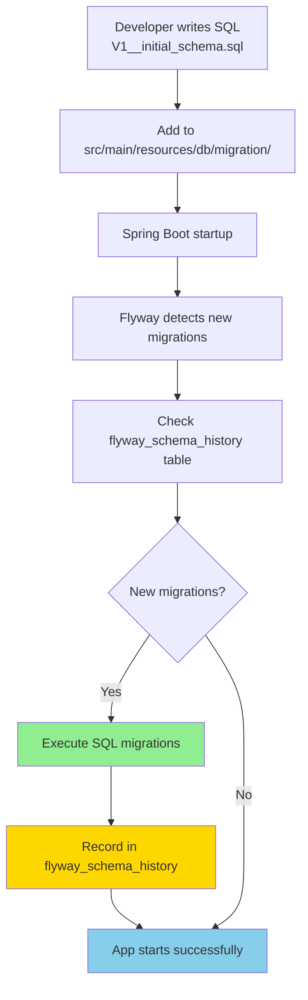

### File Naming Convention

**Format:** `V{version}__{description}.sql`

```
✅ Correct:
V1__initial_schema.sql
V2__add_accounts_table.sql
V1_1__fix_typo.sql

❌ Wrong:
V1_initial_schema.sql          (wrong separator, use __)
001_initial_schema.sql         (missing V prefix)
V2 add accounts table.sql      (spaces in name)
```

### Migration Versioning Strategy

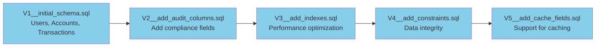

### Directory Structure

```
src/main/resources/db/migration/
├── V1__initial_schema.sql
├── V2__add_transactions_table.sql
├── V3__add_audit_columns.sql
├── V4__add_constraints_triggers.sql
├── V5__add_cache_fields.sql
└── ... (more migrations)
```

### Configuration by Environment

| Env | `ddl-auto` | `baseline-on-migrate` | `clean-disabled` | Use Case |
|-----|---|---|---|---|
| **local** | `validate` | `true` | `false` | Fresh starts allowed |
| **test** | `validate` | `true` | `false` | Test isolation |
| **staging** | `validate` | `false` | `true` | Production-like |
| **production** | `validate` | `false` | **true** | Never clean data |

### Migration Execution Timeline

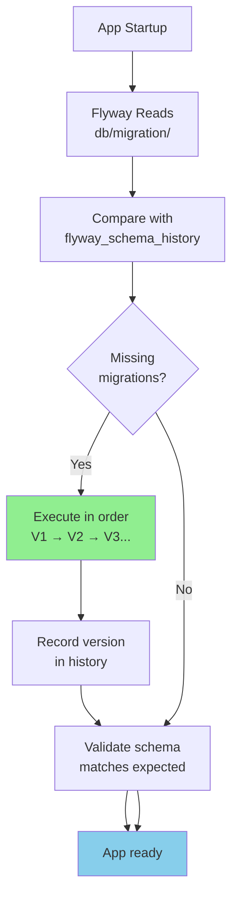

### Essential Flyway Commands

```bash
# Check migration status
mvn flyway:info

# Baseline existing database (local only)
mvn flyway:baseline -Dflyway.baselineVersion=1

# Run migrations (automatic on app startup)
mvn spring-boot:run
```

### flyway_schema_history Table

Records all migrations applied:

```
| version | description | type | installed_on | execution_time | success |
|---------|-------------|------|--------------|---|---------|
| 1 | initial schema | SQL | 2026-05-24 10:20 | 150 | true |
| 2 | add transactions | SQL | 2026-05-24 10:21 | 200 | true |
```

### Key Principles

✅ **Do:**
- Test migrations locally first
- Write forward-only migrations (Flyway doesn't support rollback)
- Never modify committed migrations
- Document schema changes
- Monitor history table
- Disable JPA `ddl-auto` (use `validate` only)

❌ **Don't:**
- Edit V1 after it's applied to production
- Allow `clean-disabled: false` in production
- Mix Flyway with JPA auto DDL
- Modify schema manually in production

---

## Spring Boot Migration (3 → 4)

### Key Changes

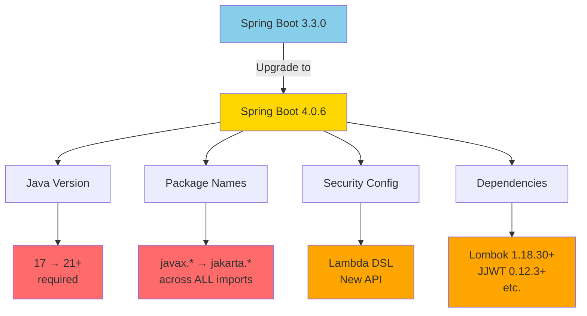

### Migration Process

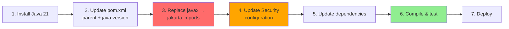

### Critical: javax → jakarta Migration

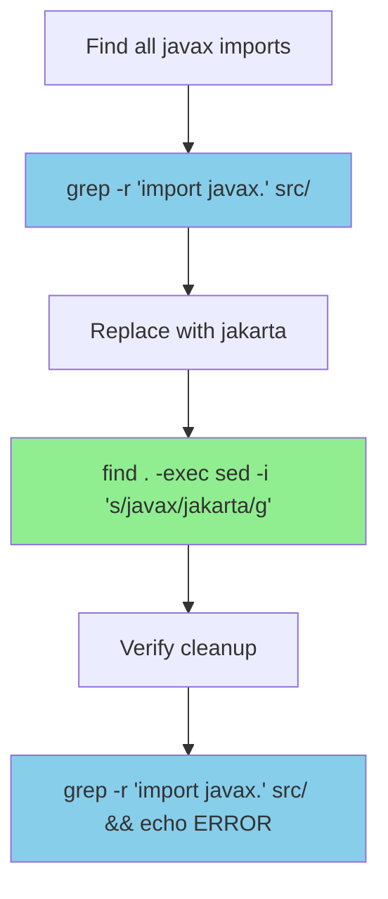

### Pre-Migration Checklist

```bash
☐ Current state: java -version (show Java 17)
☐ Current state: mvn --version
☐ Current state: git status (clean)
☐ Create branch: git checkout -b upgrade/sb3-to-sb4
```

### Migration Checklist

```bash
# Java & Build
☐ Install Java 21
☐ Configure IDE (IntelliJ/VS Code)
☐ Update pom.xml parent (4.0.6)
☐ Update pom.xml java.version (21)

# Code Changes
☐ Replace javax → jakarta imports
☐ Update Spring Security configuration
☐ Update dependencies (Lombok, JJWT, etc.)

# Testing
☐ mvn clean compile -DskipTests
☐ mvn test
☐ mvn verify
☐ Local smoke test

# Infrastructure
☐ Update Dockerfile (Java 21)
☐ Test Docker build
☐ Deploy to staging
☐ Monitor for 48 hours
☐ Deploy to production
```

### Timeline

| Phase | Effort | Duration |
|-------|--------|----------|
| Setup & Java | 30 min | Day 1 |
| POM + fixes | 2 hours | Day 1 |
| jakarta migration | 1 hour | Day 1 |
| Testing | 2 hours | Day 1-2 |
| Staging validation | 4 hours | Day 2-3 |
| **Total** | **~10 hours** | **3 days** |

---

## Java Version Migration (21 → 25)

### ⚠️ LTS vs Non-LTS

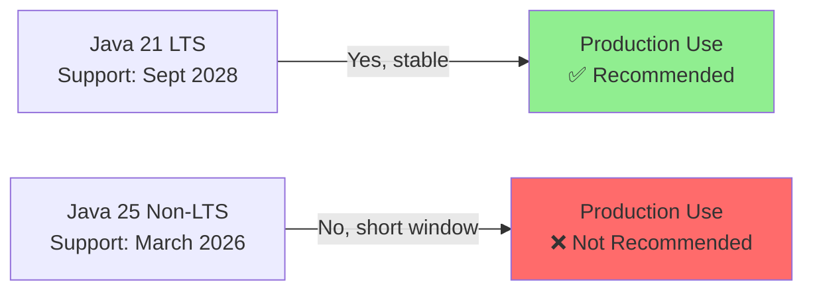

### Decision Tree

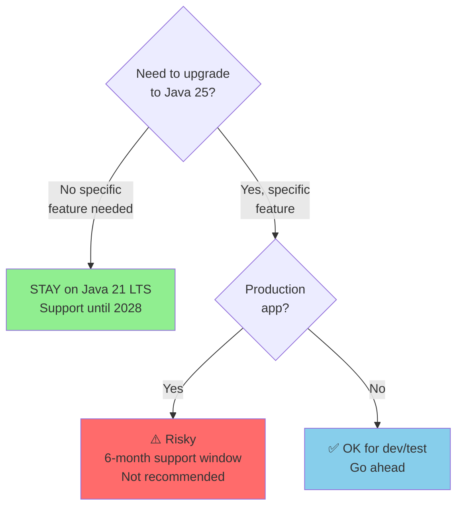

### Migration Process (if needed)

```bash
# 1. Install Java 25
brew install openjdk@25
export JAVA_HOME=$(/usr/libexec/java_home -v 25)

# 2. Update pom.xml
# <java.version>25</java.version>

# 3. Update Dockerfile
# FROM eclipse-temurin:25-jdk-alpine

# 4. Test
mvn clean compile
mvn test && mvn verify

# 5. Deploy
docker build -t ebank:java25 .
```

### Migration Checklist

```bash
☐ Install Java 25
☐ Update pom.xml (java.version)
☐ Update dependencies
☐ Compile & test
☐ Check deprecations: mvn compile -Xlint:deprecation
☐ Update Dockerfile
☐ Test Docker image
☐ Performance benchmark
☐ Deploy to staging
☐ Monitor 48 hours
☐ Deploy to production
```

### Timeline

| Phase | Effort | Duration |
|-------|--------|----------|
| Setup | 30 min | Day 1 |
| Config | 30 min | Day 1 |
| Testing | 2 hours | Day 1-2 |
| Staging | 4 hours | Day 2-3 |
| **Total** | **~9 hours** | **3 days** |

### Recommendation

**For banking applications (ebank):** Stay on **Java 21 LTS**. Next upgrade to **Java 27 LTS** when released (Sept 2026).

---

## Cache & Database Versioning

### The Challenge

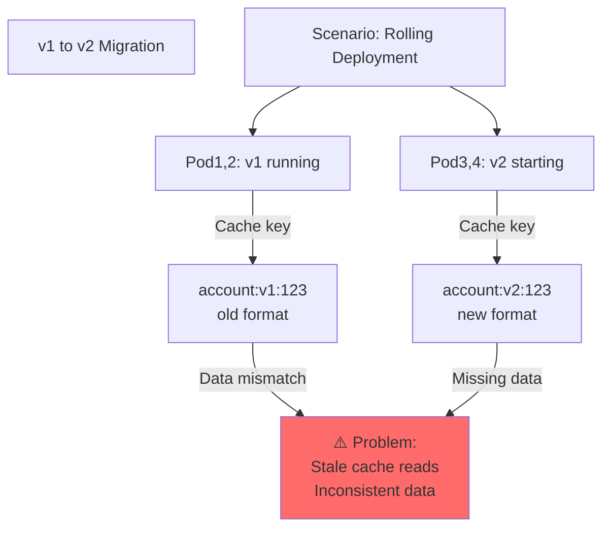

### Solution: Versioned Cache Keys

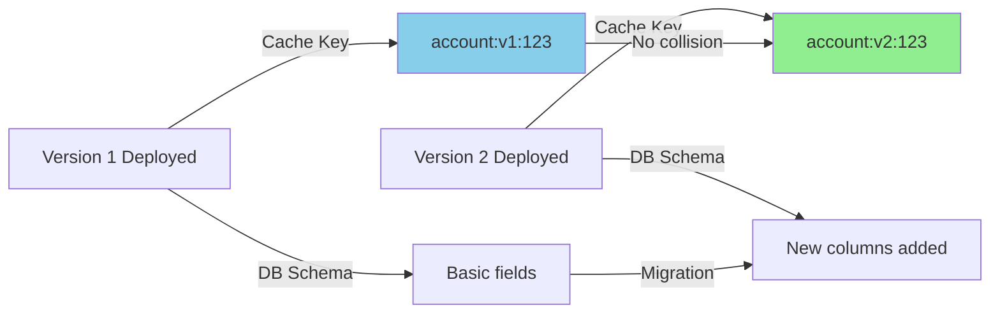

### Migration Timeline

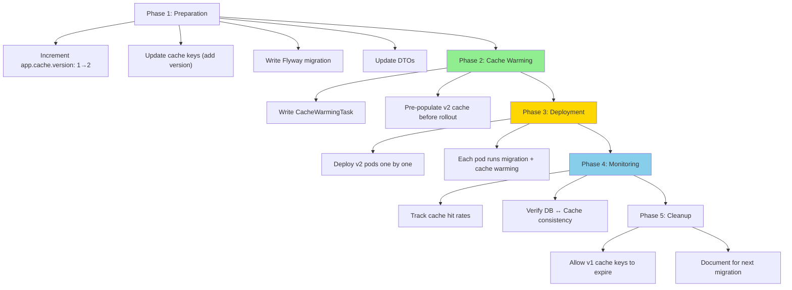

### Cache Key Strategy

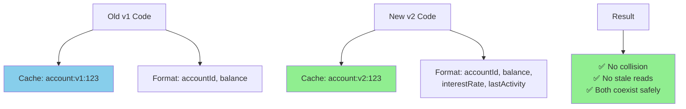

### Architecture: Cache + DB Versioning

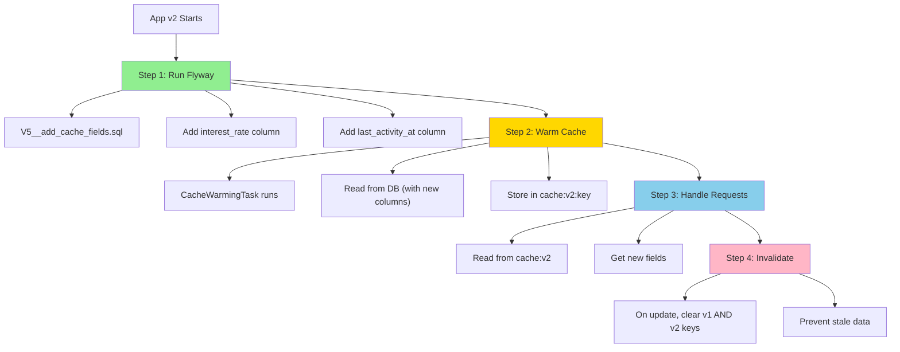

### Kubernetes Rolling Deployment

```mermaid
graph TD
    A["Rolling Deployment Strategy"]
    
    B["Pod A (v1)"]
    B --> B1["Running"]
    
    C["Pod B (v2 - NEW)"]
    C --> C1["1. Run Flyway migration"]
    C --> C2["2. Run cache warming"]
    C --> C3["3. Start serving requests"]
    
    D["Pod A (v1)"]
    D --> D1["Drain gracefully"]
    
    E["Pod C (v2 - NEW)"]
    E --> E1["Same as Pod B"]
    
    F["Result"]
    F --> F1["✅ Zero downtime"]
    F --> F2["✅ Cache pre-warmed"]
    F --> F3["✅ DB schema applied"]
    F --> F4["✅ No stale reads"]
    
    A --> B
    A --> C
    B --> D
    D --> E
    E --> F
    
    style C fill:#90EE90
    style E fill:#90EE90
    style F fill:#90EE90
```

### Monitoring Cache Consistency

```mermaid
graph LR
    A["Monitoring Endpoints"]
    
    B["/actuator/cache/consistency-check"]
    B --> B1["Total accounts"]
    B --> B2["Cached accounts"]
    B --> B3["Hit rate %"]
    
    C["/actuator/cache/verify/{id}"]
    C --> C1["Compare cache value"]
    C --> C2["vs DB value"]
    C --> C3["Alert if mismatch"]
    
    D["Alert Thresholds"]
    D --> D1["Hit rate < 70%: WARN"]
    D --> D2["Mismatch detected: ALERT"]
    D --> D3["DB ≠ Cache: Invalidate"]
    
    A --> B
    A --> C
    A --> D
    
    style B fill:#87CEEB
    style C fill:#87CEEB
    style D1 fill:#FFA500
    style D2 fill:#FF6B6B
```

### Deployment Checklist

```bash
# PHASE 1: Preparation
☐ Increment app.cache.version (1 → 2)
☐ Update cache key format: "account:v{version}:{id}"
☐ Write Flyway migration: V5__add_cache_fields.sql
☐ Update DTOs with new fields
☐ Write CacheWarmingTask

# PHASE 2: Testing
☐ Test locally: versioned cache keys work
☐ Test Flyway migration
☐ Test cache warming
☐ Simulate rolling deployment

# PHASE 3: Staging
☐ Deploy to staging
☐ Monitor cache hit rates
☐ Verify DB ↔ Cache consistency
☐ Monitor 48 hours

# PHASE 4: Production
☐ Backup Redis + PostgreSQL
☐ Deploy with rolling strategy
☐ Monitor cache consistency
☐ Monitor error rates
☐ Alert if cache hit < 70%

# PHASE 5: Cleanup
☐ Allow v1 cache to expire
☐ Daily cleanup script
☐ Document for next migration
```

### Key Principles

| Principle | Why |
|-----------|-----|
| **Versioned Cache Keys** | v1 and v2 don't collide, no stale reads |
| **DB Migration First** | Flyway applies before cache uses new columns |
| **Cache Warming Before** | Pre-populate v2 cache to avoid misses during rollout |
| **Both Versions in Deploy** | Invalidate both v1 and v2 keys on updates |
| **Monitor Consistency** | Track hits/misses, alert on mismatches |
| **Rolling Deployment** | Gradual v2 rollout, coexist with v1 safely |

---

## Summary

### Key Practices

| Area | Practice | Benefit |
|------|----------|---------|
| **Exceptions** | Centralized handler + traceId | Secure, observable, debuggable |
| **Environments** | Profile-based config + Vault | Secrets-safe, reproducible |
| **API Versioning** | Multi-version with shared service | Gradual migration, no breaking changes |
| **Migrations** | Flyway version control | Consistent, auditable, reproducible |
| **Upgrades** | Systematic process with testing | Safe, zero-downtime deployments |
| **Cache + DB** | Versioned keys + warming | Consistent data during rolling updates |

### Quick Reference

```mermaid
graph TD
    A["Production-Ready ebank"]
    
    A --> B["Error Handling"]
    B --> B1["@RestControllerAdvice<br/>Centralized + ELK logging"]
    
    A --> C["Configuration"]
    C --> C1["Profiles + Vault<br/>No hardcoded secrets"]
    
    A --> D["APIs"]
    D --> D1["v1 + v2 simultaneous<br/>Gradual migration"]
    
    A --> E["Database"]
    E --> E1["Flyway migrations<br/>Version-controlled schema"]
    
    A --> F["Cache"]
    F --> F1["Versioned keys<br/>Safe migrations"]
    
    A --> G["Security"]
    G --> G1["jakarta.*, Spring Security Lambda DSL<br/>Latest frameworks"]
    
    style A fill:#FFD700
    style B fill:#87CEEB
    style C fill:#87CEEB
    style D fill:#87CEEB
    style E fill:#87CEEB
    style F fill:#87CEEB
    style G fill:#87CEEB
```

---

**All practices prioritize production-readiness, security, observability, and reliability for a banking application.** ✅
