# HashiCorp Vault: Secrets Management Guide for ebank

## Table of Contents

1. [What is Vault?](#what-is-vault)
2. [How Vault Works](#how-vault-works)
3. [Pros vs Cons](#pros-vs-cons)
4. [Vault Alternatives Comparison](#vault-alternatives-comparison)
5. [Integration in New Projects](#integration-in-new-projects)
6. [Integration in Existing Projects](#integration-in-existing-projects)
7. [Multi-Environment Setup](#multi-environment-setup)
8. [Kubernetes Integration](#kubernetes-integration)
9. [Best Practices](#best-practices)
10. [Disaster Recovery & Backup](#disaster-recovery--backup)

---

## What is Vault?

### Definition

**HashiCorp Vault** = Secure secrets management and encryption platform.

Centralized solution to:
- Store secrets (passwords, API keys, tokens, certificates)
- Rotate secrets automatically
- Audit all access
- Control who can access what
- Encrypt data at rest and in transit

### Secret Types Vault Manages

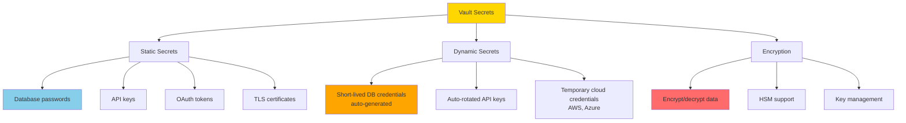

### Vault vs Hardcoding Secrets

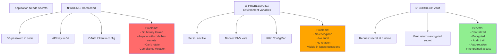

---

## How Vault Works

### Architecture

```mermaid
graph TD
    A["Vault Server"]
    A --> A1["Vault Core"]
    A --> A2["Secret Engines"]
    A --> A3["Auth Methods"]
    A --> A4["Audit Logs"]
    A --> A5["Storage Backend"]
    
    A1 --> A1a["Encryption/Decryption<br/>Barrier"]
    A1 --> A1b["Request routing"]
    A1 --> A1c["Policy enforcement"]
    
    A2 --> A2a["KV (Key-Value)"]
    A2 --> A2b["Database"]
    A2 --> A2c["AWS/Azure/GCP"]
    A2 --> A2d["PKI<br/>Certificates"]
    
    A3 --> A3a["Kubernetes auth"]
    A3 --> A3b["AppRole"]
    A3 --> A3c["LDAP/OAuth"]
    A3 --> A3d["Token auth"]
    
    A4 --> A4a["Who accessed?"]
    A4 --> A4b["When?"]
    A4 --> A4c["What did they access?"]
    
    A5 --> A5a["PostgreSQL"]
    A5 --> A5b["Consul"]
    A5 --> A5c["S3"]
    A5 --> A5d["File system"]
    
    style A1 fill:#FFD700
    style A2 fill:#87CEEB
    style A3 fill:#87CEEB
    style A4 fill:#FFA500
    style A5 fill:#90EE90
```

### Request Flow

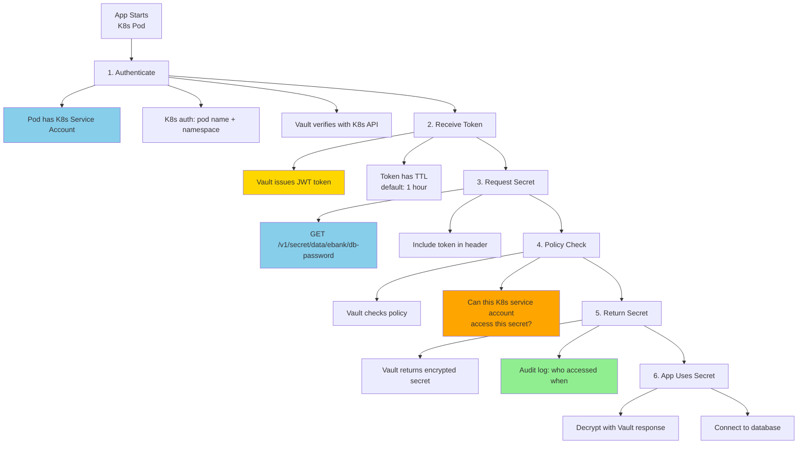

### Secret Storage

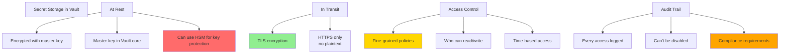

---

## Pros vs Cons

### Detailed Comparison

```mermaid
graph TD
    A["Vault Analysis"]
    
    B["PROS ✅"]
    B --> B1["Centralized<br/>Single source of truth"]
    B --> B2["Encryption<br/>At rest + in transit"]
    B --> B3["Audit Trail<br/>Every access logged"]
    B --> B4["Auto-Rotation<br/>Secrets rotated automatically"]
    B --> B5["Dynamic Secrets<br/>Short-lived credentials"]
    B --> B6["Multi-Cloud<br/>AWS, Azure, GCP support"]
    B --> B7["Fine-Grained Access<br/>Policy-based control"]
    
    C["CONS ❌"]
    C --> C1["Operational Complexity<br/>Setup, maintenance, HA"]
    C --> C2["Single Point of Failure<br/>If Vault down, no secrets"]
    C --> C3["Learning Curve<br/>New tool, new concepts"]
    C --> C4["Cost<br/>Enterprise version $$"]
    C --> C5["Integration Work<br/>Code changes needed"]
    C --> C6["Performance<br/>Extra HTTP calls for secrets"]
    
    A --> B
    A --> C
    
    style B1 fill:#90EE90
    style B4 fill:#90EE90
    style B6 fill:#90EE90
    style C1 fill:#FF6B6B
    style C2 fill:#FF6B6B
    style C6 fill:#FFA500
```

### When to Use Vault

| Scenario | Vault? | Why |
|----------|--------|-----|
| **Startup project** | ⚠️ Later | Overhead > benefit initially |
| **Multiple environments** | ✅ Yes | Easy env-specific secrets |
| **Compliance requirements** | ✅ Yes | Audit trail mandatory |
| **Cloud-native K8s** | ✅ Yes | Native K8s auth |
| **High security needs** | ✅ Yes | Banking, healthcare, etc. |
| **Small team, few secrets** | ❌ No | Environment vars sufficient |
| **Monolithic app** | ⚠️ Maybe | Depends on secret volume |

---

## Vault Alternatives Comparison

### Feature Comparison Matrix

```mermaid
graph TD
    A["Secrets Management Solutions"]
    
    B["HashiCorp Vault"]
    B --> B1["Open source + Enterprise"]
    B --> B2["Full-featured, complex"]
    B --> B3["Best for: Large teams, compliance"]
    
    C["AWS Secrets Manager"]
    C --> C1["AWS native"]
    C --> C2["Easier to use"]
    C --> C3["Best for: AWS-only shops"]
    
    D["Azure Key Vault"]
    D --> D1["Azure native"]
    D --> D2["Azure ecosystem"]
    D --> D3["Best for: Azure-only shops"]
    
    E["Sealed Secrets (K8s)"]
    E --> E1["Kubernetes native"]
    E --> E2["Simpler, less powerful"]
    E --> E3["Best for: K8s-only, GitOps"]
    
    F["Environment Variables"]
    F --> F1["Simplest"]
    F --> F2["No encryption"]
    F --> F3["Best for: Dev only"]
    
    A --> B
    A --> C
    A --> D
    A --> E
    A --> F
    
    style B fill:#FFD700
    style C fill:#87CEEB
    style D fill:#87CEEB
    style E fill:#87CEEB
    style F fill:#FF6B6B
```

### Detailed Comparison

| Feature | Vault | AWS SM | Azure KV | Sealed Secrets | .env |
|---------|-------|--------|----------|---|---|
| **Multi-cloud** | ✅ Yes | ❌ No | ❌ No | ✅ Yes | ✅ Yes |
| **Encryption** | ✅ Full | ✅ Full | ✅ Full | ✅ Full | ❌ No |
| **Audit trail** | ✅ Full | ✅ Full | ✅ Full | ⚠️ Limited | ❌ No |
| **Auto-rotation** | ✅ Yes | ✅ Yes | ✅ Yes | ❌ No | ❌ No |
| **Dynamic secrets** | ✅ Yes | ⚠️ Limited | ⚠️ Limited | ❌ No | ❌ No |
| **Learning curve** | ❌ High | ✅ Low | ✅ Low | ⚠️ Medium | ✅ Low |
| **Operational overhead** | ❌ High | ✅ Low | ✅ Low | ⚠️ Medium | ✅ Low |
| **Cost** | ⚠️ Medium | ⚠️ Medium | ⚠️ Medium | ✅ Free | ✅ Free |
| **Best for** | **Large scale** | **AWS only** | **Azure only** | **K8s only** | **Dev only** |

### Recommendation for ebank

```
✅ Recommended: HashiCorp Vault

Reasons:
- Multi-cloud (AWS + possible future expansion)
- Banking requires strict compliance (audit trail)
- Microservices architecture (multiple secrets)
- K8s native authentication
- Auto-rotation for banking credentials
- Future-proof investment
```

---

## Integration in New Projects

### Step 1: Vault Infrastructure Setup

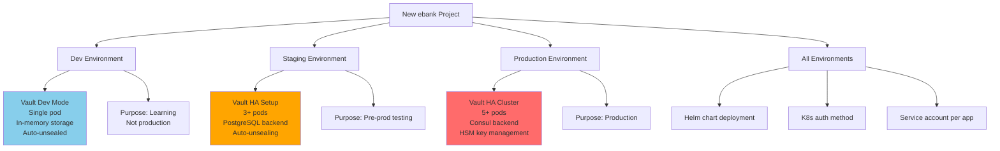

### Step 2: Spring Boot Integration (New App)

**Add dependency:**
```
spring-cloud-starter-vault-config
↓
@RestController needs DB password
↓
Spring loads secret from Vault on startup
↓
App runs with injected secrets
```

**Application structure:**
```
src/main/java/com/ebank/
├── config/
│   └── VaultConfiguration.java      # Vault client config
├── secrets/
│   └── SecretProvider.java          # Read secrets from Vault
└── ... (rest of app)

application.yml
├── spring.cloud.vault:
│   ├─ host: vault-server
│   ├─ auth-method: kubernetes
│   ├─ kubernetes-path: /auth/kubernetes
│   └─ kubernetes-role: ebank-app
```

### Step 3: Secret Storage Structure

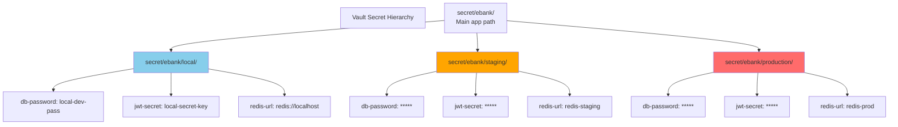

### Step 4: Initialization Script

```
Vault setup for new project:

1. Create app role:
   vault auth enable approle
   vault write auth/approle/role/ebank-app \
     token_ttl=1h token_policies="ebank-app"

2. Create secret engine:
   vault secrets enable -path=secret kv-v2

3. Store initial secrets:
   vault kv put secret/ebank/production \
     db-password="***" \
     jwt-secret="***"

4. Create policy:
   vault policy write ebank-app - <<EOF
     path "secret/data/ebank/production/*" {
       capabilities = ["read", "list"]
     }
   EOF

5. Deploy app:
   App requests secret → Vault validates K8s SA → Returns secret
```

---

## Integration in Existing Projects

### Migration Path

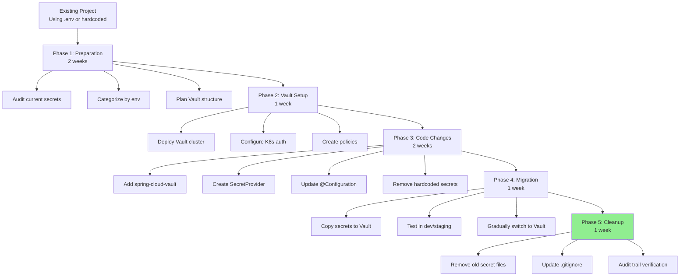

### Minimal Code Changes

**Before (Hardcoded/Env Vars):**
```
application.yml:
spring:
  datasource:
    password: ${DB_PASSWORD}  # From environment
    
Environment:
export DB_PASSWORD=my-secret
```

**After (Vault):**
```
application.yml:
spring:
  datasource:
    password: ${db.password}  # From Vault
  cloud:
    vault:
      host: vault.example.com
      auth-method: kubernetes
      
Code:
@Configuration
public class DatabaseConfig {
  @Value("${db.password}")  // Spring injects from Vault
  private String password;
}
```

### Rollback Strategy

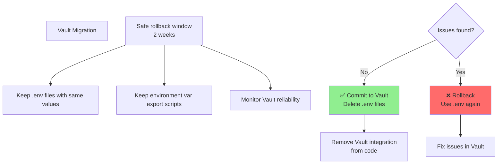

---

## Multi-Environment Setup

### Secret Structure by Environment

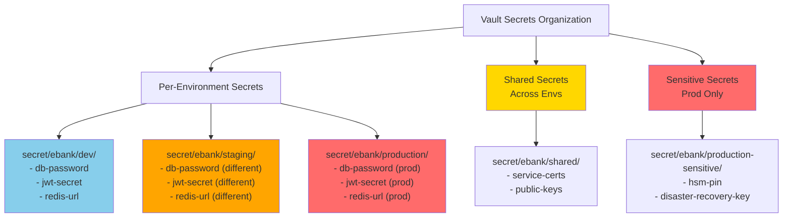

### Environment-Specific Configuration

```yaml
# application.yml (Shared)
spring:
  cloud:
    vault:
      host: ${VAULT_HOST:vault.example.com}
      auth-method: kubernetes
      kubernetes-path: auth/kubernetes

---
# application-local.yml (Dev)
spring:
  cloud:
    vault:
      host: vault-dev.internal
      kubernetes-role: ebank-dev
      kv:
        engine-version: 2
        backend-path: secret

---
# application-ref.yml (Staging)
spring:
  cloud:
    vault:
      host: vault-staging.internal
      kubernetes-role: ebank-staging
      kv:
        engine-version: 2
        backend-path: secret

---
# application-prod.yml (Production)
spring:
  cloud:
    vault:
      host: vault-prod.internal
      kubernetes-role: ebank-production
      tls:
        enabled: true
        cert-auth-path: auth/cert
        key-store: /etc/vault/certs/key.jks
      kv:
        engine-version: 2
        backend-path: secret
      
      # Enhanced security for production
      namespace: ebank
      timeout: 5000
      read-timeout: 5000
```

### Policy per Environment

```
VAULT POLICIES:

policy "ebank-dev":
  path "secret/data/ebank/dev/*" {
    capabilities = ["read", "list"]
  }
  path "secret/data/ebank/shared/*" {
    capabilities = ["read"]
  }

policy "ebank-staging":
  path "secret/data/ebank/staging/*" {
    capabilities = ["read", "list"]
  }
  path "secret/data/ebank/shared/*" {
    capabilities = ["read"]
  }

policy "ebank-production":
  path "secret/data/ebank/production/*" {
    capabilities = ["read", "list"]
  }
  path "secret/data/ebank/shared/*" {
    capabilities = ["read"]
  }
  # Deny: sensitive production secrets in separate policy
```

---

## Kubernetes Integration

### Architecture

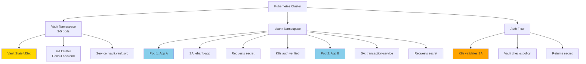

### Step 1: Deploy Vault with Helm

```bash
# Add Vault Helm repo
helm repo add hashicorp https://helm.releases.hashicorp.com

# Install Vault (HA mode)
helm install vault hashicorp/vault \
  --namespace vault \
  --create-namespace \
  --values vault-values.yaml

# Values file (vault-values.yaml):
# - server.ha.enabled: true
# - server.dataStorage.size: 10Gi
# - server.authMethod: kubernetes
```

### Step 2: Configure Kubernetes Auth

```yaml
# Vault Kubernetes Auth Configuration
vault auth enable kubernetes

vault write auth/kubernetes/config \
  token_reviewer_jwt=@/var/run/secrets/kubernetes.io/serviceaccount/token \
  kubernetes_host="https://$KUBERNETES_SERVICE_HOST:$KUBERNETES_SERVICE_PORT" \
  kubernetes_ca_cert=@/var/run/secrets/kubernetes.io/serviceaccount/ca.crt

# Create role for ebank-app
vault write auth/kubernetes/role/ebank-app \
  bound_service_account_names=ebank-app \
  bound_service_account_namespaces=ebank \
  policies=ebank-app \
  ttl=1h
```

### Step 3: Create Service Account & Policy

```yaml
# K8s ServiceAccount
apiVersion: v1
kind: ServiceAccount
metadata:
  name: ebank-app
  namespace: ebank

---
# Vault Policy
vault policy write ebank-app -<<EOF
path "secret/data/ebank/production/*" {
  capabilities = ["read", "list"]
}
EOF
```

### Step 4: Deploy App with Vault Integration

```yaml
# Kubernetes Deployment
apiVersion: apps/v1
kind: Deployment
metadata:
  name: ebank-app
  namespace: ebank
spec:
  template:
    spec:
      serviceAccountName: ebank-app  # ← Links to SA
      
      containers:
      - name: app
        image: ebank:latest
        
        env:
        # Vault connection
        - name: VAULT_ADDR
          value: "https://vault.vault.svc:8200"
        
        # K8s auth
        - name: VAULT_AUTH_METHOD
          value: "kubernetes"
        
        # This secret path will be auto-read by Spring Cloud Vault
        - name: SPRING_CLOUD_VAULT_KV_VERSION
          value: "2"
        
        volumeMounts:
        # K8s gives us the auth token
        - name: vault-token
          mountPath: /var/run/secrets/tokens
      
      volumes:
      - name: vault-token
        projected:
          sources:
          - serviceAccountToken:
              path: vault
              expirationSeconds: 3600
```

### Step 5: App Configuration (Spring Boot)

```yaml
# application-prod.yml (in K8s)
spring:
  cloud:
    vault:
      host: vault.vault.svc  # ← K8s DNS
      port: 8200
      scheme: https
      
      # Kubernetes auth
      authentication: KUBERNETES
      kubernetes-path: auth/kubernetes
      kubernetes-role: ebank-app
      
      # Service account token location
      kubernetes-service-account-token-file: \
        /var/run/secrets/tokens/vault
      
      # Secrets location
      kv:
        enabled: true
        version: 2
        backend-path: secret
```

### Full K8s Deployment Flow

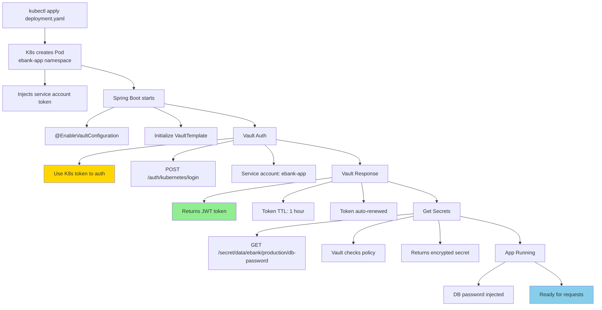

---

## Best Practices

### 1. Secret Rotation

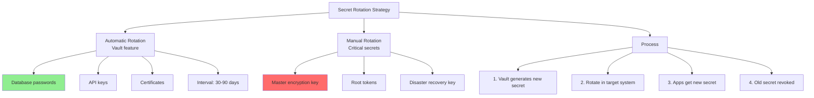

### 2. Principle of Least Privilege

```
POLICY DESIGN:

❌ WRONG:
vault write auth/kubernetes/role/ebank-app \
  policies=admin  # Too much access!

✅ CORRECT:
vault write auth/kubernetes/role/ebank-app \
  policies=ebank-app  # Minimal access to needed path only

Policy ebank-app:
path "secret/data/ebank/production/db-*" {
  capabilities = ["read"]  # Read-only
}

path "secret/data/ebank/production/jwt" {
  capabilities = ["read"]  # Read-only
}
```

### 3. Audit & Logging

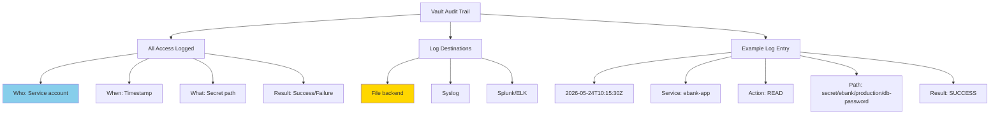

### 4. High Availability

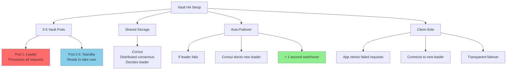

### 5. Backup & Disaster Recovery

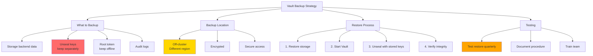

### 6. Token Management

```
TOKEN LIFECYCLE:

Creation:
- Service account authenticates
- Vault returns JWT token

TTL (Time To Live):
- Default: 1 hour
- Apps refresh token before expiry
- Spring Cloud Vault: automatic refresh

Renewal:
- App calls: POST /auth/token/renew
- Extends token TTL

Revocation:
- Explicit: DELETE /auth/token
- On app termination
- On K8s pod deletion

Best Practice:
- Short TTL: 1-2 hours (production)
- Auto-renewal: enabled (Spring Cloud Vault)
- Revoke on shutdown: implement graceful shutdown hook
```

### 7. Secret Naming Convention

```
VAULT SECRET PATHS:

Pattern:
secret/{app}/{environment}/{secret-name}

Examples:
secret/ebank/production/db-password
secret/ebank/production/jwt-secret
secret/ebank/staging/api-key
secret/ebank/local/test-token

Benefits:
✅ Clear organization
✅ Easy to find
✅ Policy structure matches path
✅ Environment separation
```

---

## Disaster Recovery & Backup

### Vault Disaster Recovery Plan

```mermaid
graph TD
    A["Disaster Scenarios"]
    
    B["Scenario 1: Leader Pod Crashed"]
    B --> B1["Impact: < 1 second"]
    B --> B2["Recovery: Auto-failover"]
    B --> B3["Action: None, automatic"]
    
    C["Scenario 2: Entire Cluster Down"]
    C --> C1["Impact: Apps can't get secrets"]
    C --> C2["Recovery: 5-10 minutes"]
    C --> C3["Action: Restore from backup"]
    
    D["Scenario 3: Storage Corruption"]
    D --> D1["Impact: Data loss risk"]
    D --> D2["Recovery: 30 minutes"]
    D --> D3["Action: Point-in-time restore"]
    
    E["Scenario 4: Unseal Keys Lost"]
    E --> E1["Impact: Can't start Vault"]
    E --> E2["Recovery: Major incident"]
    E --> E3["Action: Restore from backup"]
    
    F["Prevention"]
    F --> F1["HA setup (scenarios 1, 4)"]
    F --> F2["Automated backups (scenarios 2, 3)"]
    F --> F3["Regular restore tests"]
    
    A --> B
    A --> C
    A --> D
    A --> E
    A --> F
    
    style F1 fill:#90EE90
    style F2 fill:#90EE90
    style F3 fill:#90EE90
```

### Backup Retention & Testing

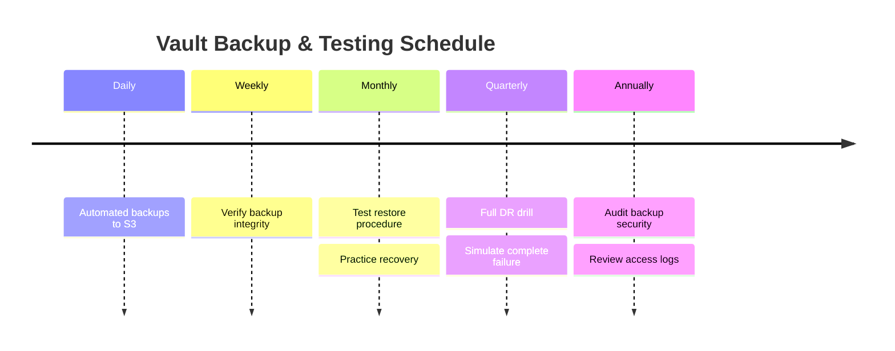

---

## Implementation Checklist for ebank

### Phase 1: Planning
```bash
☐ Audit current secrets (in code, .env, K8s ConfigMaps)
☐ Categorize by environment (dev, staging, prod)
☐ Design Vault secret hierarchy
☐ Define access policies per app
☐ Choose deployment mode (HA, storage backend)
```

### Phase 2: Infrastructure
```bash
☐ Deploy Vault cluster (Helm chart)
☐ Configure Kubernetes auth method
☐ Setup auto-unseal (if using KMS)
☐ Configure audit logging (to Splunk/ELK)
☐ Setup backup strategy (S3, cross-region)
```

### Phase 3: Secrets Migration
```bash
☐ Store secrets in Vault per environment
☐ Create roles and policies
☐ Bind service accounts to policies
☐ Document secret naming scheme
☐ Setup rotation policies
```

### Phase 4: Application Integration
```bash
☐ Add spring-cloud-starter-vault-config
☐ Configure application.yml per environment
☐ Create SecretProvider class
☐ Update @Configuration classes
☐ Remove hardcoded secrets from code
```

### Phase 5: Testing & Migration
```bash
☐ Test locally with Vault dev mode
☐ Test in staging with HA Vault
☐ Verify auto-renewal works
☐ Perform failover test
☐ Gradual migration to Vault in prod
```

### Phase 6: Operations & Monitoring
```bash
☐ Setup alerts for Vault health
☐ Monitor token TTL and renewals
☐ Review audit logs regularly
☐ Test backup/restore monthly
☐ Document runbooks for team
```

---

## Summary

### Vault for ebank: Should You Use It?

```mermaid
graph TD
    A["ebank Decision"]
    
    B["Current State"]
    B --> B1["Microservices architecture"]
    B --> B2["Multiple environments"]
    B --> B3["Kubernetes deployment"]
    B --> B4["Banking (compliance required)"]
    
    C["Vault Fit?"]
    C --> C1["✅ Multi-cloud ready"]
    C --> C2["✅ K8s native auth"]
    C --> C3["✅ Audit trail for compliance"]
    C --> C4["✅ Auto-rotation for banking"]
    C --> C5["✅ Centralized secrets"]
    
    D["RECOMMENDATION"]
    D --> D1["✅ YES, implement Vault"]
    D --> D1a["Phase 1: K8s auth + staging"]
    D --> D1b["Phase 2: Prod migration"]
    D --> D1c["Phase 3: Full automation"]
    
    A --> B
    A --> C
    A --> D
    
    style D1a fill:#90EE90
    style D1b fill:#FFD700
    style D1c fill:#FFA500
```

### Key Takeaways

| Aspect | Recommendation |
|--------|---|
| **Use Vault?** | ✅ Yes, for production |
| **When?** | Before production deployment |
| **Setup complexity** | Medium (1-2 weeks) |
| **Operational overhead** | Medium (HA required) |
| **ROI** | High (compliance + security) |
| **K8s integration** | Native, excellent support |
| **Multi-environment** | Best tool for the job |

---

**HashiCorp Vault is the best-in-class solution for ebank's secrets management needs.** 🔐
