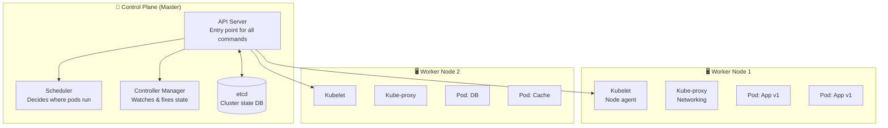
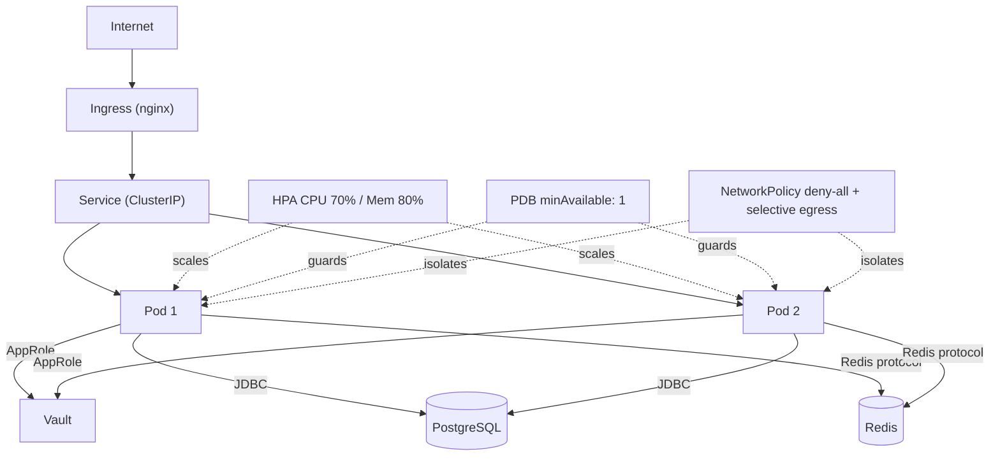
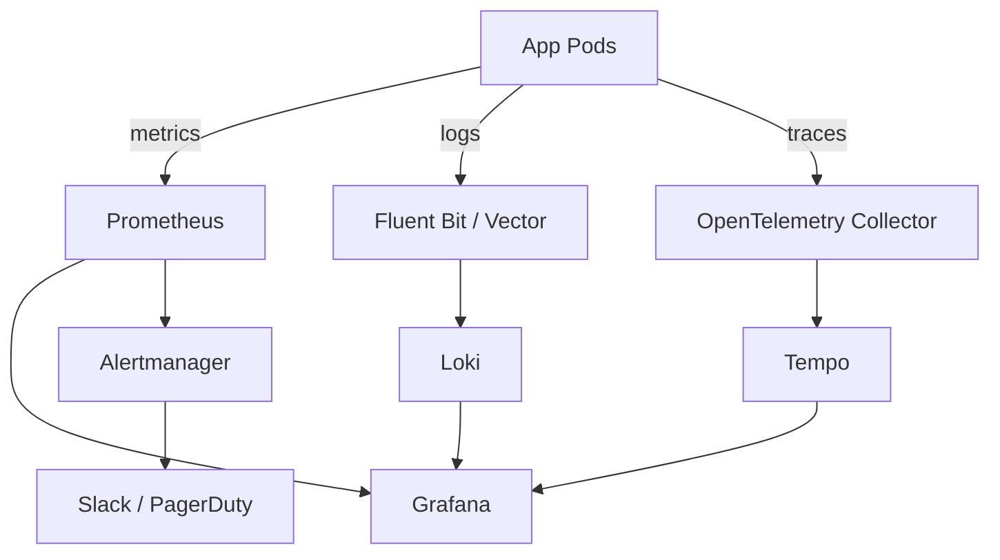
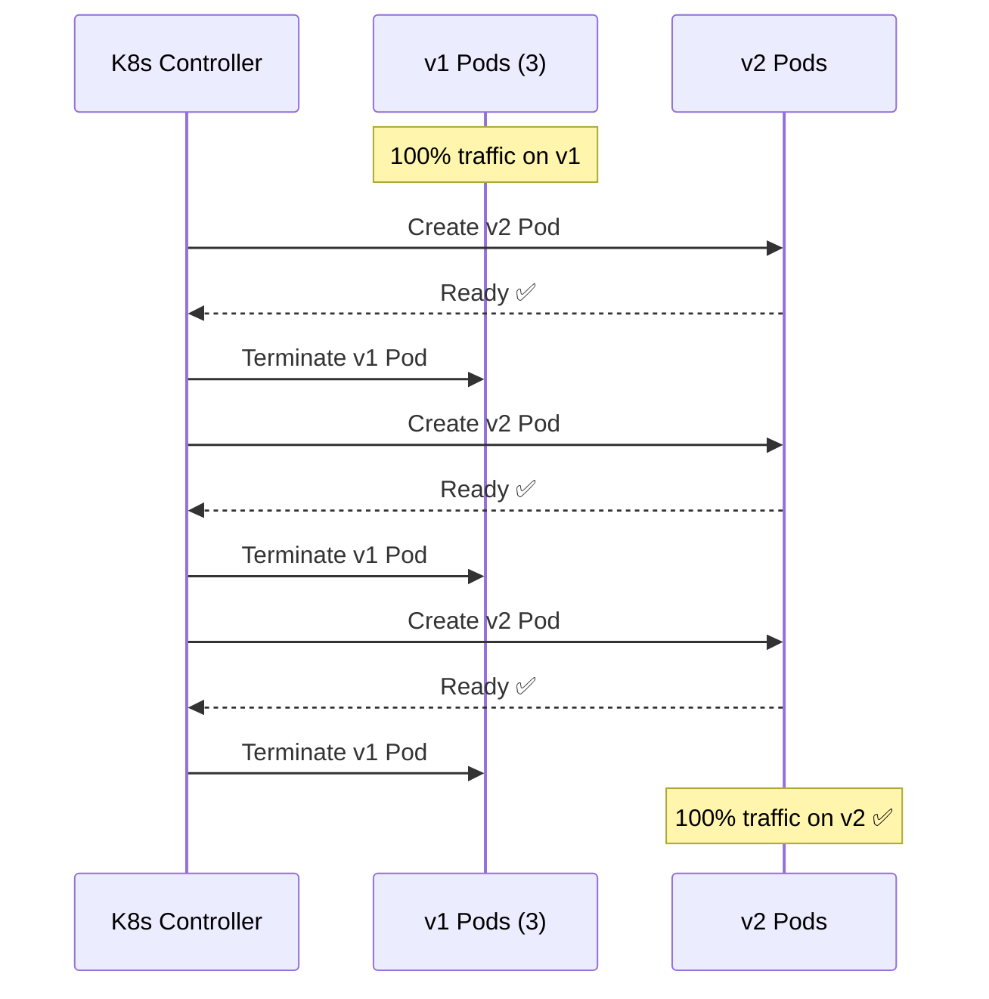
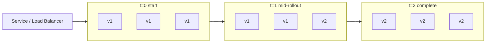

**Manage java version in windows:

https://medium.com/@pabasarapasindu365/effortlessly-switch-between-multiple-java-versions-in-the-same-command-prompt-on-windows-03adc8d1e96e
https://www.happycoders.eu/java/how-to-switch-multiple-java-versions-windows/


**PROGRAM:


voir k8s /jenkins/k8s

Observabilité: (elk, monitoring, tracing), lire observability.md

faire des exercice pratique pour implementation de test => strategie tdd, bdd, ddd, mindset pour tester efficacement pour un debutant en testing.

lire cicd => /jenkins .md
comprendre comment ça fonctionne.
confiigurer jenkins UI.
et lancer test pipeline avec jenkins.

lire gitops.md

Resilience.


DONE:

Exception handling.
logging.
Envs / profiles.
versionning.
how to migrate spring boot 3 to 4 ? (process to follow, commands, challenges, ...).
how to migrate java 21 to 25 ? (process to follow, commands, challenges, ...).
how to add flyway in this app or any other spring boot app ? (process to follow, commands, challenges, ...).
what's vault ? how it works ? pros & cons ? vault integration in a new or existing project ? best practices ? 
BDD: multi db, backup, in case down.
how to handle multiple environments ? in case k8s cluster ?
partitioning vs sharding vs replication
caching.
comprendre docker:
c'est quoi docker ? comment ça fonctionne ? quel probleme ça corrige ? avantages et inconvenients ?
use case?
k8s:
comprendre k8s et fonctionnement dans k8s / files / workflow / ...
comprendre flux / fonctionnement
voir helm => /helm
lire => k8s.md


NOTES:


## Exception/Error Handling:

create AppException extends RuntimeException
create custom exceptions extends AppException class
create ErrorResponse class (error format to follow)
throw exception in code by call => custom exception
create GlobalExceptionHandler class
inside GlobalExceptionHandler:
create methode to handle exception & group commun exceptions.
return response entity (only necessary info to consumer) + log error (context error + stack trace + usefull meta data => elk).

handle all exceptions:

known app exceptions.
spring violation errors
DB exception / constraints violation.
catch-all unexpected exceptions (500) at the end of GlobalExceptionHandler file.

NB:
add correlationId / traceId.
no hardcoded messages or data.
no sensitive data (annonymize).
handle most common exceptions & errors (404, 400, not allowed method, 401, 403, 409, 500).


## Environments / Profiles:

application.yml (default file).
create a file for each environment (application-prod.yml) => production.
run app with params to choose a specific profile.


NB:
no hard code data in application.yml file
.env => local environment config.
application-test.yml => testing config.
vault => deployed environment configs
vault will inculde both config + secrets.


## Versioning:

let's keep multiple api version at a time ex: v1, v2.
ex:
api/v1 => 
controller (2x file) a file for each version.
service (1x file) a file contains 2 methods one for each version.
dto (2x file) a file for each version.
Cache
DB


## Migration SPring boot 3 => 4:

install:
=> java 21+, maven (compatible), configure VSCode/IntelliJ (java version)
update java version => pom.xml.
update spring-boot-starter-parent version => compatible version with new java version.
update other dependencies (pom.xml) => use intellij to identify deprecated dependencies.
in case of breaking changes => fix them in app.
compile / package app.
fix compilation errors.
Run unit tests => fix them in case.
Run integration tests => fix them in case.
Run app + make some simulations (check BDD/Cache consistency).
Run perf/load Tests.
update docker/k8s (change base image 17 => 21).

## Migration Java 21 => 25:

Choose only java version LTS.
=> do not choose a non LTS version unless there a specific feature in version.
install:
=> java 21+, maven (compatible), configure VSCode/IntelliJ (java version)
update java version => pom.xml.
=> install java manage version local (easy to swotch versions).

update spring-boot-starter-parent version => compatible version with new java version.
update other dependencies (pom.xml) => use intellij to identify deprecated dependencies.
update code with new syntax (deprecated code).
compile / package app.
fix compilation errors.
Run unit tests => fix them in case.
Run integration tests => fix them in case.
Run app + make some simulations (check BDD/Cache consistency).
Run perf/load Tests.
update docker/k8s (change base image 17 => 21).

## Add Flyway in app:

version control for DB schema.
prod: Critical for consistency, auditing, and reproducibility.

add dependency spring-boot-starter-flyway => pom.xml
create migration files.
├── src/main/resources/
│   ├── db/
│   │   └── migration/
│   │       ├── V1__initial_schema.sql

add config in application.yml for environments: local, dev, test, prod.
start with baseline in case existing app with no flyway.

☐ Test migration locally (mvn clean package)
☐ Verify migration status (mvn flyway:info)
☐ Write V2, V3 migrations as needed
☐ Test each migration in isolation
☐ Add FlywayCallback for logging
☐ Create migration documentation
☐ Build Docker image with migrations
☐ Test in Docker Compose
☐ Deploy to staging
☐ Verify migrations on staging
☐ Deploy to production
☐ Monitor flyway_schema_history table
☐ Document rollback procedure (forward-only)


**NB:**
naming convention in flyway migration.
update config JPA with FLyway (no conflicts).
fix schema with a new version not in previous version.
Monitor flyway_schema_history table
respect production safety config.
document the rollback process (flyway do not support rollingback => forward-only migration).

1. Add dependency:        spring-boot-starter-flyway
2. Create migrations:     db/migration/V1__*.sql
3. Disable JPA DDL:       ddl-auto: validate
4. Configure:             application.yml
5. Run:                   mvn clean package (auto-runs migrations)
6. Monitor:               mvn flyway:info
7. Deploy:                Docker + K8s (migrations run on startup)
8. Database:              flyway_schema_history tracks all changes


## Test 

**C'est quoi le Testing?**

C'est vérifier que ton code fait ce qu'il doit faire — identifier les bugs avant qu'ils ne touchent l'utilisateur.


**La Pyramide des Tests** (concept clé)

         /\
        /  \          ⚠️ Chers, lents, fragiles => 10%
       / E2E \        Teste l'app entière (UI + API + DB)
      /______\
     /        \
    /          \      ⚠️ Moyens => 20%
   / Integration\    Teste services + DB ensemble
  /____________\
 /              \
/                \    ✅ Rapides, nombreux, isolés => 70%
/    Unit Tests   \   Teste 1 fonction/classe à la fois
/__________________\

Ratio idéal: 
70% unitaires | 20% intégration | 10% E2E

**Les 3 Niveaux de Tests:**

**Tests Unitaires** (le cœur)
Tester une fonction isolée sans dépendances externes.

Avantages: ✅ Rapides (ms) | ✅ Isolés | ✅ Nombreux (100+)
Outils ebank: JUnit 5, Mockito

**Tests d'Intégration**
Tester plusieurs composants ensemble (ex: service + base de données).

Avantages: ✅ Réaliste | ⚠️ Plus lent (secondes) | ⚠️ Moins nombreux (10-20)
Outils ebank: TestContainers (PostgreSQL réel), Spring @SpringBootTest

**Tests E2E (End-to-End)**
Tester l'application entière comme un vrai utilisateur (UI + API + DB).


# ebank-microservices: Postman/Newman collection
# Teste: GET /api/accounts → DB → Response JSON
newman run jenkins/e2e/ebank-postman-collection.json
Avantages: ✅ Très réaliste | ❌ Très lent (minutes) | ❌ Fragiles
Outils ebank: Postman, Newman, Selenium (si React frontend)


**Stratégie de Tests** (approche complète)

1. Définir les scénarios critiques
   ↓
2. Tester d'abord les cas normaux (happy path)
   ↓
3. Puis les cas d'erreur (edge cases, validations)
   ↓
4. Automatiser tout dans le CI/CD


**TDD (Test-Driven Development)**

**C'est quoi?**
Écrire les tests AVANT le code — une discipline de développement.

RED → GREEN → REFACTOR (cycle répétitif)

Processus étape par étape

1. RED: Écris un test qui échoue
   └─ Rien n'existe encore, c'est normal
   
2. GREEN: Écris le code minimum pour passer
   └─ Pas de perfection, juste passer le test
   
3. REFACTOR: Améliore le code
   └─ Maintenant on peut nettoyer sans casser le test
   
4. Répète jusqu'à la feature complète

**BDD (Behavior-Driven Development)**

**C'est quoi?**
Extension de TDD — on écrit les tests en langage métier que tout le monde comprend (dev + PO + QA).
**ex:**
Given un compte avec 1000 euros
When l'utilisateur transfère 500 euros
Then le solde doit être 500 euros

**DDD (Domain-Driven Design)**
**C'est quoi?**
Approche architecturale — organiser ton code autour du domaine métier, pas par couches techniques.

Bounded Contexts (Contextes délimités)
Aggregates (Agrégats)
Ubiquitous Language (Langage commun)
Value Objects (Objets Valeur)


**Strategie recommendé:**

DESIGN avec DDD
    ↓
SPÉCIFIER avec BDD (Gherkin)
    ↓
IMPLÉMENTER avec TDD (Red-Green-Refactor)
    ↓
TESTER


## BD:

in monolith + modular:
- single shared db: all modules share the db.
- multiple db per module: every module have it own db.
- hybrid (primary + read replicas): one logical db + multiple instances (read).

chaque table à son propre schema de bdd, user associé, et permission d'accès.
**Ex:**
x3 tables => transactions, accounts, users 
=> (x3) schema par table.
=> (x3) users par table + permissions.


```sql
# create db ebank
CREATE DATABASE ebank;

# Create role per domain:
CREATE ROLE auth_user LOGIN;
CREATE ROLE account_user LOGIN;
CREATE ROLE transaction_user LOGIN;

# Grant selective permissions:
GRANT SELECT ON public.users TO auth_user;
GRANT INSERT, UPDATE ON public.accounts TO account_user;

# App connects with appropriate role per service
```

in case:
- HIGH read operations app:
multiple instance DB: primary (write), replicas (read).
+1000 read/s

- high write 10k/s:
- cache + denormalize db:
reduce pressure on db write on cache + batch/queue to async write on db.
- partitioning: by region, date, ... => split table.
- sharding: split db.


**Partittioning:**
Splits a single table's data across multiple storage locations on the same server or cluster, based on a rule (like range, hash, or list).

**Ex:** A users table split by user ID:
Partition 1: IDs 1-1000
Partition 2: IDs 1001-2000
Partition 3: IDs 2001-3000

**Use case:** 
Improve query performance on huge tables; 
easier maintenance (drop old partitions).


**Sharding:**
Distributes data across multiple independent databases/servers, based on a shard key. Each server holds a subset of the data.

**Ex:** 
An e-commerce platform with millions of orders:

Shard 1 (Server A): Users 1-1M
Shard 2 (Server B): Users 1M-2M
Shard 3 (Server C): Users 2M-3M

**Use case:**
Horizontal scaling; 
handle massive datasets that won't fit on one machine.


**Replication:**
Creates identical copies of the entire database on multiple servers. All replicas have the same data.

**Ex:**
Primary (Master): All writes go here
Replica 1: Read-only copy of all data
Replica 2: Read-only copy of all data

**Use case:** 
High availability, 
read scaling, disaster recovery.


## Cache

Le cache est une couche de stockage temporaire rapide qui garde en mémoire des données fréquemment demandées, pour éviter de les recalculer ou de les refetcher depuis une source lente (BDD, API externe).

Sans cache :  Client → App → Base de données (100-500ms)
Avec cache :  Client → App → Cache Redis     (1-5ms)   ✓


**pros:**
performence, reduce db pressure, scalable.

**cons:**
stale data, increase complexity, increase cost, invalidation handling.

**use cases:**
Donnée lue beaucoup plus qu'elle n'est écrite
Calcul / requête est coûteux
Tolérance à une légère stale data acceptable
scale read operations, reduce presure on db & increase performence,


**les différents types de cache:**

┌─────────────────────────────────────────────────────┐
│  IN-PROCESS (local)                                 │
│  Ex: Caffeine, Guava                                │
│  → Ultra rapide, mais non partagé entre instances   │
├─────────────────────────────────────────────────────┤
│  DISTRIBUTED (partagé)                              │
│  Ex: Redis, Memcached                               │
│  → Partagé entre toutes les instances               │
├─────────────────────────────────────────────────────┤
│  TWO-LEVEL (L1 + L2)                                │
│  Ex: Caffeine (L1) + Redis (L2)                     │
│  → Best of both worlds                              │
├─────────────────────────────────────────────────────┤
│  HTTP CACHE                                         │
│  Ex: Cache-Control headers, CDN                     │
│  → Au niveau réseau / navigateur                    │
└─────────────────────────────────────────────────────┘
 
**Les Stratégies de Cache:**

**Cache-Aside (Lazy Loading)**

**Principe:** L'application gère tout manuellement. Elle vérifie le cache, si MISS elle va en BDD et stocke.


App → Cache ? 
        HIT  → retourne
        MISS → BDD → stocke en Cache → retourne
        
**Use Cases:**

Profil utilisateur (lu souvent, change rarement)
Détail d'un compte bancaire
Catalogue produits / liste de banques partenaires
Données de référence (pays, devises, codes postaux)

**Quand l'utiliser:**

Ratio lecture/écriture => Très élevé (80/20 ou plus).
Tolérance stale data => Oui (quelques minutes).
Contrôle fin => Tu veux gérer toi-même l'invalidation.
Cas par défaut => C'est la stratégie à choisir si tu hésites.

**Dans le monolith : **
C'est exactement ce que fait @Cacheable sur getAccount() et getAccountsByUser()

**2. Write-Through**

**Principe:** Chaque écriture met à jour BDD ET cache en même temps, de manière synchrone.

App → écrit en Cache → écrit en BDD → retourne

**Use Cases:**

Solde de compte (doit toujours être frais après mise à jour)
Paramètres de configuration critiques
Données médicales / financières où la cohérence prime
Profil utilisateur modifié fréquemment et relu immédiatement

**Quand l'utiliser:**

Cohérence exigée	Élevée — pas de stale data acceptable
Fréquence d'écriture	Modérée (si trop élevée, le cache se remplit inutilement)
Lecture après écriture	Immédiate et fréquente
Risque accepté	Latence légèrement plus longue à l'écriture

**Attention :** 
Si tu écris souvent mais lis rarement → tu pollues le cache pour rien.

**3. Write-Behind (Write-Back)**

**Principe:** 

L'écriture va dans le cache immédiatement, et la BDD est mise à jour en asynchrone (plus tard, en batch ou après délai).

App → écrit en Cache → ACK immédiat
              ↓ (async, quelques ms/s plus tard)
           écrit en BDD
           
**Use Cases:**

Compteurs de vues / likes (millions d'incréments par minute)
Logs d'activité utilisateur en temps réel
Métriques / analytics (agrégées avant d'être persistées)
Score de jeu en ligne (flush périodique)
Rate limiting (nombre de requêtes par IP — stocké dans Redis)

**Quand l'utiliser:**

Fréquence d'écriture	Très élevée
Tolérance à la perte	Acceptable (quelques secondes de données)
BDD sous pression	Oui — tu veux la protéger
Cohérence stricte	Non — pas adapté pour les virements

**Dans le monolith :** 

Le RateLimitFilter utilise Redis pour compter les requêtes — c'est du Write-Behind implicite.

**Risque majeur :** 

Si Redis crash avant le flush → données perdues.

**4. Read-Through**

**Principe:** 

Le cache est transparent pour l'app. Si MISS, c'est le cache lui-même qui va chercher en BDD (via un loader configuré).

App → Cache ?
        HIT  → retourne
        MISS → Cache charge depuis BDD → stocke → retourne
(L'app ne parle jamais directement à la BDD)

**Use Cases:**

Systèmes avec librairies de cache avancées (Caffeine + loader, JCache)
Données de référence partagées entre microservices
CDN qui charge les assets depuis le stockage si absent
ORM avec second-level cache (Hibernate L2 Cache)

**Quand l'utiliser:**

Tu veux abstraire la BDD	Oui — l'app ne voit que le cache
Framework supporté	Caffeine CacheLoader, JCache, Hibernate L2
Logique de chargement	Centralisée et réutilisable
Simplicité app	Prioritaire

**Différence avec Cache-Aside :** 

Dans Cache-Aside, l'app gère le MISS. Dans Read-Through, le cache le gère seul.

**5. Refresh-Ahead**


**Principe:** 

Le cache renouvelle proactivement les entrées populaires avant leur expiration, sans attendre le MISS.

TTL = 10 min
À 8 min → cache déclenche un refresh en arrière-plan
À 10 min → nouvelle valeur déjà prête, zéro latence

**Use Cases:**

Taux de change (mis à jour toutes les X minutes, toujours demandés)
Dashboard temps réel avec données agrégées
Token d'accès API externe (refresh avant expiration)
Données météo / stock market feeds
Listes populaires (top 10 transactions du jour)

**Quand l'utiliser:**
Données très populaires	Oui — toujours en cache HIT
Refresh prévisible	Oui — on sait que la donnée change périodiquement
Tolérance à légère stale data	Oui (quelques secondes max)
Latence zéro exigée	Oui — pas de pic de latence au refresh

**Risque :** 
Tu rafraîchis des données qui ne seront peut-être plus demandées → gaspillage.

**decision making:**

Tu lis beaucoup, écris peu ?          → Cache-Aside
Tu écris et relis immédiatement ?     → Write-Through
Tu as des millions d'écritures/min ?  → Write-Behind
Tu veux que l'app ignore la BDD ?     → Read-Through
Tu veux zéro latence sur données chaudes ? → Refresh-Ahead

## Docker


Docker est un outil de conteneurisation : il permet d'empaqueter une application avec toutes ses dépendances (runtime, libs, config) dans une unité isolée appelée conteneur.

fonctionnement:

graph TD
    A[Dockerfile] -->|docker build| B[Image]
    B -->|docker run| C[Conteneur]
    C -->|tourne sur| D[Docker Engine]
    D -->|tourne sur| E[Ton OS / Serveur]

    F[Docker Hub / Registry] -->|docker pull| B
    B -->|docker push| F


Dockerfile	=> Recette de cuisine => Fichier texte qui décrit comment	=> construire l'image
Image	Moule / Template	=> Snapshot immuable de l'app + environnement
Conteneur => Instance vivante	=> Image en cours d'exécution, isolée
Registry	App Store => Dépôt d'images => (Docker Hub, ECR, GHCR...)
Volume =>	Disque externe =>	Stockage persistant monté dans le conteneur
Network => Réseau privé => Communication entre conteneurs

**Conteneur vs VM:**

- VM: virtualise le hardware entier → lourd (GB), lent à démarrer (minutes).
- Docker: partage le kernel de l'OS hôte → léger (MB), rapide (secondes).

Docker utilise deux fonctionnalités du kernel Linux:
namespaces → isolation (réseau, processus, fichiers)
cgroups → limitation des ressources (CPU, RAM)

**Docker compose:**
Lancer plusieurs services (app + bdd + cache + autres dependances).

pros:
portabilité: (même comportement local, Prod).
isolation: (les app dans docker sont isolé du reste du systeme dans les container).
rapidité: plus rapide qu'une vm => virtualisation.
scalabilité: facile à scale vers N instances.
reproductibilité: reproduire surd'autre serveur/machines.

cons: 
complexité supplementaire.
orchestration à gerer dans le cas de la scalabilité.
persistance des données.

**layers:**

Chaque instruction du Dockerfile = une couche cachée. Si tu changes seulement le code, Docker re-build uniquement les couches modifiées → builds rapides.

Bonne pratique : mets les choses qui changent rarement en haut du Dockerfile (dépendances), et ton code en bas.

**Multi-stage Build**

Problème : l'image finale contient les outils de build (Maven, compilateur...) inutiles en prod → image trop grosse.

**Health Checks**

Docker peut surveiller si ton conteneur est vraiment "sain" (pas juste démarré).

Kubernetes utilise la même logique avec les liveness/readiness probes.

**Variables d'environnement & Secrets:**

Ne jamais hardcoder des secrets dans une image → ils sont visibles dans les layers.

**Réseau Docker — Modes:**

bridge (défaut)	=> Conteneurs sur le même host communiquent
host	=> Conteneur partage le réseau de l'hôte
overlay	=> Multi-host (utilisé par Docker Swarm)
none	=> Totalement isolé

**Volumes:**

persister les données dans un dossier /tmp (container data).


**Docker in Docker (DinD)**

Faire tourner Docker dans un conteneur Docker — utilisé dans les pipelines CI pour builder des images sans accès à l'hôte.

**docker ne sais pas:**

auto-scaler, secret management, monotoring, load balancing, 


## K8S:

Kubernetes is an open-source container orchestration platform that automates deploying, scaling, and managing containerized applications across a cluster of machines.

Containers restart automatically, scale on demand, and roll out updates with zero downtime.

**CORE CONCEPTS:**



**api server:** endpoint for all command go through here
**etcd:** store all cluster state
**scheduler:** pick on which node run a pod
**controller manager:** ensure desired state matches actual
**kubelet:** runs on each node, manages pods	

**Pods:**
smallest unit in k8s, its a wrapper arround one or more containers taht share a network and storage.

**Deployment:**
declares: pod, service, replcas (number of pod cpoies that running), configSet, secretSet.

**Service:**
a permanet virtual IP + DNS server that laod balances trafic across a set of pods.
(every time restart, deleted, ... it gets a new ip server provide stable ip endpoint).

service types:
cluster Ip: inside cluster only (internal communication/microservices).
nodePort: via node IP + port (in dev / testing environment).
loadBalancer: eternal cloud LB (expose app to internet).

**ConfigMap & Secret:**
decouple config from container images
configMap: plain text for config only, secret for sensitive data (values are encoded in base64).

**namespace:**
logical separation for ressources, it allows us to restrict resources quotas.
eg: for environment / team.

**labels / selectors:**
key/value tags, allows resources to find objects by thoes labels.

**volumes / pv / pvc:**
storage for containers to persist data in case restart/destroyed.
pod => PVC => PV => disk/cloud/nfs

StatefulSet — For Stateful Applications
it's like a Deployment, but Pods get stable identities (fixed names, stable network IDs, ordered startup/shutdown). Critical for databases and clustered apps.
Why not just use Deployment? Databases need: pod-0, pod-1, pod-2 — always the same name, same storage, same startup order. A Deployment gives random names and no ordering guarantees.
stable name, each pod gets it own PVC, sequential (0 -> 1 -> 2), use for state full APIs.

**ingress:**
maange external http/https traffic to the cluster.
we can set rukes on routing.

**job / cronjob:**
job runs on a pod (a one time delivery).
cronjob: is recurring job execution on a pod.
cronjob (schedule) => job => pod

**HPA:**
automatically scale up or down number of pod replicas based on: cpu, memory, on custom metrics.

**RBAC:**
controls who can do what on which resource.
user => RoleBinding => Role => K8s resources

**Rolling Update Strategy:**
replace old Pods with new ones gradually, ensuring zero downtime.

**Helm:**
package manager for k8s, bundles related related manifests (deployments, configMap, secret, ...), into resusable, versioned "charts".
Helm chart => helm => manifests

**app Monolith in k8s:**

| Aspect | Monolith | Microservices |
|---|---|---|
| Deployment unit | One Deployment, one image | Many Deployments, many images |
| Scaling | Scale the whole app via replica count | Scale each service independently (often per-service HPA) |
| Communication | In-process function calls | Network calls (HTTP/gRPC) between Pods |
| Failure isolation | A crash can take down the whole app | Failures are isolated per service |
| CI/CD | One pipeline, one release | One pipeline per service, independent releases |
| Networking complexity | Low — one Service | Higher — service discovery, retries, often a service mesh |
| Observability complexity | Lower — fewer moving parts | Higher — a single request spans many services |
| Resource overhead | Lower (fewer Pods/sidecars) | Higher (more Pods, often sidecars per Pod) |
| Team structure | Works well for one team | Enables independent teams per service |
| Tech stack | Usually one language/framework | Can be polyglot (different stacks per service) |


## Monolith


## Microservices

## Observability

**The 3 Pillars:**



Metrics — numeric, aggregatable (CPU, latency, request rate, error rate)
Logs — discrete, detailed events for debugging
Traces — the path a single request takes across services/calls

| | Monolith | Microservices |
|---|---|---|
| Tracing | Useful for DB/external calls, not critical | **Essential** — a request spans many services; without traces you can't see the full path |
| Logs | Single log stream, easy to follow | Must correlate logs across services via a shared trace/request ID |
| Metrics | One dashboard usually enough | Need per-service dashboards + a service-dependency map |
| APM | One agent can usually cover it | Often need a service mesh for automatic golden-signal metrics |
 


write a prompt follow this structure:

**[ROLE]**
You are a [specific role] with expertise in [domain].
Your communication style is [adjectives: direct/warm/technical/etc].

**[CONTEXT]**
Background: [what the model needs to know]
Audience: [who will read the output]
Goal: [what this output will be used for]


**[TASK]**
[Specific action verb] + [specific object] + [specific scope]

**[FORMAT]**
Structure your response as: [exact structure]
Length: [word count or "concise" / "comprehensive"]
Use [tables/bullets/prose/numbered list/JSON]

**[CONSTRAINTS]**
Always: [behaviors to enforce]
Never: [behaviors to prohibit]
If [edge case]: [how to handle it]


+

Persona Lock

+

XML / Delimiter Tags technique

+

Negative Prompting

+

**Anti-fluff prompt:**

No preamble. No filler. No restating the question.
Confidence: state it once (High / Medium / Low) at the very start.
Opinion: pick a side — no "it depends" non-answers.
Length: max 60 words total.
Bullets: max 4, no sub-bullets, one line each — or use prose if that's shorter.

[Your question here]


Exercises:

write a prompt that will:
- help learn prompting efficiently by practice.
- writing tests, writing a retro-documentation, code review, write technical user stories, respond emails/messages, technical expert on a specific, functional expert on a specific.


create a custom agent:


i want to build a custom agent that:
reveive "offre d'emploi" as an input.
you have my cv as file and linkedin profil as file too.
and you will:
- summrize clearly in bullet points follo this structure: (company name, secteur, poste, job description, contact infos, compensation, others).
- create a custom CV.
- write a custom cover letter


i want to build a custom agent that:
prepare me for interview:
HR (human resource) and technical interview
based on: job offer, related experiences, most known about interview preapration.


veil informationel
=> it concepts (search recent concepts on it based on my criterias: field (dev, devops, ai, cloud, ...), )


exercises:


prompting techniques:

use different techniques to solve different problems the idea is to combine these techniques.

prompts to build:


TOPICS:

WORK:


Me:
démarche administrative.
conseil domaine juridique.
recherche d'appartement.
recherche de mission: freelance, portage, ...
learn.
veil informationnel.

**Rolling Update**
Replace old Pods with new ones gradually, one batch at a time. The default K8s strategy.

Analogy: Replacing tires on a moving car — one at a time, the car never stops.



**during rollout:**



**use case:**
deploy bugfix, new feature.
no risk of incompatibility.*

**pros:**
built-in strategy, zero downtime (both strategies run simultaneously), low resource overhead

**cons:**
can't test subset of user (no control sample testing new version).
rollback is slow.

**Canary Deployment**
Send a small percentage of real traffic to the new version first. Monitor for errors. Gradually increase if healthy. 
Full rollback if something breaks.

**use cases:**
validation with real produciton traffic before complete rollout.
high traffic systems.
where 1% pf traffic is meaningful.

**pros:**
granular control over traffic.
control over rollout speed.

**cons:**
complexity

**canary vs rolling update vs green/blue:**

``m̀ermaid
    graph TD
        subgraph Rolling
            R_START[v1: 3 pods] -->|gradually| R_MID[v1: 2, v2: 1]
            R_MID -->|gradually| R_END[v2: 3 pods]
            R_T[Traffic: mixed during update]
        end

        subgraph Blue/Green
            BG_BLUE[v1: 3 pods LIVE]
            BG_GREEN[v2: 3 pods IDLE]
            BG_SWITCH[Instant switch]
            BG_BLUE -->|test green| BG_GREEN
            BG_GREEN -->|flip selector| BG_SWITCH
            BG_T[Traffic: all v1 THEN all v2]
        end

        subgraph Canary
            C_START[v1: 95% v2: 5%]
            C_MID[v1: 75% v2: 25%]
            C_END[v2: 100%]
            C_START -->|monitor| C_MID -->|monitor| C_END
            C_T[Traffic: controlled % shift]
    end
``