# Jenkins CI/CD Pipeline — Guide Complet

> **Auteur :** Mike | **Stack :** Jenkins · Maven · Docker · Kubernetes (Minikube)
> **Application :** Spring Boot 3.3 · Java 17 · PostgreSQL

---

## Table des Matières

1. [Est-ce possible d'ajouter ces étapes ?](#1-est-ce-possible-dajouter-ces-étapes-)
2. [Diagramme Mermaid — Vue Complète du Pipeline](#2-diagramme-mermaid--vue-complète-du-pipeline)
3. [Prérequis & Installation des Outils](#3-prérequis--installation-des-outils)
4. [Configuration Jenkins](#4-configuration-jenkins)
5. [CI — Étapes détaillées](#5-ci--étapes-détaillées)
   - [CI-1 : Validation Conformité Projet](#ci-1--validation-conformité-projet)
   - [CI-2 : Build](#ci-2--build)
   - [CI-3 : Tests Unitaires](#ci-3--tests-unitaires)
   - [CI-4 : Tests d'Intégration](#ci-4--tests-dintégration)
   - [CI-5a : Analyse des Dépendances (OWASP)](#ci-5a--analyse-des-dépendances-owasp)
   - [CI-5b : Analyse SBOM (CycloneDX)](#ci-5b--analyse-sbom-cyclonedx)
   - [CI-6 : Qualimétrie — SonarQube](#ci-6--qualimétrie--sonarqube)
   - [CI-7 : Quality Gate](#ci-7--quality-gate)
   - [CI-8 : Docker Build](#ci-8--docker-build)
   - [CI-9 : Analyse Image IaCS](#ci-9--analyse-image-iacs)
   - [CI-10 : Push Image](#ci-10--push-image)
6. [CD — Étapes détaillées](#6-cd--étapes-détaillées)
   - [CD-1 : Deploy Kubernetes](#cd-1--deploy-kubernetes)
   - [CD-2 : Smoke Test](#cd-2--smoke-test)
   - [CD-3a : Analyse DAST (OWASP ZAP)](#cd-3a--analyse-dast-owasp-zap)
   - [CD-3b : Tests E2E (Newman)](#cd-3b--tests-e2e-newman)
   - [CD-4 : Tests Accessibilité (RGAA / WCAG)](#cd-4--tests-accessibilité-rgaa--wcag)
   - [CD-5 : Analyse Green IT](#cd-5--analyse-green-it)
7. [Tableau récapitulatif — Outils & Alternatives](#7-tableau-récapitulatif--outils--alternatives)
8. [Variables d'Environnement](#8-variables-denvironnement)
9. [Troubleshooting](#9-troubleshooting)

---

## 1. Est-ce possible d'ajouter ces étapes ?

**Oui, toutes ces étapes sont implémentables dans Jenkins.** Voici une réponse rapide par étape :

| Étape | Possible ? | Complexité | Prérequis principal |
|-------|-----------|-----------|-------------------|
| Validation conformité | ✅ Oui | Faible | Plugin Maven Enforcer + Checkstyle |
| Analyse dépendances | ✅ Oui | Faible | Plugin OWASP Dependency-Check (Maven) |
| Analyse SBOM | ✅ Oui | Faible | Plugin CycloneDX (Maven) |
| Qualimétrie SonarQube | ✅ Oui | Moyenne | Serveur SonarQube + plugin Jenkins |
| Push image | ✅ Oui | Faible | Credential Docker Hub dans Jenkins |
| Analyse image IaCS | ✅ Oui | Faible | Trivy + Hadolint + Checkov sur l'agent |
| Analyse DAST | ✅ Oui | Moyenne | Docker (ZAP s'exécute en conteneur) |
| Tests E2E | ✅ Oui | Moyenne | Newman (npm) ou Karate |
| Tests accessibilité | ✅ Oui | Faible | Pa11y (npm) |
| Analyse Green IT | ✅ Oui (partiel) | Moyenne | Node.js (EcoIndex CLI) + kubectl |

> **Note Green IT :** La mesure précise de la consommation énergétique (Scaphandre, GreenFrame) nécessite
> soit un accès aux compteurs matériels RAPL (Linux bare-metal), soit une clé API cloud payante.
> Pour un environnement Minikube local, EcoIndex CLI + `kubectl top` est la solution la plus accessible.

---

## 2. Diagramme Mermaid — Vue Complète du Pipeline

```mermaid
flowchart TD
    PUSH(["🔀 Git Push / Pull Request"])
    CHECKOUT["📥 Checkout clone + env setup"]

    PUSH --> CHECKOUT

    subgraph CI ["🔵 CONTINUOUS INTEGRATION"]
        direction TB

        CHECKOUT --> VALID["🔍 CI-1 · Validation Conformité Maven Enforcer · Checkstyle convergence dépendances · style code"]

        VALID --> BUILD["🔨 CI-2 · Build mvn clean package -DskipTests JAR → target/"]

        BUILD --> UNIT["🧪 CI-3 · Tests Unitaires JUnit 5 · Mockito · H2 target/surefire-reports/"]

        UNIT --> INTEG["🔗 CI-4 · Tests Intégration SpringBootTest · MockMvc · H2 target/failsafe-reports/"]

        INTEG --> STATIC_PAR

        subgraph STATIC_PAR ["⚡ Parallèle — Analyses Statiques"]
            direction LR
            OWASP["🛡️ CI-5a · Dépendances OWASP Dependency-Check CVSS ≥ 7 → FAIL bom: HTML + JSON"]
            SBOM["📋 CI-5b · SBOM CycloneDX Maven Plugin bom.json · bom.xml licences + hashes"]
        end

        STATIC_PAR --> SONAR["📊 CI-6 · Qualimétrie SonarQube Scanner bugs · smells · coverage duplication · vulnérabilités"]

        SONAR --> GATE{"✅ CI-7 · Quality Gate SonarQube OK / ERROR"}

        GATE -->|"✅ Pass"| DBUILD["🐳 CI-8 · Docker Build Multi-stage · JRE Alpine tag: branch-sha7-buildNum"]
        GATE -->|"❌ Error"| ABORT(["🚫 Pipeline Interrompu — notification —"])

        DBUILD --> IMAGE_PAR

        subgraph IMAGE_PAR ["⚡ Parallèle — Analyse Image IaCS"]
            direction LR
            TRIVY["🔍 CI-9a · CVE Scan Trivy HIGH/CRITICAL → FAIL trivy-image-report.json"]
            HADOLINT["📝 CI-9b · Dockerfile Lint Hadolint best practices Docker hadolint-report.json"]
            CHECKOV["🏗️ CI-9c · IaC Scan Checkov K8s manifests + Dockerfile checkov-k8s-report.json"]
        end

        IMAGE_PAR --> PUSH_IMG["📤 CI-10 · Push Image Docker Hub branch-sha7-buildNum + latest si branche main"]
    end

    subgraph CD ["🟢 CONTINUOUS DEPLOYMENT"]
        direction TB

        PUSH_IMG --> DEPLOY["☸️ CD-1 · Deploy Kubernetes envsubst + kubectl apply Rolling Update maxSurge=1 · maxUnavailable=0"]

        DEPLOY --> SMOKE["💨 CD-2 · Smoke Test /actuator/health → UP timeout 60s · retry toutes 5s"]

        SMOKE --> POST_PAR

        subgraph POST_PAR ["⚡ Parallèle — Analyses Post-Déploiement"]
            direction LR
            ZAP["🔐 CD-3a · DAST OWASP ZAP API Scan OpenAPI /v3/api-docs Passif → rapport HTML"]
            E2E["🌐 CD-3b · Tests E2E Newman (Postman CLI) Register → Login → Account → Transfer · JUnit XML"]
        end

        POST_PAR --> ACCESS["♿ CD-4 · Accessibilité Pa11y CLI WCAG 2.1 AA ⊇ RGAA 4.1 pa11y-report.html"]

        ACCESS --> GREEN["🌱 CD-5 · Green IT EcoIndex CLI → note A-G kubectl top → CPU/RAM ecoindex-report.json"]

        GREEN --> SUCCESS(["✅ Déploiement Validé — notification succès —"])
    end

    SMOKE -->|"❌ Échec"| ROLLBACK["🔄 Rollback Auto kubectl rollout undo retour révision N-1"]
    ABORT --> NOTIF_FAIL(["📧 Notification Échec"])
    ROLLBACK --> NOTIF_FAIL

    style CI fill:#EBF5FB,stroke:#2E86C1,stroke-width:2px,color:#1a1a1a
    style CD fill:#EAFAF1,stroke:#27AE60,stroke-width:2px,color:#1a1a1a
    style STATIC_PAR fill:#FEF9E7,stroke:#F39C12,stroke-width:1px
    style IMAGE_PAR fill:#FEF9E7,stroke:#F39C12,stroke-width:1px
    style POST_PAR fill:#FEF9E7,stroke:#F39C12,stroke-width:1px
    style ABORT fill:#FDEDEC,stroke:#E74C3C
    style SUCCESS fill:#EAFAF1,stroke:#27AE60
    style ROLLBACK fill:#FDEDEC,stroke:#E74C3C
    style NOTIF_FAIL fill:#FDEDEC,stroke:#E74C3C
```



---

## 3. Prérequis & Installation des Outils

### Sur l'agent Jenkins

```bash
# Java 17
apt install openjdk-17-jdk

# Docker
curl -fsSL https://get.docker.com | sh
usermod -aG docker jenkins   # donne accès Docker à l'utilisateur jenkins

# kubectl
snap install kubectl --classic

# Trivy (CVE scan)
apt-get install wget apt-transport-https gnupg lsb-release
wget -qO - https://aquasecurity.github.io/trivy-repo/deb/public.key | apt-key add -
echo "deb https://aquasecurity.github.io/trivy-repo/deb $(lsb_release -sc) main" \
    | tee /etc/apt/sources.list.d/trivy.list
apt update && apt install trivy

# Hadolint (Dockerfile linting)
wget -O /usr/local/bin/hadolint \
    https://github.com/hadolint/hadolint/releases/latest/download/hadolint-Linux-x86_64
chmod +x /usr/local/bin/hadolint

# Checkov (IaC scan)
pip3 install checkov

# Newman (Postman CLI)
npm install -g newman newman-reporter-junit

# Pa11y (accessibilité)
npm install -g pa11y

# envsubst (injection de variables dans les manifests K8s)
apt install gettext-base
```

### Serveurs externes nécessaires

| Service | Usage | Installation |
|---------|-------|-------------|
| **SonarQube** | Qualimétrie | `docker run -d -p 9000:9000 sonarqube:lts-community` |
| **Minikube** | Cluster K8s local | [minikube.sigs.k8s.io/docs/start](https://minikube.sigs.k8s.io/docs/start/) |

### Addons Minikube

```bash
minikube start --driver=docker --cpus=4 --memory=4096
minikube addons enable ingress          # Nginx ingress (Accessibilité, DAST)
minikube addons enable metrics-server   # kubectl top (Green IT, HPA)

# Entrée DNS locale pour l'Ingress
echo "$(minikube ip)  ebank.local" | sudo tee -a /etc/hosts
```

---

## 4. Configuration Jenkins

### Plugins à installer

**Jenkins > Manage Jenkins > Plugins > Available :**

| Plugin | Utilité |
|--------|---------|
| **Pipeline** | Syntaxe `pipeline {}` déclarative |
| **Git** | Checkout SCM |
| **Docker Pipeline** | `docker.build()`, `docker.withRegistry()` |
| **Credentials Binding** | `withCredentials` — injection sécurisée des secrets |
| **JUnit** | Parsing des rapports XML de tests |
| **HTML Publisher** | Publication des rapports HTML (ZAP, Pa11y, OWASP) |
| **Warnings Next Generation** | `recordIssues` pour Checkstyle |
| **SonarQube Scanner** | `withSonarQubeEnv`, `waitForQualityGate` |
| **Workspace Cleanup** | `cleanWs()` entre les builds |
| **Blue Ocean** *(optionnel)* | Visualisation graphique du pipeline |
| **Slack Notification** *(optionnel)* | `slackSend` pour les alertes |

### Credentials à créer

**Jenkins > Manage Jenkins > Credentials > (global) > Add Credentials :**

| ID | Type | Contenu |
|----|------|---------|
| `dockerhub-credentials` | Username + Password | Login Docker Hub |
| `kubeconfig` | Secret file | Fichier `~/.kube/config` (Minikube) |
| `sonarqube-token` | Secret text | Token généré dans SonarQube > My Account > Security |

### Configuration SonarQube dans Jenkins

**Jenkins > Manage Jenkins > Configure System > SonarQube servers :**
- Name: `SonarQube`
- URL: `http://localhost:9000`
- Server authentication token: `sonarqube-token` (credential créé ci-dessus)

### Créer le job Pipeline

1. **New Item** → `ebank-monolith` → **Pipeline**
2. **Pipeline** → **Pipeline script from SCM**
3. SCM: **Git** → URL de votre dépôt
4. Script Path: `monolith/jenkins/Jenkinsfile`
5. **Save** → **Build Now**

---

## 5. CI — Étapes détaillées

---

### CI-1 : Validation Conformité Projet

**Outil :** Maven Enforcer Plugin + Maven Checkstyle Plugin
**Fichier de config :** `jenkins/config/checkstyle.xml`

#### Qu'est-ce que c'est ?

La **validation de conformité** est la première barrière qualité du pipeline.
Elle vérifie que le code respecte les règles définies par l'équipe **avant même de compiler**.

**Maven Enforcer** enforce des règles sur l'environnement de build :
- Version Java minimum (Java 17)
- Version Maven minimum (3.9+)
- Convergence des versions de dépendances (pas de conflits)

**Checkstyle** enforce des règles sur la forme du code Java :
- Indentation, longueur des lignes (120 max)
- Nommage des classes, méthodes, variables
- Imports inutilisés ou wildcard (`import java.util.*`)
- Présence de `{` pour tous les blocs

```xml
<!-- pom.xml — ajouter dans <build><plugins> -->
<plugin>
    <groupId>org.apache.maven.plugins</groupId>
    <artifactId>maven-enforcer-plugin</artifactId>
    <version>3.4.1</version>
    <configuration>
        <rules>
            <requireJavaVersion><version>[17,)</version></requireJavaVersion>
            <requireMavenVersion><version>[3.9,)</version></requireMavenVersion>
            <dependencyConvergence/>
        </rules>
    </configuration>
</plugin>

<plugin>
    <groupId>org.apache.maven.plugins</groupId>
    <artifactId>maven-checkstyle-plugin</artifactId>
    <version>3.3.1</version>
</plugin>
```

#### Utilité

- Garantit que le code buildé en CI est identique à ce que les développeurs produisent localement
- Évite les disputes de style dans les code reviews (le pipeline tranche)
- Détecte les imports oubliés, variables non utilisées, blocs sans accolades

#### ✅ Avantages

- Aucun outil externe — tout est un plugin Maven
- Feedback immédiat (< 30 secondes)
- Les règles sont versionnées dans Git avec le code
- Configurable finement (seuil d'erreur vs warning)

#### ❌ Inconvénients

- Les développeurs doivent configurer leur IDE avec les mêmes règles Checkstyle (sinon frustration)
- Des règles trop strictes ralentissent l'onboarding
- Maven Enforcer `dependencyConvergence` peut être bruyant sur des projets avec beaucoup de transitive deps

---

### CI-2 : Build

**Outil :** Maven (`./mvnw clean package -DskipTests`)

#### Qu'est-ce que c'est ?

Compilation du code source Java et packaging en JAR exécutable.
Les tests sont ignorés ici volontairement (`-DskipTests`) pour obtenir un **feedback rapide** en cas d'erreur de compilation, indépendamment des tests.

#### Utilité

Valide que le code compile. Si un développeur a oublié une dépendance ou cassé une signature de méthode, le pipeline échoue ici en < 2 minutes au lieu d'attendre les tests.

#### ✅ Avantages

- Séparation claire compilation / tests
- Artifact (JAR) versionné et archivé avec fingerprint
- Maven wrapper (`./mvnw`) garantit la version Maven sans installation globale

#### ❌ Inconvénients

- Double exécution Maven (compile ici + recompile pour les tests) — peut être optimisé avec `mvn package` suivi de tests en passant le JAR existant

---

### CI-3 : Tests Unitaires

**Outil :** JUnit 5 + Mockito + H2 (in-memory)

#### Qu'est-ce que c'est ?

Tests qui vérifient une unité de code (méthode, classe) **en isolation complète**.
Les dépendances externes (DB, services) sont remplacées par des **mocks Mockito**.

Dans ce projet : `AuthServiceTest` (inscription, email unique, etc.)

La base H2 en mémoire est activée par `src/test/resources/application.yaml` — **aucun Postgres requis**.

#### Utilité

- Vérifie la logique métier pure
- Exécution ultra-rapide (< 10 secondes)
- Rapports JUnit intégrés dans l'UI Jenkins (historique, tendances)

#### ✅ Avantages

- Très rapides (pas de I/O réseau)
- Isolés — ne dépendent pas de l'environnement
- Faciles à déboguer (scope réduit)

#### ❌ Inconvénients

- Les mocks peuvent masquer des bugs d'intégration réels (ex: comportement différent de la vraie DB)
- Risque de sur-mocking : tester le mock plutôt que le code réel

---

### CI-4 : Tests d'Intégration

**Outil :** Spring Boot Test + MockMvc + H2

#### Qu'est-ce que c'est ?

Tests qui vérifient l'**intégration entre les couches** de l'application (Controller → Service → Repository).
Spring Boot démarre un contexte complet mais MockMvc simule les requêtes HTTP sans ouvrir de vrai port réseau.

Dans ce projet : `AuthControllerTest` (POST `/api/v1/auth/register`, POST `/api/v1/auth/login`)

#### Utilité

- Valide les routes HTTP, la désérialisation JSON, la sécurité Spring (`@PreAuthorize`), les validations Bean Validation
- Plus réaliste que les tests unitaires sans nécessiter de serveur externe

#### ✅ Avantages

- Couvre la stack complète de l'application
- Rapports séparés des tests unitaires → identification précise des régressions
- H2 reste utilisé → pas de Postgres requis en CI

#### ❌ Inconvénients

- Plus lents que les tests unitaires (démarrage du contexte Spring : ~10-30 secondes)
- H2 n'est pas 100% compatible PostgreSQL (quelques différences de SQL dialects)
- En cas d'échec, le scope est plus large → debug plus difficile

---

### CI-5a : Analyse des Dépendances (OWASP)

**Outil :** OWASP Dependency-Check Maven Plugin
**Rapport :** `target/dependency-check-report.html`, `target/dependency-check-report.json`

#### Qu'est-ce que c'est ?

Scanne toutes les dépendances Maven (directes **et** transitives) contre la base de données publique **NVD** (National Vulnerability Database — CVE).

Chaque dépendance est identifiée par son CPE (Common Platform Enumeration), puis matchée aux CVE connus. Si un CVE a un score **CVSS ≥ 7** (HIGH ou CRITICAL), le build échoue.

```xml
<!-- pom.xml — ajouter dans <build><plugins> -->
<plugin>
    <groupId>org.owasp</groupId>
    <artifactId>dependency-check-maven</artifactId>
    <version>9.2.0</version>
</plugin>
```

#### Utilité

- Détecte les dépendances avec des vulnérabilités connues (ex: Log4Shell dans log4j, Spring4Shell dans Spring)
- Obligatoire pour les projets financiers (conformité PCI-DSS, ISO 27001)
- Génère un rapport exploitable pour les audits de sécurité

#### ✅ Avantages

- Couvre les dépendances **transitives** (celles que vous n'avez pas choisies directement)
- Rapport HTML riche avec les CVE détaillés, scores CVSS, descriptions
- Fichier de suppression versionné dans Git pour gérer les faux positifs
- Gratuit et open source

#### ❌ Inconvénients

- **Lent** : le premier téléchargement de la base NVD prend 5-15 min (mis en cache ensuite)
- Faux positifs : certains CVE sont mal associés à des dépendances (ex: CVE pour "commons-lang" version 2 appliqué à la version 3)
- Nécessite une API key NVD pour des mises à jour rapides (sinon rate-limiting)
- Ne détecte pas les vulnérabilités dans le **code maison** (pour ça → SonarQube)

---

### CI-5b : Analyse SBOM (CycloneDX)

**Outil :** CycloneDX Maven Plugin
**Rapport :** `target/bom.json`, `target/bom.xml`

#### Qu'est-ce que c'est ?

Un **SBOM** (Software Bill of Materials) est l'inventaire complet de tous les composants de votre application : dépendances, licences, hashes SHA-256, versions, auteurs.

CycloneDX est le format standard (également adopté par SPDX/NTIA). Le fichier `bom.json` peut être ingéré par des outils comme **OWASP Dependency-Track** pour un suivi continu des vulnérabilités.

```xml
<!-- pom.xml -->
<plugin>
    <groupId>org.cyclonedx</groupId>
    <artifactId>cyclonedx-maven-plugin</artifactId>
    <version>2.8.0</version>
</plugin>
```

#### Utilité

- Exigence légale croissante : Executive Order américain (2021), directive NIS2 européenne (2024)
- Permet d'auditer les licences (LGPL, GPL, Apache 2.0, MIT) → risque légal pour les projets commerciaux
- Intégration avec OWASP Dependency-Track pour alertes en temps réel sur nouvelles CVE

#### ✅ Avantages

- Génère un inventaire complet en < 30 secondes
- Format standardisé (CycloneDX v1.4+) — interopérable avec tous les outils du marché
- Tracé des hashes → vérification d'intégrité de la supply chain
- Aucune dépendance externe (plugin Maven autonome)

#### ❌ Inconvénients

- Le SBOM seul ne fait rien — il faut un outil d'analyse comme Dependency-Track pour en tirer de la valeur
- Ne couvre pas les dépendances système (packages OS dans l'image Docker) — pour ça → Trivy SBOM
- Volumineux pour les projets avec beaucoup de dépendances

---

### CI-6 : Qualimétrie — SonarQube

**Outil :** SonarQube Server + SonarScanner for Maven
**Dashboard :** `http://localhost:9000`

#### Qu'est-ce que c'est ?

Analyse statique approfondie du code source. SonarQube identifie :
- **Bugs** : code qui va probablement planter en production
- **Code Smells** : code qui fonctionne mais est difficile à maintenir
- **Vulnérabilités** : patterns de sécurité dangereux (SQL injection, XSS, etc.)
- **Couverture de tests** : % de lignes couvertes par les tests JUnit (via JaCoCo)
- **Duplication** : blocs de code copiés-collés (DRY violations)
- **Hotspots de sécurité** : code qui mérite une revue humaine

```sh
# Démarrer SonarQube (Docker)
docker run -d --name sonarqube -p 9000:9000 sonarqube:lts-community
# Accéder sur http://localhost:9000 (admin/admin par défaut)
# Créer un projet → générer un token → l'ajouter dans Jenkins credentials
```

```xml
<!-- pom.xml — JaCoCo pour la couverture -->
<plugin>
    <groupId>org.jacoco</groupId>
    <artifactId>jacoco-maven-plugin</artifactId>
    <version>0.8.12</version>
    <executions>
        <execution><goals><goal>prepare-agent</goal></goals></execution>
        <execution>
            <id>report</id>
            <phase>test</phase>
            <goals><goal>report</goal></goals>
        </execution>
    </executions>
</plugin>
```

#### Utilité

- Vision globale de la qualité du code (dette technique quantifiée)
- Historique des métriques build par build → mesure de la progression
- Intégration GitHub/GitLab : commentaires automatiques sur les PR

#### ✅ Avantages

- Analyse très complète (1000+ règles Java)
- Dashboard riche avec tendances et comparaisons entre builds
- Quality Gate configurable (ex: couverture > 80%, zéro nouveau bug)
- Version Community gratuite suffisante pour un projet personnel ou équipe réduite
- Plugin Jenkins natif (`waitForQualityGate`)

#### ❌ Inconvénients

- Serveur SonarQube à maintenir (RAM : min 2 GB recommandés)
- Le premier scan peut être lent (10-20 min selon la taille du projet)
- La version Community n'analyse pas les branches (seulement `main`) — la version Developer est payante
- Nécessite JaCoCo configuré dans le pom.xml pour la couverture

---

### CI-7 : Quality Gate

**Outil :** Plugin Jenkins SonarQube (`waitForQualityGate`)

#### Qu'est-ce que c'est ?

Après l'envoi des métriques à SonarQube (CI-6), le pipeline **attend la réponse du Quality Gate** (OK / ERROR). Si le gate est en erreur, `abortPipeline: true` stoppe le pipeline immédiatement.

Le Quality Gate est défini dans SonarQube et peut être personnalisé :
```
Exemple de Quality Gate "Sonar way" (défaut) :
  - Couverture sur nouveau code ≥ 80%
  - Duplication sur nouveau code ≤ 3%
  - Zéro nouvelle vulnérabilité de sévérité HIGH
  - Zéro nouveau bug de sévérité CRITICAL/BLOCKER
```

#### Utilité

- Empêche de pusher une image Docker d'un code qui ne passe pas les critères qualité
- Feedback loop court : les développeurs voient immédiatement l'impact de leurs commits

#### ✅ Avantages

- Séparation claire : SonarQube analyse en async, Jenkins attend le résultat (pas de polling actif)
- Configurable sans toucher au Jenkinsfile (règles gérées dans SonarQube)
- Timeout configurable (`timeout(time: 5, unit: 'MINUTES')`)

#### ❌ Inconvénients

- Ajoute un délai d'attente (SonarQube est asynchrone)
- Si le serveur SonarQube est down → le pipeline est bloqué
- Les règles du Quality Gate doivent être calibrées progressivement (trop strict au départ → frustration)

---

### CI-8 : Docker Build

**Outil :** Docker Engine + Dockerfile multi-stage existant

#### Qu'est-ce que c'est ?

Construction de l'image Docker à partir du `Dockerfile` existant.
L'image finale est une **JRE Alpine** (~150 MB) contenant uniquement le JAR — sans Maven, sans JDK, sans code source.

Tags appliqués :
- `yourdockerhub/ebank-monolith:main-a3f9c12-42` (tag unique par build)
- `yourdockerhub/ebank-monolith:latest` (uniquement depuis `main`)

Labels pour la traçabilité :
```
git-commit=a3f9c12
build-number=42
branch=main
pipeline=jenkins
```

#### Utilité

- Produit un artefact immuable et versionnée — le même JAR qu'en CI est déployé en production
- Les labels permettent de retrouver quel commit correspond à quelle image en production

#### ✅ Avantages

- Le Dockerfile existant est déjà production-ready (multi-stage, non-root, Alpine)
- BuildKit cache les couches → builds rapides si les dépendances n'ont pas changé
- L'image est identique entre dev, staging et prod (pas de "ça marche sur ma machine")

#### ❌ Inconvénients

- L'agent Jenkins a besoin d'accès à Docker (montage du socket `/var/run/docker.sock`)
- Risque de "Docker socket exposure" → privilèges élevés sur l'hôte Jenkins
- Les images peuvent s'accumuler sur l'agent → nettoyage nécessaire (`post { always { docker rmi } }`)

---

### CI-9 : Analyse Image IaCS

**IaCS = Infrastructure as Code Security** — trois axes complémentaires analysés en parallèle.

---

#### CI-9a : CVE Scan — Trivy

**Outil :** Trivy (Aqua Security)
**Rapport :** `target/trivy-image-report.json`

Scanne les couches de l'image Docker contre la base CVE (NVD, GitHub Advisory, etc.).
Couvre les packages OS (Alpine apk), les dépendances Java (JARs), et les libs native.

**Différence avec OWASP Dependency-Check (CI-5a) :**
- OWASP scanne les dépendances Maven déclarées dans `pom.xml`
- Trivy scanne **l'image Docker finale** — y compris les packages Alpine (`musl`, `busybox`, etc.) que Maven ne voit pas

#### ✅ Avantages

- Très rapide (< 1 min avec cache local)
- Couvre les packages OS — angle mort de l'OWASP
- Format JSON exploitable par des dashboards (Grafana, Dependency-Track)

#### ❌ Inconvénients

- Faux positifs sur des CVE qui ne sont pas exploitables dans votre contexte (ex: CVE dans un module CLI non utilisé)
- La sévérité HIGH/CRITICAL peut être trop stricte sur certains projets → ajuster avec `--ignore-unfixed`

---

#### CI-9b : Dockerfile Lint — Hadolint

**Outil :** Hadolint
**Rapport :** `target/hadolint-report.json`

Lint statique du `Dockerfile` selon les best practices officielles Docker + ShellCheck sur les commandes `RUN`.

Exemples de règles :
- `DL3008` : Pinning des versions de packages (`apt-get install -y curl=7.x`)
- `DL3025` : Utiliser CMD sous forme JSON (`CMD ["java", "-jar"]` vs `CMD java -jar`)
- `SC2086` : Double-quoting des variables shell dans les `RUN`

#### ✅ Avantages

- Prévient les anti-patterns qui impactent la taille et la sécurité de l'image
- Très rapide (analyse statique, < 5 secondes)
- Mode `--failure-threshold error` : ne fail que sur les vraies erreurs, pas les warnings

#### ❌ Inconvénients

- Ne couvre que le Dockerfile, pas l'image finale (rôle complémentaire de Trivy)
- Certaines règles sont trop strictes pour des cas légitimes (possibilité d'ignorer par ligne `# hadolint ignore=DL3008`)

---

#### CI-9c : IaC Scan — Checkov

**Outil :** Checkov (Bridgecrew / Palo Alto)
**Rapport :** `target/checkov-k8s-report.json`

Analyse les fichiers d'infrastructure (manifests Kubernetes, Dockerfile, Terraform, etc.) pour détecter des **mauvaises configurations de sécurité**.

Exemples de checks Kubernetes :
- `CKV_K8S_8` : `livenessProbe` manquante
- `CKV_K8S_11` : Limites CPU non définies
- `CKV_K8S_30` : Container en root (`runAsNonRoot: false`)
- `CKV_K8S_43` : Image sans tag précis (`:latest`)

Dans notre pipeline, `--soft-fail` est utilisé : le rapport est généré sans bloquer le build (pédagogique).
En production, retirer `--soft-fail` et ajouter un seuil d'échec.

#### ✅ Avantages

- Couvre 1000+ checks sur Kubernetes, Dockerfile, Helm, Terraform
- Référence directe aux CIS Benchmarks et frameworks de sécurité (NIST, SOC2)
- Output JSON facilement intégrable dans des dashboards

#### ❌ Inconvénients

- Beaucoup de faux positifs sur des setups intentionnels (ex: `hostNetwork: true` pour certains cas réseaux)
- Lent sur de grands dépôts (scan récursif)
- Nécessite Python 3.8+ et pip sur l'agent Jenkins

---

### CI-10 : Push Image

**Outil :** Docker CLI + credentials Jenkins

#### Qu'est-ce que c'est ?

Push de l'image validée vers Docker Hub. L'authentification utilise `withCredentials` Jenkins — le mot de passe n'apparaît **jamais** dans les logs.

Logique de tag :
- Toute branche → push du tag `branch-sha-num`
- Branche `main` uniquement → push additionnel du tag `latest`

#### Utilité

- Rend l'image disponible pour le déploiement Kubernetes (et pour d'autres membres de l'équipe)
- Le tag unique garantit qu'on sait exactement quel commit est en production

#### ✅ Avantages

- Simple, natif Docker
- Le tag `latest` uniquement sur `main` évite d'écraser la version stable avec une feature branch

#### ❌ Inconvénients

- Docker Hub a des limitations de pull en Free tier (100 pulls/6h pour les IPs partagées)
- En production, préférer un registry privé (AWS ECR, GCR, Harbor) pour la confidentialité et la performance

---

## 6. CD — Étapes détaillées

---

### CD-1 : Deploy Kubernetes

**Outil :** kubectl + envsubst + manifests `jenkins/k8s/`

#### Qu'est-ce que c'est ?

Déploiement de l'image dans le cluster Kubernetes. `envsubst` injecte le tag d'image dynamique dans `deployment.yaml` (le fichier contient `$IMAGE_FULL` comme placeholder).

La stratégie **Rolling Update** (`maxSurge: 1`, `maxUnavailable: 0`) garantit :
1. Un nouveau pod démarre avec la nouvelle image
2. Il passe les `readinessProbe` → reçoit du trafic
3. Un ancien pod est éteint
4. Répété jusqu'à remplacement complet → **zéro downtime**

#### Utilité

- Déploiement reproductible et traçable (chaque deploy = un commit = une image taguée)
- `kubectl rollout status --timeout=120s` → le pipeline échoue si le déploiement prend trop longtemps (ex: image non pullable, OOM)

#### ✅ Avantages

- Rollback instantané (`kubectl rollout undo`) — historique des 10 dernières révisions conservé
- Séparation config (ConfigMap) / secrets (Secret) / app (Deployment) → changements indépendants
- HPA intégré → l'app scale automatiquement sous charge

#### ❌ Inconvénients

- `envsubst` est fragile (substitue TOUTES les variables `$` du fichier) → utiliser Helm en production
- Le kubeconfig sur l'agent Jenkins est un vecteur d'attaque si l'agent est compromis
- En production, utiliser un ServiceAccount K8s dédié avec RBAC limité au namespace `ebank`

---

### CD-2 : Smoke Test

**Outil :** `jenkins/scripts/smoke-test.sh` (curl + retry loop)

#### Qu'est-ce que c'est ?

Test de bon fonctionnement minimal après déploiement. Le script interroge `/actuator/health` toutes les 5 secondes pendant 60 secondes max et vérifie la présence de `"status":"UP"`.

Si l'app ne répond pas → rollback automatique déclenché.

#### Utilité

- Attrape les erreurs de configuration au runtime que les tests CI ne peuvent pas voir :
  - Mauvais URL de DB dans le ConfigMap
  - Secret JWT manquant
  - Port Kubernetes mal configuré

#### ✅ Avantages

- Très simple (un curl avec retry)
- Basé sur Spring Actuator déjà présent dans le projet
- Feedback en < 60 secondes

#### ❌ Inconvénients

- Ne teste qu'un seul endpoint (`/actuator/health`) → ne valide pas la logique métier
- Un faux positif (app UP mais DB corrompue) peut passer le smoke test → c'est pour ça que les E2E existent

---

### CD-3a : Analyse DAST (OWASP ZAP)

**Outil :** OWASP ZAP (Zed Attack Proxy) — exécuté en conteneur Docker
**Rapport :** `zap-reports/zap-report.html`, `zap-report.json`

#### Qu'est-ce que c'est ?

Le **DAST** (Dynamic Application Security Testing) analyse l'application **en cours d'exécution** en simulant un attaquant externe. Contrairement au SAST (SonarQube), il peut détecter :
- Injections SQL en testant les endpoints réels
- Failles XSS sur les réponses HTML
- Mauvais en-têtes de sécurité (`X-Frame-Options`, `Content-Security-Policy`)
- Authentification faible, tokens prévisibles

Dans notre pipeline, on utilise `zap-api-scan.py` en mode **passif** :
- ZAP lit la spec OpenAPI (`/v3/api-docs`)
- Il envoie des requêtes légitimes et analyse les **réponses** (pas d'attaque active)
- Mode passif = safe pour n'importe quel environnement

```sh
# Mode API scan (utilisé dans le pipeline)
zap-api-scan.py -t http://ebank.local/v3/api-docs -f openapi -r report.html

# Mode full scan (actif — uniquement sur environnement dédié)
# zap-full-scan.py -t http://ebank.local -r report.html
```

#### Utilité

- Complète le SAST (SonarQube analyse le code statique ; ZAP teste l'app réelle)
- Valide les configurations de sécurité HTTP (headers, cookies, CORS)
- Obligatoire dans les projets soumis à des audits OWASP Top 10

#### ✅ Avantages

- Aucune installation sur l'agent Jenkins (ZAP s'exécute en conteneur)
- `zap-api-scan.py` comprend nativement OpenAPI/Swagger → couverture exhaustive des endpoints
- Mode `-I` (ignore) : génère un rapport sans bloquer le pipeline (adapté pendant la phase d'apprentissage)
- Rapport HTML riche avec classification OWASP des risques

#### ❌ Inconvénients

- Lent : 5-20 minutes selon le nombre d'endpoints
- En mode actif (`full-scan`), peut modifier des données ou provoquer des erreurs 500 → réserver à un environnement dédié
- Faux positifs à gérer via un fichier de contexte ZAP (`.context`)
- ZAP ne peut pas tester la logique métier complexe (ex: règles de virement)

---

### CD-3b : Tests E2E (Newman)

**Outil :** Newman (CLI Postman) + collection `jenkins/e2e/ebank-api.postman_collection.json`
**Rapport :** `target/e2e-results.xml` (format JUnit)

#### Qu'est-ce que c'est ?

Les **tests E2E** (End-to-End) simulent les scénarios complets d'un utilisateur réel sur l'application déployée. Chaque requête s'enchaîne via des variables dynamiques :

```
Register → Login (→ sauvegarde token JWT) → Créer compte (→ sauvegarde accountId)
→ Virer de l'argent (→ utilise accountId) → Vérifier le solde
```

Newman exécute la collection Postman en ligne de commande, produit un rapport JUnit (lisible par Jenkins) et un rapport console.

```bash
newman run ebank-api.postman_collection.json \
    --env-var "baseUrl=http://ebank.local" \
    --reporters cli,junit \
    --reporter-junit-export target/e2e-results.xml \
    --bail   # arrête au premier échec de test
```

#### Utilité

- Valide les **flux fonctionnels complets** — ce que les tests unitaires et d'intégration ne peuvent pas faire
- Détecte les régressions entre composants (ex: le service Auth fonctionne mais l'endpoint Transactions rejette le token JWT)
- La collection Postman peut être partagée et exécutée localement par les développeurs

#### ✅ Avantages

- Facile à maintenir (interface Postman graphique pour créer les requêtes)
- Exécutable localement par les développeurs avant de pusher
- Rapport JUnit intégré dans le dashboard Jenkins (onglet Tests)
- Le flag `--bail` stoppe au premier échec → feedback rapide

#### ❌ Inconvénients

- Les données de test créent des entrées en base → nécessite un nettoyage (teardown) ou une base dédiée
- La collection Postman peut devenir un fourre-tout difficile à maintenir si non structurée
- Pas adapté aux tests de performance (pour ça → k6, Gatling)
- Alternative plus puissante : **Karate DSL** (Java-native, BDD, assertions avancées)

---

### CD-4 : Tests Accessibilité (RGAA / WCAG)

**Outil :** Pa11y CLI
**Standards :** WCAG 2.1 Niveau AA ⊇ RGAA 4.1
**Rapport :** `target/pa11y-report.html`, `target/pa11y-report.json`

#### Qu'est-ce que c'est ?

Analyse automatique de l'accessibilité des interfaces web selon les standards internationaux.

**WCAG** (Web Content Accessibility Guidelines) : standard international W3C.
**RGAA** (Référentiel Général d'Amélioration de l'Accessibilité) : standard français basé sur WCAG 2.1 AA, obligatoire pour les services publics numériques.

Pa11y injecte le moteur **axe-core** dans un navigateur headless (Chrome), analyse le DOM et détecte les violations d'accessibilité :
- Images sans attribut `alt`
- Contraste couleur insuffisant (WCAG 1.4.3)
- Formulaires sans labels (`<input>` sans `<label>`)
- Liens sans texte descriptif ("Cliquez ici")
- Structure de titres incorrecte (`<h3>` sans `<h2>`)

Dans notre projet, la seule interface web est **Swagger UI** (`/swagger-ui/index.html`).

```bash
pa11y http://ebank.local/swagger-ui/index.html \
    --standard WCAG2AA \
    --reporter html \
    --threshold 5    # tolère jusqu'à 5 violations avant d'échouer
```

#### Utilité

- Assure que la documentation API (Swagger UI) est utilisable par des personnes en situation de handicap
- Requis pour les marchés publics et les applications soumises à la loi française du 11 février 2005
- Détecte des problèmes qui améliorent aussi l'UX générale (contraste, navigation clavier)

#### ✅ Avantages

- Très rapide (< 30 secondes pour une page)
- Standard WCAG 2.1 AA = niveau légal requis en France pour les services publics
- Rapport HTML lisible par des non-développeurs (clients, équipe qualité)
- Le `--threshold` permet d'introduire progressivement le standard sans bloquer le pipeline

#### ❌ Inconvénients

- **Couverture limitée** : Pa11y ne détecte qu'environ 30-40% des violations d'accessibilité réelles (le reste nécessite un audit humain)
- Swagger UI est un composant tiers — certaines violations viennent de la librairie elle-même, pas de votre code
- Pour une vraie conformité RGAA, un audit humain est indispensable (Pa11y est un outil de détection automatique, pas de certification)
- Le test de l'accessibilité d'une API REST a une pertinence limitée si l'app n'a pas de frontend

---

### CD-5 : Analyse Green IT

**Outil :** EcoIndex CLI (Node.js) + `kubectl top`
**Rapport :** `target/ecoindex-report.json`, `target/k8s-resource-usage.txt`

#### Qu'est-ce que c'est ?

Mesure de l'impact environnemental de l'application selon deux angles :

**EcoIndex** : Note l'écologie d'une page web (A à G) en mesurant :
- Taille des ressources téléchargées (DOM, CSS, JS, images)
- Nombre de requêtes HTTP
- Complexité du DOM

Formule : `EcoIndex = 1 - (poids_dom/1 000 + nb_requetes/100 + poids_page/1 000) / 3`

**`kubectl top`** : Mesure la consommation CPU et mémoire réelle des pods en production. Indirectement corrélée à la consommation électrique et donc à l'empreinte carbone.

```bash
# EcoIndex via npx (sans installation globale)
npx --yes ecoindex-cli analyze \
    --url "http://ebank.local/swagger-ui/index.html" \
    --format json

# Consommation des pods K8s
kubectl top pods -n ebank --sort-by=cpu
kubectl top nodes
```

#### Utilité

- Sensibilisation des développeurs à l'impact environnemental du code
- Baseline mesurable : si l'EcoIndex baisse entre deux versions, la nouvelle est plus impactante
- `kubectl top` identifie les pods qui consomment trop de ressources (optimisation possible)

#### ✅ Avantages

- EcoIndex est gratuit, open source, aucun serveur externe
- `kubectl top` est natif Kubernetes (avec metrics-server)
- Mesure objective et reproductible sur chaque build

#### ❌ Inconvénients

- **EcoIndex** mesure la Swagger UI (frontend léger) — pas les traitements backend (calculs, requêtes SQL)
- La mesure de consommation énergétique **réelle** nécessite des outils matériels (Scaphandre/RAPL) non disponibles sur Minikube
- `kubectl top` donne la consommation instantanée, pas une moyenne sur la durée
- L'EcoIndex d'une API REST est peu représentatif (le vrai impact est dans les traitements backend)

> **Pour aller plus loin en Green IT :**
> - **Scaphandre** : mesure RAPL (Linux bare-metal uniquement)
> - **GreenFrame** : mesure cloud complète (API payante)
> - **Cloud Carbon Footprint** : mesure l'empreinte AWS/GCP/Azure
> - **Kepler** (CNCF) : métriques énergétiques dans Kubernetes (via eBPF)

---

## 7. Tableau récapitulatif — Outils & Alternatives

| Étape | Outil choisi | Alternative 1 | Alternative 2 |
|-------|-------------|--------------|--------------|
| Conformité | Maven Enforcer + Checkstyle | PMD | SpotBugs |
| Dépendances | OWASP Dependency-Check | Snyk | GitHub Dependabot |
| SBOM | CycloneDX Maven | Syft (Anchore) | Trivy SBOM |
| Qualimétrie | SonarQube Community | SonarCloud (SaaS) | SpotBugs + PMD |
| CVE Image | Trivy | Grype (Anchore) | Docker Scout |
| Dockerfile lint | Hadolint | Dockle | — |
| IaC Scan | Checkov | kube-score | kubesec |
| DAST | OWASP ZAP | Nuclei | Burp Suite Enterprise |
| Tests E2E | Newman (Postman) | Karate DSL | REST Assured |
| Accessibilité | Pa11y | axe-cli | Lighthouse CI |
| Green IT | EcoIndex CLI | GreenFrame | Scaphandre + Kepler |

---

## 8. Variables d'Environnement

### Dans le Jenkinsfile

| Variable | Valeur par défaut | Description |
|----------|------------------|-------------|
| `DOCKER_HUB_USER` | `yourdockerhub` | **À changer** → votre username Docker Hub |
| `APP_NAME` | `ebank-monolith` | Nom de l'application |
| `DOCKER_IMAGE` | `${DOCKER_HUB_USER}/${APP_NAME}` | Nom complet de l'image |
| `IMAGE_TAG` | `branch-sha7-buildNum` | Tag unique généré automatiquement |
| `K8S_NAMESPACE` | `ebank` | Namespace Kubernetes |
| `SONAR_HOST_URL` | `http://localhost:9000` | **À changer** → URL de votre SonarQube |
| `SONAR_PROJECT_KEY` | `ebank-monolith` | Clé du projet dans SonarQube |
| `APP_BASE_URL` | `http://ebank.local` | URL de l'app après déploiement |

### Credentials Jenkins requis

| ID | Type | Utilisation |
|----|------|------------|
| `dockerhub-credentials` | Username + Password | Login Docker Hub (Push Image) |
| `kubeconfig` | Secret file | Accès kubectl au cluster Minikube |
| `sonarqube-token` | Secret text | Authentification SonarQube |

---

## 9. Troubleshooting

### OWASP Dependency-Check — téléchargement lent

```bash
# Le premier téléchargement NVD prend 5-15 min.
# Activer le cache Jenkins pour accélérer les builds suivants :
# Monter un volume persistant dans le conteneur Jenkins :
docker run -v jenkins_home:/var/jenkins_home \
           -v nvd_cache:/root/.m2/repository/org/owasp/dependency-check-data \
           jenkins/jenkins:lts
```

### SonarQube — Quality Gate timeout

```groovy
// Augmenter le timeout si SonarQube est lent :
timeout(time: 10, unit: 'MINUTES') {
    waitForQualityGate abortPipeline: true
}
```

### OWASP ZAP — connexion refusée

```bash
# Vérifier que l'Ingress Nginx est actif et que /etc/hosts est configuré :
minikube addons enable ingress
echo "$(minikube ip)  ebank.local" | sudo tee -a /etc/hosts
curl http://ebank.local/actuator/health
```

### Pa11y — Chrome introuvable sur l'agent Jenkins

```bash
# Installer Chromium sur l'agent :
apt install -y chromium-browser
# Pa11y utilise Chromium automatiquement via puppeteer
```

### Newman — collection non trouvée

```bash
# Vérifier que le fichier existe dans le workspace Jenkins :
ls -la monolith/jenkins/e2e/ebank-api.postman_collection.json
# Vérifier que le checkout SCM a bien récupéré tous les fichiers
```

### kubectl top — `metrics not available`

```bash
minikube addons enable metrics-server
# Attendre ~60 secondes que les métriques se propagent
kubectl top pods -n ebank
```

### Checkov — `ModuleNotFoundError`

```bash
# Vérifier l'installation Python sur l'agent :
pip3 install checkov --upgrade
python3 -m checkov --version
```

---

## Structure Complète des Fichiers

```
monolith/jenkins/
├── Jenkinsfile                           ← Pipeline principal (CI + CD complet)
├── CICD_GUIDE.md                         ← Ce fichier
├── config/
│   ├── checkstyle.xml                    ← Règles Checkstyle (Google Java Style adapté)
│   └── dependency-suppression.xml        ← Suppressions faux positifs OWASP
├── e2e/
│   └── ebank-api.postman_collection.json ← Collection Newman (Register→Login→Account→Transfer)
├── k8s/
│   ├── namespace.yaml                    ← Namespace ebank
│   ├── configmap.yaml                    ← Config non-sensible (SPRING_PROFILES_ACTIVE, etc.)
│   ├── secret.yaml                       ← Template secrets (DB, JWT)
│   ├── deployment.yaml                   ← Pods + probes + rolling update
│   ├── service.yaml                      ← NodePort (port 30080)
│   ├── ingress.yaml                      ← Nginx → ebank.local
│   └── hpa.yaml                          ← Autoscaler CPU 70%, 2-5 pods
└── scripts/
    ├── smoke-test.sh                     ← /actuator/health avec retry 60s
    └── rollback.sh                       ← kubectl rollout undo
```
