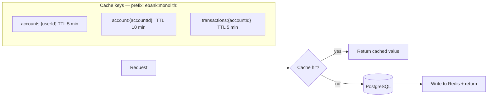

# eBank Monolith

Spring Boot modular monolith — JWT auth, accounts, transfers, Redis cache, PostgreSQL.

---

## Architecture

```mermaid
graph TD
    Client -->|HTTP + Bearer JWT| API

    subgraph API["Spring Boot — port 8080"]
        direction TB
        JF[JwtFilter] -.->|validates token| JP[JwtProvider]
        RL[RateLimitFilter] -.->|login throttle| Redis

        AC[AuthController]  --> AS[AuthService]
        ACC[AccountController] --> ACS[AccountService]
        TC[TransactionController] --> TS[TransactionService]

        AS --> UR[UserRepository]
        ACS -->|@Cacheable| Redis[(Redis)]
        ACS --> AR[AccountRepository]
        TS  -->|@Cacheable / @CacheEvict| Redis
        TS  --> TR[TransactionRepository]
        TS  --> AR
    end

    subgraph DB["PostgreSQL"]
        UR --> users
        AR --> accounts
        TR --> transactions
    end
```

---

## Caching



| Operation | Cache effect |
|---|---|
| `GET /accounts` | `@Cacheable accounts:{userId}` |
| `GET /accounts/{id}` | `@Cacheable account:{accountId}` |
| `POST /accounts` | `@CacheEvict accounts:{userId}`, evict all `account:*` |
| `GET /accounts/{id}/transactions` | `@Cacheable transactions:{accountId}` |
| `POST /transactions/.../transfer` | Evict `transactions` + `account` for both sides, evict all `accounts:*` |
| **Rate-limit counter** | Redis INCR+EXPIRE per IP (falls back to in-memory if Redis is down) |

**Serialisation:** JSON via `GenericJackson2JsonRedisSerializer` with `ebank:monolith:` key prefix.
**Tests:** `spring.cache.type=none` → `@Cacheable` is a no-op; no Redis required.

---

## Environments

| | **local** | **dev (E2)** | **prod (E1)** |
|---|---|---|---|
| Spring profile | `local` | `dev` | `prod` |
| Config source | `application-local.yaml` | Vault `secret/e-bank/monolith/E2/config` | Vault `secret/e-bank/monolith/E1/config` |
| Vault auth | none | AppRole | AppRole |
| Database | `localhost:5432` | Shared test DB | Managed prod DB |
| Redis | `localhost:6379` (no auth) | Vault-supplied host/pass | Vault-supplied host/pass |
| DDL | `update` | `validate` | `validate` |
| Rate-limit | 10/min | 20/min | 10/min |

Tests use H2 in-memory + `spring.cache.type=none`. No Vault, no Redis, no Docker needed.

---

## Quick Start

### Local (no Vault)

```bash
docker compose up -d postgres redis

./mvnw spring-boot:run -Dspring-boot.run.profiles=local
# or fully containerised:
docker compose up -d --build

curl http://localhost:8081/actuator/health
```

### Dev profile with Vault

```bash
docker compose -f docker-compose.yml -f docker-compose.vault.yml up -d --build

curl http://localhost:8081/actuator/health
# Vault UI: http://localhost:8200  (token: root)
```

### Tests

```bash
./mvnw test                                # H2 + no-op cache, no Docker needed
./mvnw test -Dtest=AuthControllerTest      # single class
```

---

## Full flow

```bash
BASE=http://localhost:8081

TOKEN=$(curl -s -X POST $BASE/api/v1/auth/register \
  -H "Content-Type: application/json" \
  -d '{"email":"alice@bank.com","password":"Alice123!","fullName":"Alice"}' \
  | python3 -c "import sys,json; print(json.load(sys.stdin)['data']['token'])")

A1=$(curl -s -X POST $BASE/api/v1/accounts \
  -H "Content-Type: application/json" -H "Authorization: Bearer $TOKEN" \
  -d '{"accountType":"CHECKING"}' \
  | python3 -c "import sys,json; print(json.load(sys.stdin)['data']['id'])")

A2=$(curl -s -X POST $BASE/api/v1/accounts \
  -H "Content-Type: application/json" -H "Authorization: Bearer $TOKEN" \
  -d '{"accountType":"SAVINGS"}' \
  | python3 -c "import sys,json; print(json.load(sys.stdin)['data']['id'])")

curl -s -X POST $BASE/api/v1/transactions/accounts/$A1/transfer \
  -H "Content-Type: application/json" -H "Authorization: Bearer $TOKEN" \
  -d "{\"toAccountId\":$A2,\"amount\":50,\"description\":\"Test\"}"
```

---

## Project structure

```
src/main/
├── java/com/ebank/
│   ├── common/          # JWT filter, security, exception handler, RedisConfig
│   ├── auth/            # register · login · profile
│   ├── account/         # create · list · get  (@Cacheable)
│   └── transaction/     # transfer · history   (@Cacheable / @CacheEvict)
└── resources/
    ├── application.yaml          # base: Redis + cache type + Vault disabled
    ├── application-local.yaml    # local dev: Redis localhost, no Vault
    ├── application-dev.yaml      # dev/testing: Vault AppRole → E2
    └── application-prod.yaml     # production:  Vault AppRole → E1

src/test/resources/application.yaml   # H2, cache=none, Redis excluded

vault/seeds/
├── E1.json    # prod config template (includes Redis host/pass)
└── E2.json    # dev/test config template (includes Redis host/pass)

helm/          # Kubernetes deployment → see doc/KUBERNETES.md
docker/        # Prometheus, Grafana, Tempo config → see doc/OBSERVABILITY.md
```

---

## Further reading

| Topic | Doc |
|---|---|
| Secrets management (Vault) | [VAULT_CONFIG.md](doc/VAULT_CONFIG.md) |
| Kubernetes & Helm | [KUBERNETES.md](doc/KUBERNETES.md) |
| Observability | [OBSERVABILITY.md](doc/OBSERVABILITY.md) |
| CI/CD | [CICD_GUIDE.md](doc/CICD_GUIDE.md) |
