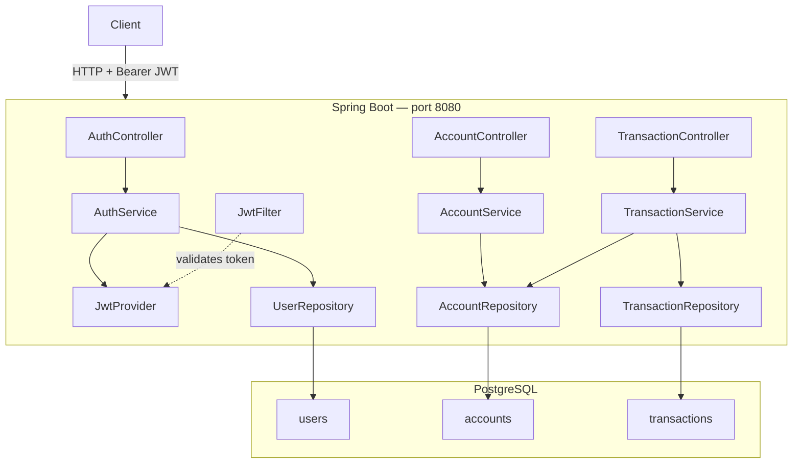
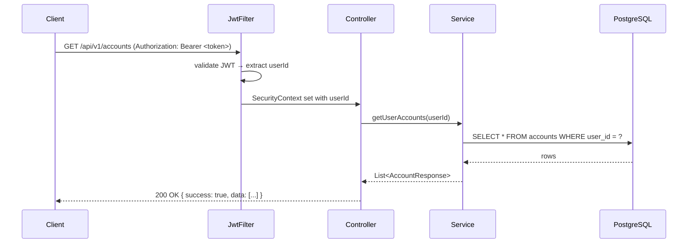

# eBank Monolith

Spring Boot modular monolith — JWT auth, accounts, transfers, PostgreSQL.

---

## Architecture



### Request flow (authenticated)



---

## Environments

All runtime config (datasource credentials, JWT expiration, logging levels, etc.) is sourced from **HashiCorp Vault KV v2**. Each environment has its own path inside Vault:

| | **local** | **E2 — testing** | **E1 — prod** |
|---|---|---|---|
| Spring profile | `local` | `prod` | `prod` |
| Vault path | `secret/e-bank/monolith/local/config` | `secret/e-bank/monolith/E2/config` | `secret/e-bank/monolith/E1/config` |
| Vault auth | Token (`root`) | AppRole | AppRole |
| Database | PostgreSQL in Docker | PostgreSQL shared test DB | PostgreSQL managed prod DB |
| DDL | `update` | `update` | `validate` |
| SQL logs | on | off | off |
| Rate-limit capacity | 10/min | 20/min | 10/min |
| Actuator endpoints | health, info | health, info | health only |
| How to run | `docker compose ... up -d` | pipeline + `VAULT_ENV_ID=E2` | pipeline + `VAULT_ENV_ID=E1` |

Tests (`./mvnw test`) use neither a profile nor Vault — they run against an H2 in-memory database configured directly in `src/test/resources/application.yaml`.

> See [VAULT_CONFIG.md](VAULT_CONFIG.md) for a full explanation of the Vault integration, auth strategies, CI/CD wiring, and how to add new environments.

---

## Quick Start

### Docker with Vault (recommended)

```bash
# Start PostgreSQL + Vault (dev mode) + the app (local profile)
docker compose -f docker-compose.yml -f docker-compose.vault.yml up -d --build

docker compose ps             # wait for (healthy) on postgres and app
curl http://localhost:8081/actuator/health
# Vault UI: http://localhost:8200  (token: root)
```

Vault is seeded automatically on first start. All config (datasource URL, credentials, JWT settings, etc.) is read from `secret/e-bank/monolith/local/config`.

### Docker without Vault (legacy / quick demo)

```bash
cp .env.example .env          # copy env template
docker compose up -d --build  # build image + start postgres + app
curl http://localhost:8081/actuator/health
```

Config is supplied via environment variables from `.env`. No secrets management.

### Local (app on JVM, Vault + DB in Docker)

```bash
docker compose -f docker-compose.yml -f docker-compose.vault.yml up -d postgres vault vault-init
./mvnw spring-boot:run -Dspring-boot.run.profiles=local \
  -Dspring-boot.run.jvmArguments="-DVAULT_HOST=localhost -DVAULT_TOKEN=root -DVAULT_ENV_ID=local"
```

### Tests

```bash
./mvnw test                                # all tests (H2, no Docker needed)
./mvnw test -Dtest=AuthControllerTest      # single class
```

---

## Example: full flow

```bash
BASE=http://localhost:8081

# 1. Register
TOKEN=$(curl -s -X POST $BASE/api/v1/auth/register \
  -H "Content-Type: application/json" \
  -d '{"email":"alice@bank.com","password":"Alice123!","fullName":"Alice"}' \
  | python3 -c "import sys,json; print(json.load(sys.stdin)['data']['token'])")

# 2. Create two accounts
A1=$(curl -s -X POST $BASE/api/v1/accounts \
  -H "Content-Type: application/json" -H "Authorization: Bearer $TOKEN" \
  -d '{"accountType":"CHECKING"}' \
  | python3 -c "import sys,json; print(json.load(sys.stdin)['data']['id'])")

A2=$(curl -s -X POST $BASE/api/v1/accounts \
  -H "Content-Type: application/json" -H "Authorization: Bearer $TOKEN" \
  -d '{"accountType":"SAVINGS"}' \
  | python3 -c "import sys,json; print(json.load(sys.stdin)['data']['id'])")

# 3. Transfer (will return "Insufficient balance" — accounts start at 0)
curl -s -X POST $BASE/api/v1/transactions/accounts/$A1/transfer \
  -H "Content-Type: application/json" -H "Authorization: Bearer $TOKEN" \
  -d "{\"toAccountId\":$A2,\"amount\":50,\"description\":\"Test\"}"
```

---

## Project Structure

```
src/main/
├── java/com/ebank/
│   ├── common/          # JWT, security filter, exception handler, base entity
│   ├── auth/            # register · login · profile
│   ├── account/         # create · list · get
│   └── transaction/     # transfer · history
└── resources/
    ├── application.yaml          # base: static framework constants, Vault disabled
    ├── application-local.yaml    # Vault token auth (local dev mode)
    └── application-prod.yaml     # Vault AppRole auth (E1 prod, E2 testing)

src/test/
├── java/com/ebank/
│   ├── auth/controller/AuthControllerTest.java
│   └── auth/service/AuthServiceTest.java
└── resources/
    └── application.yaml          # H2 in-memory, no Vault needed

vault/
├── init.sh                       # seeds Vault on first stack start
├── policy/ebank-monolith.hcl     # read-only Vault policy
└── seeds/
    ├── local.json                 # local dev config (auto-seeded)
    ├── E1.json                    # prod config template (CHANGE_ME values)
    └── E2.json                    # testing config template
```

---

### Production deployment (E1)

```bash
# 1. Build and push the image
docker build -t your-registry/ebank-monolith:1.0.0 ebank-monolith/
docker push your-registry/ebank-monolith:1.0.0

# Seed E1 config in the production Vault cluster (first time only)
VAULT_ADDR=https://vault.prod.example.com \
VAULT_TOKEN=<root-or-admin-token> \
  vault kv put secret/e-bank/monolith/E1/config @vault/seeds/E1.json

# Deploy — supply Vault connection + AppRole credentials; no .env with secrets
APP_IMAGE=your-registry/ebank-monolith:1.0.0 \
VAULT_HOST=vault.prod.example.com \
VAULT_ROLE_ID=<role-id> \
VAULT_SECRET_ID=<secret-id> \
VAULT_ENV_ID=E1 \
  docker compose -f docker-compose.yml -f docker-compose.prod.yml up -d
```

> The app pulls **all** config from Vault at startup. No secrets travel in the `.env` file.
