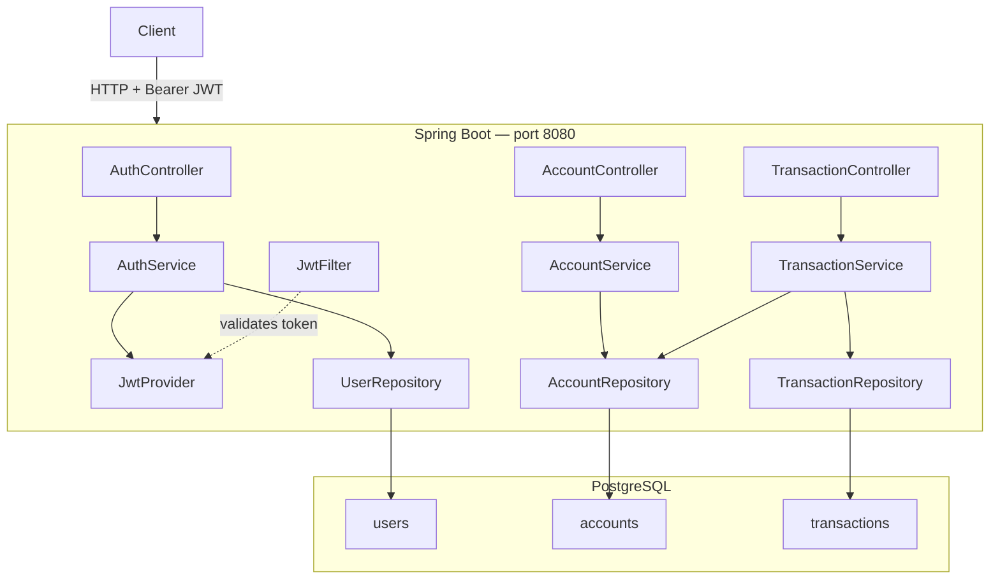
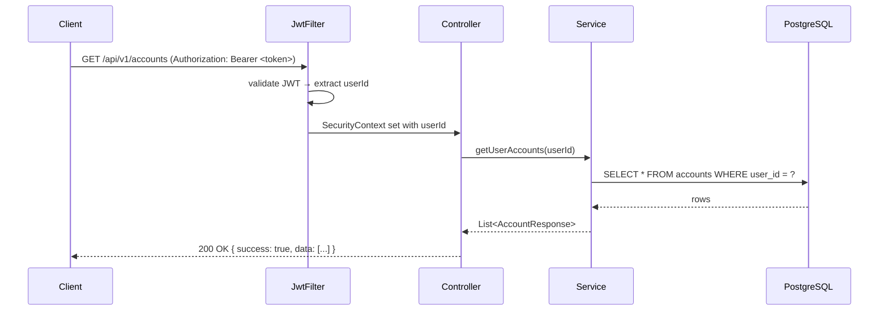

# eBank Monolith

Spring Boot modular monolith — JWT auth, accounts, transfers, PostgreSQL.

---

## Architecture



### Request flow (authenticated)



---

## Environments

Three Spring profiles cover all use cases:

| | **local** | **dev (E2)** | **prod (E1)** |
|---|---|---|---|
| Spring profile | `local` | `dev` | `prod` |
| Config source | `application-local.yaml` | Vault `secret/e-bank/monolith/E2/config` | Vault `secret/e-bank/monolith/E1/config` |
| Vault auth | **none** | AppRole | AppRole |
| Database | PostgreSQL `localhost:5432` | Shared testing DB | Managed prod DB |
| DDL | `update` | `update` | `validate` |
| SQL logs | on | off | off |
| Rate-limit | 10/min | 20/min | 10/min |
| Actuator | health, info | health, info | health only |
| How to run | `docker compose up -d postgres` | pipeline + `VAULT_ENV_ID=E2` | pipeline + `VAULT_ENV_ID=E1` |

`local` is self-contained — no Vault, no coordination overhead. `dev` and `prod` load **all** config from Vault at startup.

Tests (`./mvnw test`) use an H2 in-memory database and activate no profile — no Vault contact at all.

> See [VAULT_CONFIG.md](VAULT_CONFIG.md) for the full technical reference: why Vault, how it wires in, auth strategies, CI/CD integration, and trade-offs.

---

## Quick Start

### Local profile — no Vault needed

```bash
docker compose up -d postgres   # start only PostgreSQL

./mvnw spring-boot:run -Dspring-boot.run.profiles=local
# or in Docker:
# docker compose up -d --build   (uses SPRING_PROFILES_ACTIVE=local in docker-compose.yml)

curl http://localhost:8081/actuator/health
```

All config comes from `application-local.yaml`. No Vault, no extra env vars.

### Dev profile with Vault (local smoke-test)

Use the vault overlay to run the `dev` Spring profile against a local Vault dev server:

```bash
docker compose -f docker-compose.yml -f docker-compose.vault.yml up -d --build

docker compose ps             # wait for (healthy) on postgres and app
curl http://localhost:8081/actuator/health
# Vault UI: http://localhost:8200  (token: root)
```

Vault is seeded automatically with E2-compatible local values. The app uses the `dev` profile and reads all config from `secret/e-bank/monolith/E2/config`.

### Tests

```bash
./mvnw test                                # H2 in-memory, no profile, no Vault
./mvnw test -Dtest=AuthControllerTest      # single class
```

### Tests

```bash
./mvnw test                                # all tests (H2, no Docker needed)
./mvnw test -Dtest=AuthControllerTest      # single class
```

---

## Example: full flow

```bash
BASE=http://localhost:8081

# 1. Register
TOKEN=$(curl -s -X POST $BASE/api/v1/auth/register \
  -H "Content-Type: application/json" \
  -d '{"email":"alice@bank.com","password":"Alice123!","fullName":"Alice"}' \
  | python3 -c "import sys,json; print(json.load(sys.stdin)['data']['token'])")

# 2. Create two accounts
A1=$(curl -s -X POST $BASE/api/v1/accounts \
  -H "Content-Type: application/json" -H "Authorization: Bearer $TOKEN" \
  -d '{"accountType":"CHECKING"}' \
  | python3 -c "import sys,json; print(json.load(sys.stdin)['data']['id'])")

A2=$(curl -s -X POST $BASE/api/v1/accounts \
  -H "Content-Type: application/json" -H "Authorization: Bearer $TOKEN" \
  -d '{"accountType":"SAVINGS"}' \
  | python3 -c "import sys,json; print(json.load(sys.stdin)['data']['id'])")

# 3. Transfer (will return "Insufficient balance" — accounts start at 0)
curl -s -X POST $BASE/api/v1/transactions/accounts/$A1/transfer \
  -H "Content-Type: application/json" -H "Authorization: Bearer $TOKEN" \
  -d "{\"toAccountId\":$A2,\"amount\":50,\"description\":\"Test\"}"
```

---

## Project Structure

```
src/main/
├── java/com/ebank/
│   ├── common/          # JWT, security filter, exception handler, base entity
│   ├── auth/            # register · login · profile
│   ├── account/         # create · list · get
│   └── transaction/     # transfer · history
└── resources/
    ├── application.yaml          # base: static constants, Vault disabled
    ├── application-local.yaml    # local dev: pure YAML, no Vault
    ├── application-dev.yaml      # dev/testing: Vault AppRole → E2
    └── application-prod.yaml     # production:  Vault AppRole → E1

src/test/
├── java/com/ebank/
│   ├── auth/controller/AuthControllerTest.java
│   └── auth/service/AuthServiceTest.java
└── resources/
    └── application.yaml          # H2 in-memory, no Vault needed

vault/
├── init.sh                       # seeds E2 on local stack start, creates AppRole
├── policy/ebank-monolith.hcl     # read-only policy for secret/e-bank/monolith/+/config
└── seeds/
    ├── E1.json                    # prod config template  (fill CHANGE_ME values)
    └── E2.json                    # dev/testing template  (fill CHANGE_ME values)

helm/                             # Helm chart — standard deployment path for K8s
├── Chart.yaml
├── values.yaml                   # defaults
├── values-dev.yaml               # E2 overrides  (1 replica, relaxed resources)
├── values-prod.yaml              # E1 overrides  (3 replicas, TLS, hard anti-affinity)
└── templates/
    ├── _helpers.tpl
    ├── deployment.yaml           # Vault AppRole env vars, read-only FS, seccomp
    ├── service.yaml              # ClusterIP
    ├── ingress.yaml
    ├── hpa.yaml                  # CPU + memory autoscaling
    ├── pdb.yaml                  # PodDisruptionBudget
    └── networkpolicy.yaml        # deny-all + Vault/PostgreSQL/DNS egress

jenkins/k8s/                      # Raw kubectl manifests (emergency / reference only)
```

---

### Deploying to dev (E2) or prod (E1) — Kubernetes via Helm

The standard deployment path is the Helm chart. The Jenkins pipeline runs these steps automatically on every push; the commands below show what it does.

```bash
# 1. Build and push the image
docker build -t your-registry/ebank-monolith:1.0.0 ebank-monolith/
docker push your-registry/ebank-monolith:1.0.0

# 2. Seed Vault (once per environment — update later with vault kv patch)
VAULT_ADDR=https://vault.example.com VAULT_TOKEN=<admin-token>
vault kv put secret/e-bank/monolith/E2/config @vault/seeds/E2.json   # dev
vault kv put secret/e-bank/monolith/E1/config @vault/seeds/E1.json   # prod

# 3. Get AppRole credentials from Vault
VAULT_ROLE_ID=$(vault read -field=role_id auth/approle/role/ebank-monolith/role-id)
VAULT_SECRET_ID=$(vault write -field=secret_id -f auth/approle/role/ebank-monolith/secret-id)

# 4. Create the K8s Secret (the ONLY secret the cluster stores)
kubectl create secret generic ebank-vault-approle \
  --from-literal=VAULT_ROLE_ID=${VAULT_ROLE_ID} \
  --from-literal=VAULT_SECRET_ID=${VAULT_SECRET_ID} \
  --namespace ebank --dry-run=client -o yaml | kubectl apply -f -

# 5. Deploy with Helm (--atomic auto-rolls back if pods don't become Ready)
helm upgrade --install ebank-monolith ebank-monolith/helm \
  --namespace ebank --create-namespace \
  -f ebank-monolith/helm/values-dev.yaml \    # or values-prod.yaml
  --set image.repository=your-registry/ebank-monolith \
  --set image.tag=1.0.0 \
  --atomic --timeout 5m --wait

# Rollback to previous release if needed
helm rollback ebank-monolith --namespace ebank --wait
```

> See [VAULT_CONFIG.md § 11](VAULT_CONFIG.md#11-kubernetes-deployment-helm) for the full Helm chart reference, security hardening details, and the path to Vault Kubernetes auth.