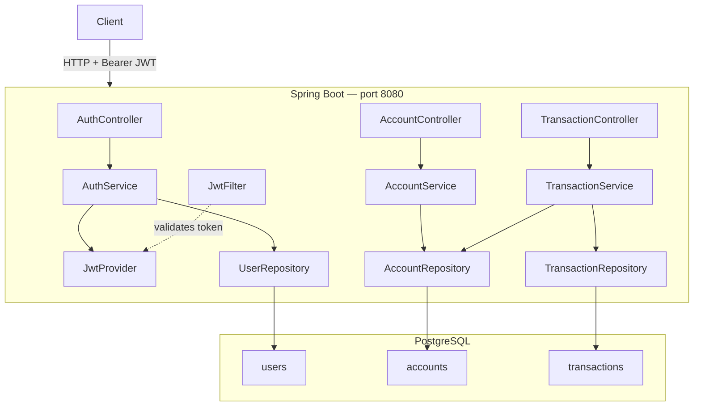
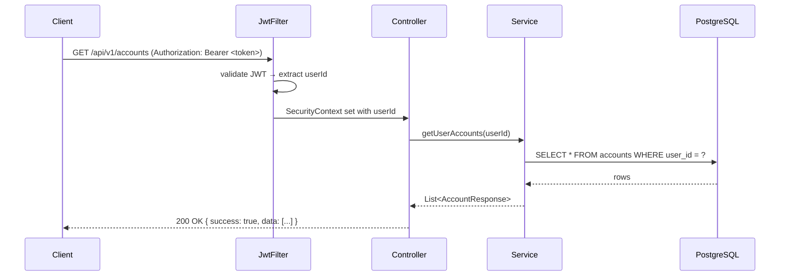

# eBank Monolith

Spring Boot modular monolith — JWT auth, accounts, transfers, PostgreSQL.

---

## Architecture



### Request flow (authenticated)



---

## Environments

| | **local** | **test** | **prod** |
|---|---|---|---|
| Profile | `local` (or default) | *(auto via `@SpringBootTest`)* | `prod` |
| Database | PostgreSQL `localhost:5432` | H2 in-memory | PostgreSQL (env vars) |
| DDL | `update` | `create-drop` | `validate` |
| SQL logs | on | off | off |
| JWT secret | hardcoded dev key | hardcoded test key | `$JWT_SECRET` env var |
| How to run | `./mvnw spring-boot:run` | `./mvnw test` | `docker compose up -d` |

---

## Quick Start

### Docker (recommended)

```bash
cp .env.example .env          # copy env template
docker compose up -d --build  # build image + start postgres + app
docker compose ps             # wait for (healthy) on both containers
curl http://localhost:8081/actuator/health
```

> Port **8081** is used to avoid conflicts. Change `"8081:8080"` → `"8080:8080"` in
> `docker-compose.yml` if 8080 is free.

### Local (app on JVM, DB in Docker)

```bash
docker compose up -d postgres              # start only PostgreSQL
./mvnw spring-boot:run \
  -Dspring-boot.run.profiles=local         # run app with local profile
```

### Tests

```bash
./mvnw test                                # all tests (H2, no Docker needed)
./mvnw test -Dtest=AuthControllerTest      # single class
```

---

## Example: full flow

```bash
BASE=http://localhost:8081

# 1. Register
TOKEN=$(curl -s -X POST $BASE/api/v1/auth/register \
  -H "Content-Type: application/json" \
  -d '{"email":"alice@bank.com","password":"Alice123!","fullName":"Alice"}' \
  | python3 -c "import sys,json; print(json.load(sys.stdin)['data']['token'])")

# 2. Create two accounts
A1=$(curl -s -X POST $BASE/api/v1/accounts \
  -H "Content-Type: application/json" -H "Authorization: Bearer $TOKEN" \
  -d '{"accountType":"CHECKING"}' \
  | python3 -c "import sys,json; print(json.load(sys.stdin)['data']['id'])")

A2=$(curl -s -X POST $BASE/api/v1/accounts \
  -H "Content-Type: application/json" -H "Authorization: Bearer $TOKEN" \
  -d '{"accountType":"SAVINGS"}' \
  | python3 -c "import sys,json; print(json.load(sys.stdin)['data']['id'])")

# 3. Transfer (will return "Insufficient balance" — accounts start at 0)
curl -s -X POST $BASE/api/v1/transactions/accounts/$A1/transfer \
  -H "Content-Type: application/json" -H "Authorization: Bearer $TOKEN" \
  -d "{\"toAccountId\":$A2,\"amount\":50,\"description\":\"Test\"}"
```

---

## Project Structure

```
src/main/
├── java/com/ebank/
│   ├── common/          # JWT, security filter, exception handler, base entity
│   ├── auth/            # register · login · profile
│   ├── account/         # create · list · get
│   └── transaction/     # transfer · history
└── resources/
    ├── application.yaml          # base config (env-var overrideable defaults)
    ├── application-local.yaml    # local dev (verbose SQL, localhost DB)
    └── application-prod.yaml     # production (validate DDL, quiet logging)

src/test/
├── java/com/ebank/
│   ├── auth/controller/AuthControllerTest.java
│   └── auth/service/AuthServiceTest.java
└── resources/
    └── application.yaml          # H2 in-memory, fixed test JWT secret
```

---

### Production deployment

```bash
# Build and push image
docker build -t your-registry/ebank-monolith:1.0.0 .
docker push your-registry/ebank-monolith:1.0.0

# On the server
cp .env.prod.example .env         # fill in real secrets
docker compose -f docker-compose.yml -f docker-compose.prod.yml up -d
```