# eBank Monolith — Knowledge Base

> Single reference consolidating all project knowledge with visual diagrams.

---

## Table of Contents

1. [Project Overview](#1-project-overview)
2. [Architecture](#2-architecture)
3. [Module Responsibilities](#3-module-responsibilities)
4. [Data Model](#4-data-model)
5. [Request & Auth Flows](#5-request--auth-flows)
6. [Configuration & Environments](#6-configuration--environments)
7. [HashiCorp Vault](#7-hashicorp-vault)
8. [Running Locally](#8-running-locally)
9. [API Reference](#9-api-reference)
10. [Testing Strategy](#10-testing-strategy)
11. [Docker Stack](#11-docker-stack)
12. [CI/CD Pipeline (Jenkins)](#12-cicd-pipeline-jenkins)
13. [GitOps with Argo CD](#13-gitops-with-argo-cd)
14. [Kubernetes & Helm](#14-kubernetes--helm)
15. [Infrastructure Setup Checklist](#15-infrastructure-setup-checklist)
16. [Troubleshooting](#16-troubleshooting)

---

## 1. Project Overview

**ebank-monolith** is a Spring Boot modular monolith — JWT auth, account management, money transfers — built as a DevOps/Cloud portfolio project.

| Property | Value |
|---|---|
| Language | Java 17 |
| Framework | Spring Boot 3.3.0 |
| Database | PostgreSQL 15 |
| Security | Spring Security + JWT (jjwt 0.12.x) |
| Config | Vault (dev/prod) · YAML (local) |
| Port | 8081 (host) → 8080 (container) |

---

## 2. Architecture

### High-Level Component View

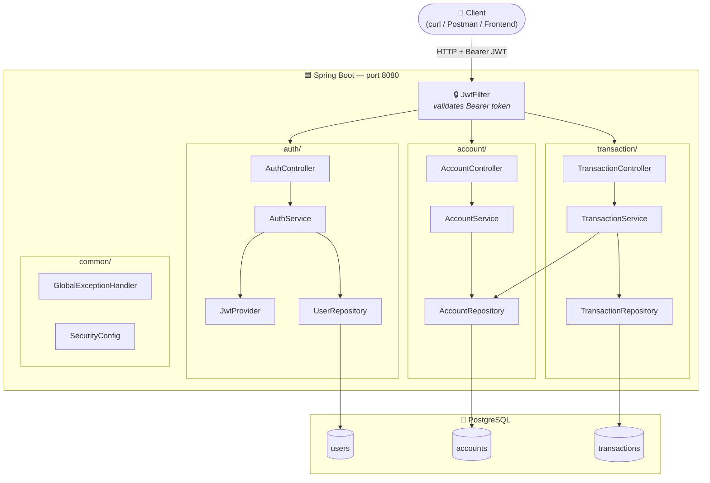
```mermaid
graph TD
    Client(["👤 Client<br/>(curl / Postman / Frontend)"])

    subgraph APP["🟦 Spring Boot — port 8080"]
        direction TB
        JF["🔒 JwtFilter<br/><i>validates Bearer token</i>"]

        subgraph AUTH["auth/"]
            AC["AuthController"] --> AS["AuthService"]
            AS --> JP["JwtProvider"]
            AS --> UR["UserRepository"]
        end

        subgraph ACCOUNT["account/"]
            ACC["AccountController"] --> ACS["AccountService"]
            ACS --> AR["AccountRepository"]
        end

        subgraph TXN["transaction/"]
            TC["TransactionController"] --> TS["TransactionService"]
            TS --> TR["TransactionRepository"]
            TS --> AR
        end

        subgraph COMMON["common/"]
            GEH["GlobalExceptionHandler"]
            SC["SecurityConfig"]
        end
    end

    subgraph DB["🐘 PostgreSQL"]
        T1[("users")]
        T2[("accounts")]
        T3[("transactions")]
    end

    Client -->|"HTTP + Bearer JWT"| JF
    JF --> AUTH & ACCOUNT & TXN
    UR --> T1
    AR --> T2
    TR --> T3
```

### Layered Architecture (per module)

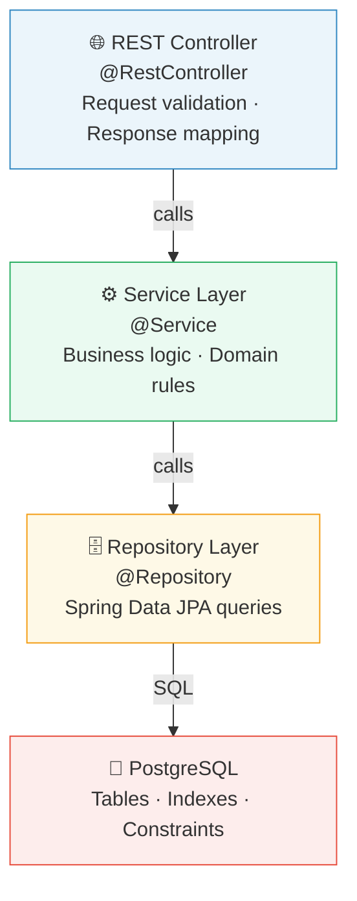
```mermaid
graph TD
    A["🌐 REST Controller<br/>@RestController<br/>Request validation · Response mapping"]
    B["⚙️ Service Layer<br/>@Service<br/>Business logic · Domain rules"]
    C["🗄️ Repository Layer<br/>@Repository<br/>Spring Data JPA queries"]
    D["🐘 PostgreSQL<br/>Tables · Indexes · Constraints"]

    A -->|"calls"| B
    B -->|"calls"| C
    C -->|"SQL"| D

    style A fill:#EBF5FB,stroke:#2E86C1
    style B fill:#EAFAF1,stroke:#27AE60
    style C fill:#FEF9E7,stroke:#F39C12
    style D fill:#FDEDEC,stroke:#E74C3C
```

---

## 3. Module Responsibilities

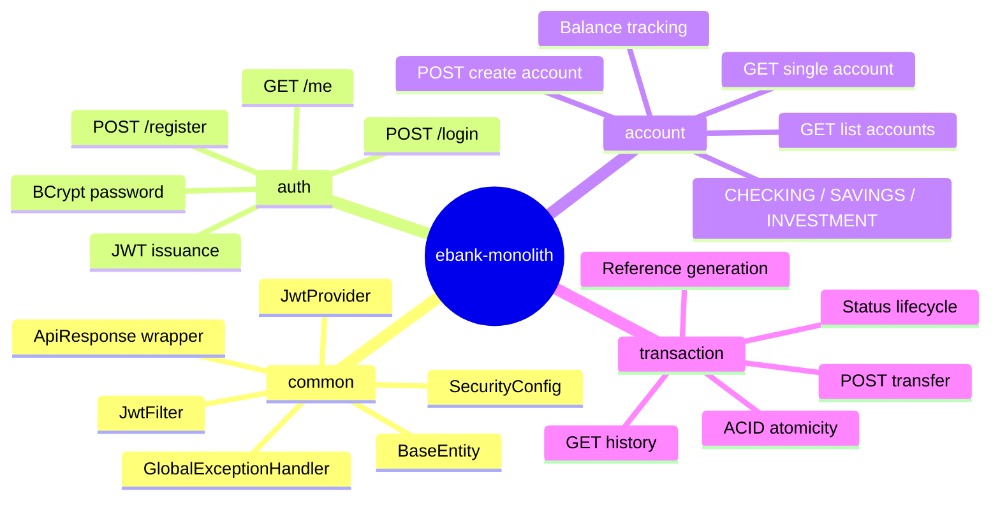
```mermaid
mindmap
  root((ebank-monolith))
    common
      SecurityConfig
      JwtFilter
      JwtProvider
      GlobalExceptionHandler
      ApiResponse wrapper
      BaseEntity
    auth
      POST /register
      POST /login
      GET /me
      BCrypt password
      JWT issuance
    account
      POST create account
      GET list accounts
      GET single account
      CHECKING / SAVINGS / INVESTMENT
      Balance tracking
    transaction
      POST transfer
      GET history
      ACID atomicity
      Reference generation
      Status lifecycle
```

---

## 4. Data Model

### Entity Relationship Diagram

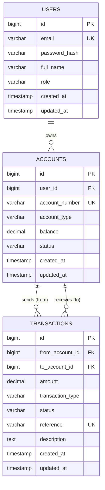
```mermaid
erDiagram
    USERS {
        bigint id PK
        varchar email UK
        varchar password_hash
        varchar full_name
        varchar role
        timestamp created_at
        timestamp updated_at
    }

    ACCOUNTS {
        bigint id PK
        bigint user_id FK
        varchar account_number UK
        varchar account_type
        decimal balance
        varchar status
        timestamp created_at
        timestamp updated_at
    }

    TRANSACTIONS {
        bigint id PK
        bigint from_account_id FK
        bigint to_account_id FK
        decimal amount
        varchar transaction_type
        varchar status
        varchar reference UK
        text description
        timestamp created_at
        timestamp updated_at
    }

    USERS ||--o{ ACCOUNTS : "owns"
    ACCOUNTS ||--o{ TRANSACTIONS : "sends (from)"
    ACCOUNTS ||--o{ TRANSACTIONS : "receives (to)"
```

### Enum Values

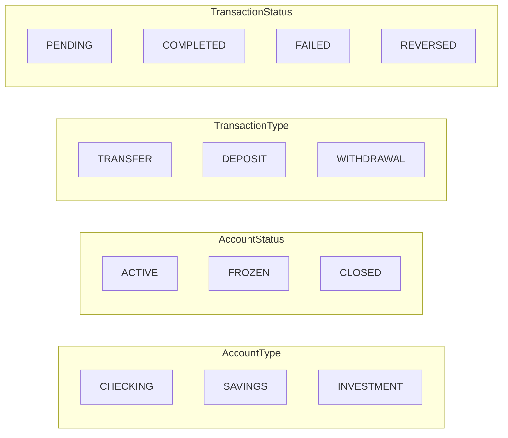
```mermaid
graph LR
    subgraph AccountType
        AT1["CHECKING"]
        AT2["SAVINGS"]
        AT3["INVESTMENT"]
    end

    subgraph AccountStatus
        AS1["ACTIVE"]
        AS2["FROZEN"]
        AS3["CLOSED"]
    end

    subgraph TransactionType
        TT1["TRANSFER"]
        TT2["DEPOSIT"]
        TT3["WITHDRAWAL"]
    end

    subgraph TransactionStatus
        TS1["PENDING"]
        TS2["COMPLETED"]
        TS3["FAILED"]
        TS4["REVERSED"]
    end
```

---

## 5. Request & Auth Flows

### Authenticated Request Flow

```mermaid
sequenceDiagram
    participant C as 👤 Client
    participant F as 🔒 JwtFilter
    participant Ctrl as 🌐 Controller
    participant Svc as ⚙️ Service
    participant DB as 🐘 PostgreSQL

    C->>F: GET /api/v1/accounts<br/>Authorization: Bearer <token>
    F->>F: Extract token from header
    F->>F: Validate JWT signature + expiry
    F->>F: Extract userId from claims
    F->>Ctrl: Set SecurityContext(userId)
    Ctrl->>Svc: getUserAccounts(userId)
    Svc->>DB: SELECT * FROM accounts WHERE user_id = ?
    DB-->>Svc: List of accounts
    Svc-->>Ctrl: List&lt;AccountResponse&gt;
    Ctrl-->>C: 200 OK { success: true, data: [...] }
```

### Register Flow

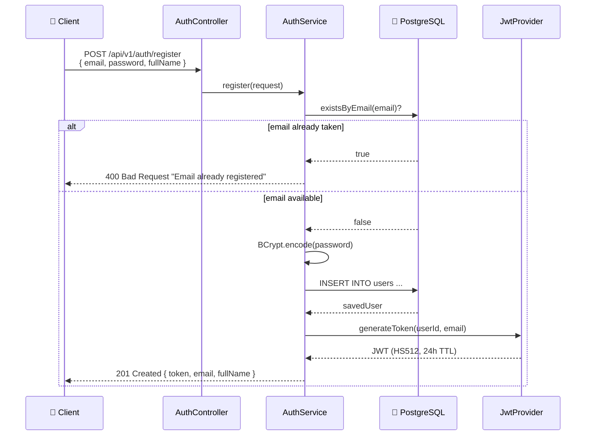
```mermaid
sequenceDiagram
    participant C as 👤 Client
    participant AC as AuthController
    participant AS as AuthService
    participant DB as 🐘 PostgreSQL
    participant JP as JwtProvider

    C->>AC: POST /api/v1/auth/register<br/>{ email, password, fullName }
    AC->>AS: register(request)
    AS->>DB: existsByEmail(email)?
    alt email already taken
        DB-->>AS: true
        AS-->>C: 400 Bad Request "Email already registered"
    else email available
        DB-->>AS: false
        AS->>AS: BCrypt.encode(password)
        AS->>DB: INSERT INTO users ...
        DB-->>AS: savedUser
        AS->>JP: generateToken(userId, email)
        JP-->>AS: JWT (HS512, 24h TTL)
        AS-->>C: 201 Created { token, email, fullName }
    end
```

### Transfer Flow

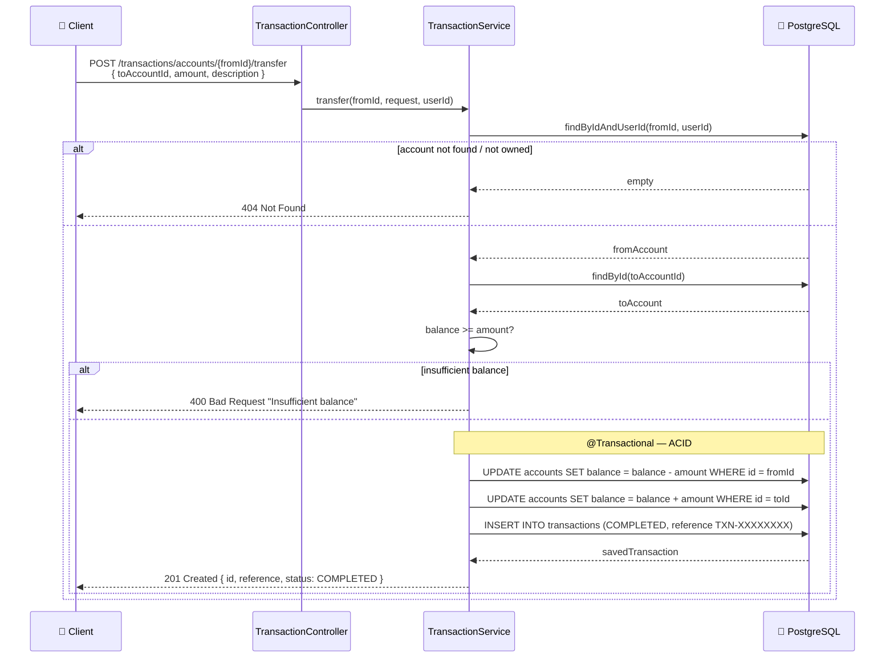
```mermaid
sequenceDiagram
    participant C as 👤 Client
    participant TC as TransactionController
    participant TS as TransactionService
    participant DB as 🐘 PostgreSQL

    C->>TC: POST /transactions/accounts/{fromId}/transfer<br/>{ toAccountId, amount, description }
    TC->>TS: transfer(fromId, request, userId)
    TS->>DB: findByIdAndUserId(fromId, userId)
    alt account not found / not owned
        DB-->>TS: empty
        TS-->>C: 404 Not Found
    else
        DB-->>TS: fromAccount
        TS->>DB: findById(toAccountId)
        DB-->>TS: toAccount
        TS->>TS: balance >= amount?
        alt insufficient balance
            TS-->>C: 400 Bad Request "Insufficient balance"
        else
            Note over TS,DB: @Transactional — ACID
            TS->>DB: UPDATE accounts SET balance = balance - amount WHERE id = fromId
            TS->>DB: UPDATE accounts SET balance = balance + amount WHERE id = toId
            TS->>DB: INSERT INTO transactions (COMPLETED, reference TXN-XXXXXXXX)
            DB-->>TS: savedTransaction
            TS-->>C: 201 Created { id, reference, status: COMPLETED }
        end
    end
```

---

## 6. Configuration & Environments

### Profile Decision Tree

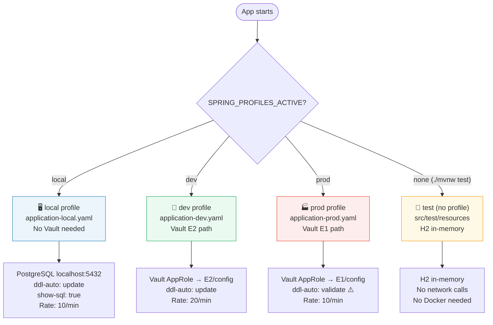
```mermaid
flowchart TD
    START(["App starts"])
    Q1{"SPRING_PROFILES_ACTIVE?"}
    LOCAL["🖥️ local profile<br/>application-local.yaml<br/>No Vault needed"]
    DEV["🧪 dev profile<br/>application-dev.yaml<br/>Vault E2 path"]
    PROD["🏭 prod profile<br/>application-prod.yaml<br/>Vault E1 path"]
    TEST["🧪 test (no profile)<br/>src/test/resources<br/>H2 in-memory"]

    START --> Q1
    Q1 -->|"local"| LOCAL
    Q1 -->|"dev"| DEV
    Q1 -->|"prod"| PROD
    Q1 -->|"none (./mvnw test)"| TEST

    LOCAL --> L1["PostgreSQL localhost:5432<br/>ddl-auto: update<br/>show-sql: true<br/>Rate: 10/min"]
    DEV --> D1["Vault AppRole → E2/config<br/>ddl-auto: update<br/>Rate: 20/min"]
    PROD --> P1["Vault AppRole → E1/config<br/>ddl-auto: validate ⚠️<br/>Rate: 10/min"]
    TEST --> T1["H2 in-memory<br/>No network calls<br/>No Docker needed"]

    style LOCAL fill:#EBF5FB,stroke:#2E86C1
    style DEV fill:#EAFAF1,stroke:#27AE60
    style PROD fill:#FDEDEC,stroke:#E74C3C
    style TEST fill:#FEF9E7,stroke:#F39C12
```

### Environment Comparison

| | local | dev (E2) | prod (E1) | test |
|---|---|---|---|---|
| Config source | YAML | Vault | Vault | YAML (H2) |
| Vault auth | None | AppRole | AppRole | None |
| DDL auto | `update` | `update` | `validate` | create-drop |
| show-sql | on | off | off | off |
| Rate limit | 10/min | 20/min | 10/min | — |
| Actuator | health + info | health + info | health only | — |

### Spring Property Priority

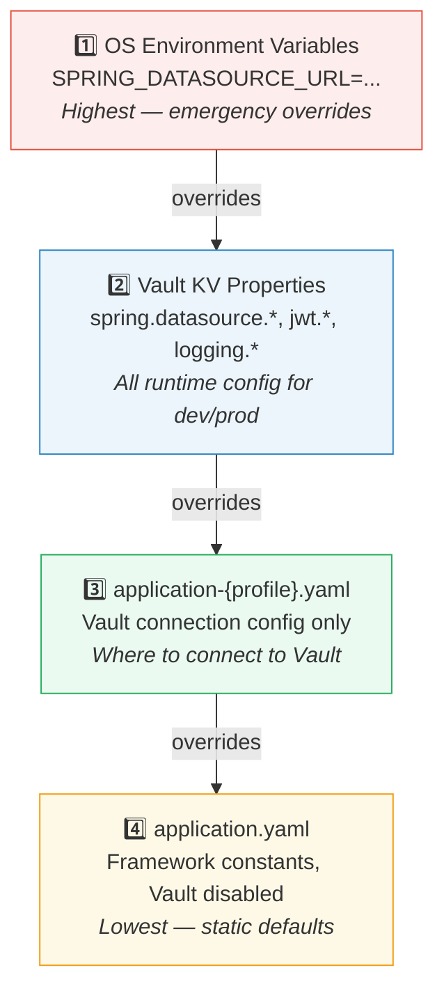
```mermaid
graph TD
    E["1️⃣ OS Environment Variables<br/>SPRING_DATASOURCE_URL=...<br/><i>Highest — emergency overrides</i>"]
    V["2️⃣ Vault KV Properties<br/>spring.datasource.*, jwt.*, logging.*<br/><i>All runtime config for dev/prod</i>"]
    P["3️⃣ application-{profile}.yaml<br/>Vault connection config only<br/><i>Where to connect to Vault</i>"]
    B["4️⃣ application.yaml<br/>Framework constants, Vault disabled<br/><i>Lowest — static defaults</i>"]

    E -->|"overrides"| V
    V -->|"overrides"| P
    P -->|"overrides"| B

    style E fill:#FDEDEC,stroke:#E74C3C
    style V fill:#EBF5FB,stroke:#2E86C1
    style P fill:#EAFAF1,stroke:#27AE60
    style B fill:#FEF9E7,stroke:#F39C12
```

---

## 7. HashiCorp Vault

### Mental Model — What Vault Replaces

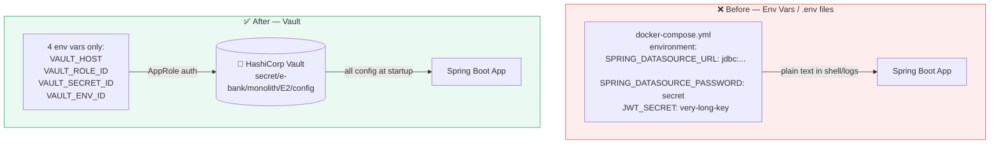
```mermaid
graph TD
    subgraph BEFORE["❌ Before — Env Vars / .env files"]
        ENV["docker-compose.yml<br/>environment:<br/>  SPRING_DATASOURCE_URL: jdbc:...<br/>  SPRING_DATASOURCE_PASSWORD: secret<br/>  JWT_SECRET: very-long-key"]
        APP1["Spring Boot App"]
        ENV -->|"plain text in shell/logs"| APP1
    end

    subgraph AFTER["✅ After — Vault"]
        CREDS["4 env vars only:<br/>VAULT_HOST<br/>VAULT_ROLE_ID<br/>VAULT_SECRET_ID<br/>VAULT_ENV_ID"]
        VLT[("🔐 HashiCorp Vault<br/>secret/e-bank/monolith/E2/config")]
        APP2["Spring Boot App"]
        CREDS -->|"AppRole auth"| VLT
        VLT -->|"all config at startup"| APP2
    end

    style BEFORE fill:#FDEDEC,stroke:#E74C3C
    style AFTER fill:#EAFAF1,stroke:#27AE60
```

### Vault Path Structure

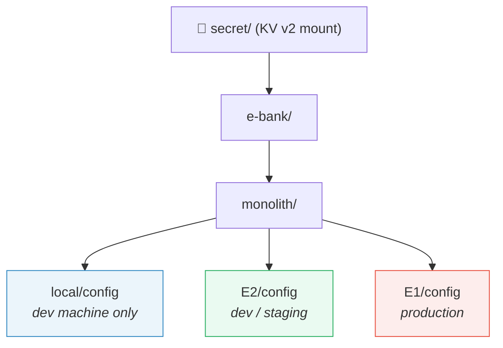
```mermaid
graph TD
    ROOT["🔐 secret/ (KV v2 mount)"]
    EB["e-bank/"]
    MON["monolith/"]
    L["local/config<br/><i>dev machine only</i>"]
    E2["E2/config<br/><i>dev / staging</i>"]
    E1["E1/config<br/><i>production</i>"]

    ROOT --> EB --> MON
    MON --> L & E2 & E1

    style E1 fill:#FDEDEC,stroke:#E74C3C
    style E2 fill:#EAFAF1,stroke:#27AE60
    style L fill:#EBF5FB,stroke:#2E86C1
```

### AppRole Authentication Flow

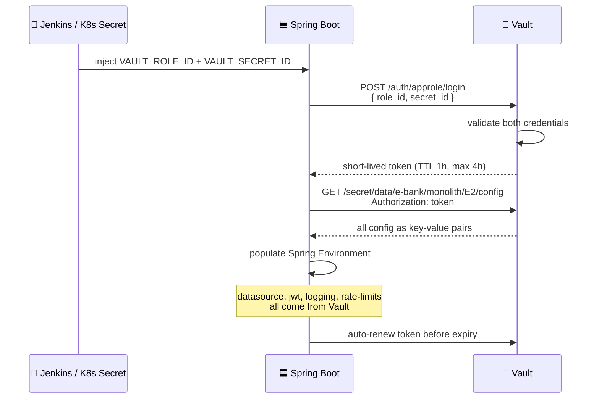
```mermaid
sequenceDiagram
    participant CI as 🤖 Jenkins / K8s Secret
    participant APP as 🟦 Spring Boot
    participant VLT as 🔐 Vault

    CI->>APP: inject VAULT_ROLE_ID + VAULT_SECRET_ID
    APP->>VLT: POST /auth/approle/login<br/>{ role_id, secret_id }
    VLT->>VLT: validate both credentials
    VLT-->>APP: short-lived token (TTL 1h, max 4h)
    APP->>VLT: GET /secret/data/e-bank/monolith/E2/config<br/>Authorization: token
    VLT-->>APP: all config as key-value pairs
    APP->>APP: populate Spring Environment
    Note over APP: datasource, jwt, logging, rate-limits<br/>all come from Vault
    APP->>VLT: auto-renew token before expiry
```

### Config in Vault vs YAML

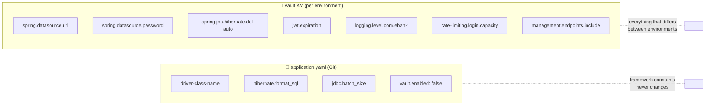
```mermaid
graph LR
    subgraph YAML["📄 application.yaml (Git)"]
        Y1["driver-class-name"]
        Y2["hibernate.format_sql"]
        Y3["jdbc.batch_size"]
        Y4["vault.enabled: false"]
    end

    subgraph VAULT["🔐 Vault KV (per environment)"]
        V1["spring.datasource.url"]
        V2["spring.datasource.password"]
        V3["spring.jpa.hibernate.ddl-auto"]
        V4["jwt.expiration"]
        V5["logging.level.com.ebank"]
        V6["rate-limiting.login.capacity"]
        V7["management.endpoints.include"]
    end

    YAML -. "framework constants\nnever changes" .- X1[" "]
    VAULT -. "everything that differs\nbetween environments" .- X2[" "]
```

---

## 8. Running Locally

### Local Stack Overview

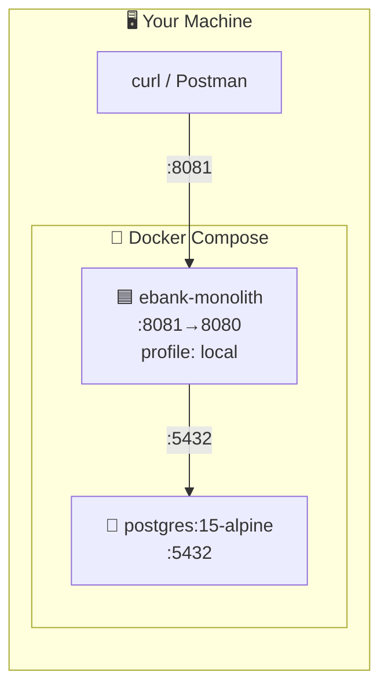
```mermaid
graph LR
    subgraph HOST["🖥️ Your Machine"]
        CLI["curl / Postman"]
        subgraph DOCKER["🐋 Docker Compose"]
            PG["🐘 postgres:15-alpine<br/>:5432"]
            APP["🟦 ebank-monolith<br/>:8081→8080<br/>profile: local"]
        end
        CLI -->|":8081"| APP
        APP -->|":5432"| PG
    end
```

### With Vault Overlay

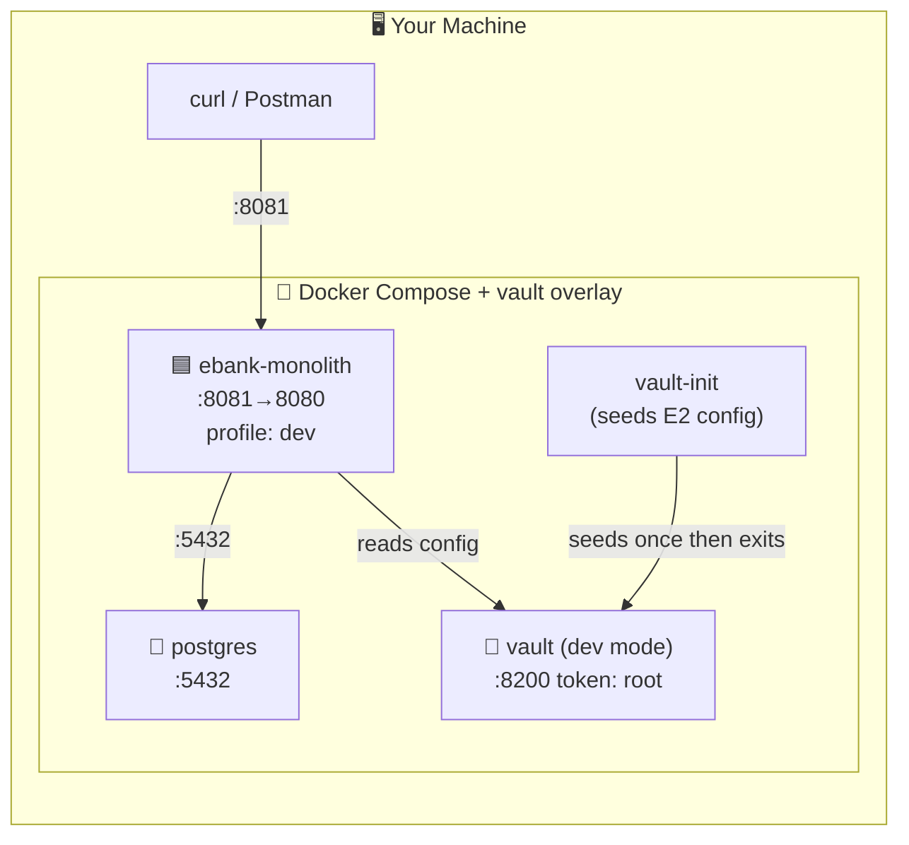
```mermaid
graph LR
    subgraph HOST["🖥️ Your Machine"]
        CLI["curl / Postman"]
        subgraph DOCKER["🐋 Docker Compose + vault overlay"]
            PG["🐘 postgres<br/>:5432"]
            VLT["🔐 vault (dev mode)<br/>:8200  token: root"]
            INIT["vault-init<br/>(seeds E2 config)"]
            APP["🟦 ebank-monolith<br/>:8081→8080<br/>profile: dev"]
        end
        CLI -->|":8081"| APP
        APP -->|":5432"| PG
        APP -->|"reads config"| VLT
        INIT -->|"seeds once then exits"| VLT
    end
```

### Quick Start Commands

```bash
# Option A — local profile (no Vault)
docker compose up -d postgres
./mvnw spring-boot:run -Dspring-boot.run.profiles=local

# Option B — dev profile with Vault
docker compose -f docker-compose.yml -f docker-compose.vault.yml up -d --build

# Tests (no Docker needed)
./mvnw test
./mvnw clean test jacoco:report   # coverage at target/site/jacoco/index.html

# Health check
curl http://localhost:8081/actuator/health
```

---

## 9. API Reference

### Endpoint Map

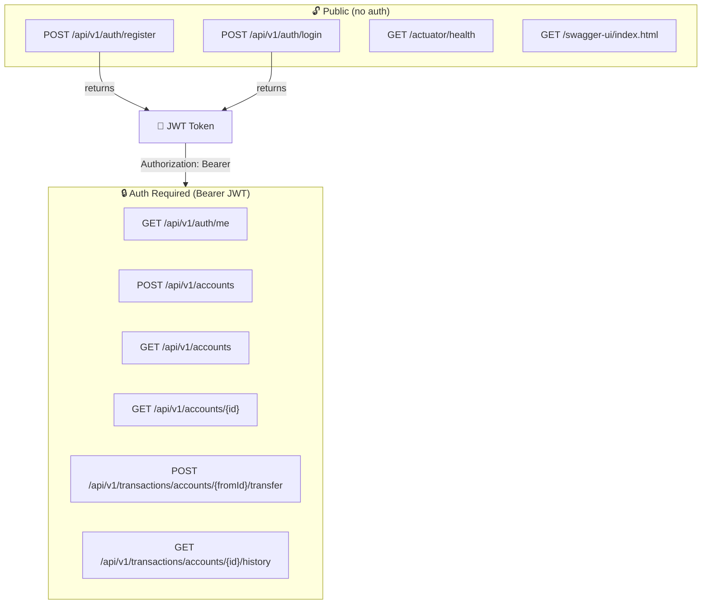
```mermaid
graph TD
    subgraph PUBLIC["🔓 Public (no auth)"]
        R["POST /api/v1/auth/register"]
        L["POST /api/v1/auth/login"]
        H["GET /actuator/health"]
        SW["GET /swagger-ui/index.html"]
    end

    subgraph AUTH_EP["🔒 Auth Required (Bearer JWT)"]
        ME["GET /api/v1/auth/me"]
        CA["POST /api/v1/accounts"]
        LA["GET /api/v1/accounts"]
        GA["GET /api/v1/accounts/{id}"]
        TR["POST /api/v1/transactions/accounts/{fromId}/transfer"]
        HI["GET /api/v1/transactions/accounts/{id}/history"]
    end

    JWT["🔑 JWT Token"]
    R -->|"returns"| JWT
    L -->|"returns"| JWT
    JWT -->|"Authorization: Bearer"| AUTH_EP
```

---

## 10. Testing Strategy

### Test Pyramid

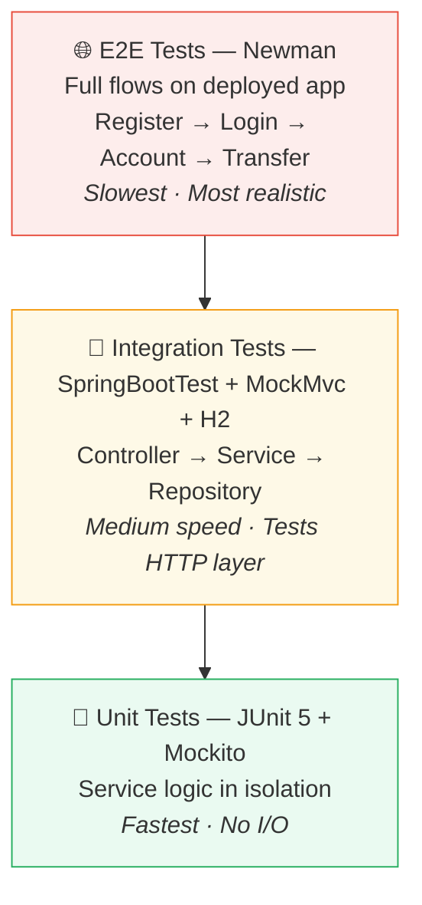
```mermaid
graph TD
    E2E["🌐 E2E Tests — Newman<br/>Full flows on deployed app<br/>Register → Login → Account → Transfer<br/><i>Slowest · Most realistic</i>"]
    INT["🔗 Integration Tests — SpringBootTest + MockMvc + H2<br/>Controller → Service → Repository<br/><i>Medium speed · Tests HTTP layer</i>"]
    UNIT["🧪 Unit Tests — JUnit 5 + Mockito<br/>Service logic in isolation<br/><i>Fastest · No I/O</i>"]

    E2E --> INT --> UNIT

    style E2E fill:#FDEDEC,stroke:#E74C3C
    style INT fill:#FEF9E7,stroke:#F39C12
    style UNIT fill:#EAFAF1,stroke:#27AE60
```

### Test Configuration

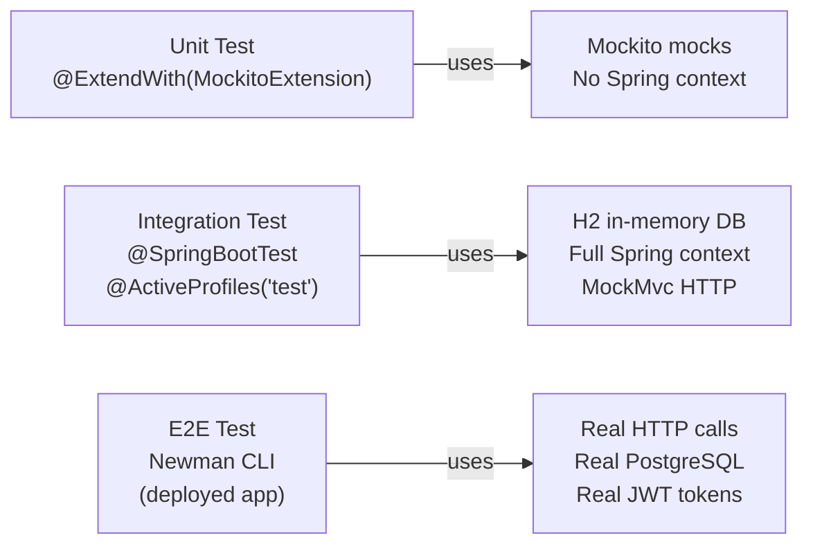
```mermaid
flowchart LR
    UT["Unit Test<br/>@ExtendWith(MockitoExtension)"]
    IT["Integration Test<br/>@SpringBootTest<br/>@ActiveProfiles('test')"]
    E2["E2E Test<br/>Newman CLI<br/>(deployed app)"]

    UT -->|"uses"| MOCK["Mockito mocks<br/>No Spring context"]
    IT -->|"uses"| H2["H2 in-memory DB<br/>Full Spring context<br/>MockMvc HTTP"]
    E2 -->|"uses"| LIVE["Real HTTP calls<br/>Real PostgreSQL<br/>Real JWT tokens"]
```

---

## 11. Docker Stack

### Container Architecture

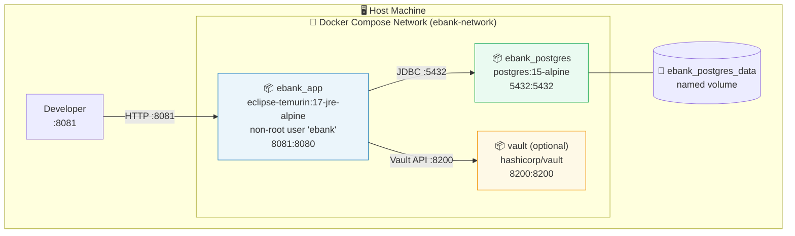
```mermaid
graph TD
    subgraph HOST["🖥️ Host Machine"]
        DEV["Developer<br/>:8081"]

        subgraph DC["🐋 Docker Compose Network (ebank-network)"]
            APP["📦 ebank_app<br/>eclipse-temurin:17-jre-alpine<br/>non-root user 'ebank'<br/>8081:8080"]
            PG["📦 ebank_postgres<br/>postgres:15-alpine<br/>5432:5432"]
            VLT["📦 vault (optional)<br/>hashicorp/vault<br/>8200:8200"]
        end

        VOL[("💾 ebank_postgres_data<br/>named volume")]
    end

    DEV -->|"HTTP :8081"| APP
    APP -->|"JDBC :5432"| PG
    APP -->|"Vault API :8200"| VLT
    PG --- VOL

    style APP fill:#EBF5FB,stroke:#2E86C1
    style PG fill:#EAFAF1,stroke:#27AE60
    style VLT fill:#FEF9E7,stroke:#F39C12
```

### Dockerfile — Multi-Stage Build

```mermaid
graph TD
    S1["Stage 1: deps<br/>maven:3.9.6-eclipse-temurin-17<br/>COPY pom.xml<br/>RUN mvn dependency:resolve<br/><i>Cached until pom.xml changes</i>"]
    S2["Stage 2: builder<br/>inherits from deps<br/>COPY src/<br/>RUN mvn package -DskipTests<br/><i>Only reruns when source changes</i>"]
    S3["Stage 3: runtime<br/>eclipse-temurin:17-jre-alpine (~80MB smaller)<br/>COPY --from=builder app.jar<br/>USER ebank (non-root)<br/>JVM: UseContainerSupport + MaxRAMPercentage=75"]

    S1 -->|"15s rebuild (src change)"| S2
    S2 -->|"copies JAR only"| S3

    CACHE["⚡ Layer Cache<br/>pom.xml unchanged → deps layer reused<br/>src/ changed → only compile reruns"]

    style S1 fill:#EBF5FB,stroke:#2E86C1
    style S2 fill:#FEF9E7,stroke:#F39C12
    style S3 fill:#EAFAF1,stroke:#27AE60
    style CACHE fill:#F0F0F0,stroke:#999
```

---

## 12. CI/CD Pipeline (Jenkins)

### Full Pipeline Flowchart

```mermaid
flowchart TD
    PUSH(["🔀 Git Push / Pull Request"])
    CHECKOUT["📥 Checkout\nclone + env setup"]

    PUSH --> CHECKOUT

    subgraph CI["🔵 CONTINUOUS INTEGRATION"]
        direction TB

        CHECKOUT --> VALID["🔍 CI-1 · Validation\nMaven Enforcer · Checkstyle\nJava 17+ · style rules"]

        VALID --> BUILD["🔨 CI-2 · Build\nmvn clean package -DskipTests\nJAR → target/"]

        BUILD --> UNIT["🧪 CI-3 · Unit Tests\nJUnit 5 · Mockito · H2"]

        UNIT --> INTEG["🔗 CI-4 · Integration Tests\nSpringBootTest · MockMvc · H2"]

        INTEG --> STATIC_PAR

        subgraph STATIC_PAR["⚡ Parallel — Static Analysis"]
            direction LR
            OWASP["🛡️ CI-5a · OWASP\nDependency-Check\nCVSS ≥ 7 → FAIL\nscans Maven deps"]
            SBOM["📋 CI-5b · SBOM\nCycloneDX\nbom.json · bom.xml\nlicenses + hashes"]
        end

        STATIC_PAR --> SONAR["📊 CI-6 · SonarQube\nbugs · smells · coverage\nvulnerabilities · duplication"]

        SONAR --> GATE{"✅ CI-7 · Quality Gate\nOK / ERROR"}

        GATE -->|"✅ Pass"| DBUILD["🐳 CI-8 · Docker Build\nMulti-stage · JRE Alpine\ntag: branch-sha7-buildNum"]
        GATE -->|"❌ Fail"| ABORT(["🚫 Pipeline Stopped"])

        DBUILD --> IMAGE_PAR

        subgraph IMAGE_PAR["⚡ Parallel — Image Security"]
            direction LR
            TRIVY["🔍 CI-9a · Trivy\nCVE scan on image\nOS packages + JARs\nHIGH/CRITICAL → FAIL"]
            HADOLINT["📝 CI-9b · Hadolint\nDockerfile lint\nbest practices"]
            CHECKOV["🏗️ CI-9c · Checkov\nK8s manifests IaC\nCIS Benchmarks"]
        end

        IMAGE_PAR --> PUSH_IMG["📤 CI-10 · Push Image\nDocker Hub\nbranch-sha-num\n+ latest if main"]
    end

    subgraph CD["🟢 CONTINUOUS DEPLOYMENT"]
        direction TB

        PUSH_IMG --> DEPLOY["☸️ CD-1 · Deploy K8s\nHelm upgrade --atomic\nRolling Update\nmaxSurge=1 · maxUnavailable=0"]

        DEPLOY --> SMOKE["💨 CD-2 · Smoke Test\n/actuator/health → UP\n60s timeout · retry every 5s"]

        SMOKE --> POST_PAR

        subgraph POST_PAR["⚡ Parallel — Post-Deploy"]
            direction LR
            ZAP["🔐 CD-3a · OWASP ZAP\nDAST — passive API scan\nreads OpenAPI /v3/api-docs\nHTTP headers · auth · CORS"]
            E2E["🌐 CD-3b · Newman E2E\nRegister→Login\n→Account→Transfer\nJUnit XML report"]
        end

        POST_PAR --> ACCESS["♿ CD-4 · Pa11y\nWCAG 2.1 AA\nSwagger UI accessibility"]

        ACCESS --> GREEN["🌱 CD-5 · Green IT\nEcoIndex score A–G\nkubectl top CPU/RAM"]

        GREEN --> SUCCESS(["✅ Deploy Validated"])
    end

    SMOKE -->|"❌ Fail"| ROLLBACK["🔄 Auto Rollback\nkubectl rollout undo\nrevert to revision N-1"]
    ROLLBACK --> NOTIF(["📧 Failure Notification"])
    ABORT --> NOTIF

    style CI fill:#EBF5FB,stroke:#2E86C1,stroke-width:2px
    style CD fill:#EAFAF1,stroke:#27AE60,stroke-width:2px
    style STATIC_PAR fill:#FEF9E7,stroke:#F39C12
    style IMAGE_PAR fill:#FEF9E7,stroke:#F39C12
    style POST_PAR fill:#FEF9E7,stroke:#F39C12
    style ABORT fill:#FDEDEC,stroke:#E74C3C
    style ROLLBACK fill:#FDEDEC,stroke:#E74C3C
    style SUCCESS fill:#EAFAF1,stroke:#27AE60
```

### SAST vs DAST — Complementary Security Layers

```mermaid
graph LR
    subgraph SAST["🔍 Static (SAST) — CI"]
        OW["OWASP Dependency-Check<br/>Maven pom.xml deps only"]
        SQ["SonarQube<br/>Source code patterns"]
        TR["Trivy<br/>Docker image layers<br/>(OS + JARs)"]
    end

    subgraph DAST["🎯 Dynamic (DAST) — CD"]
        ZAP["OWASP ZAP<br/>Running app<br/>HTTP headers · injections · CORS"]
    end

    CODE["📝 Source Code"]
    IMAGE["🐳 Docker Image"]
    RUNNING["🏃 Deployed App"]

    CODE --> OW & SQ
    IMAGE --> TR
    RUNNING --> ZAP

    style SAST fill:#EBF5FB,stroke:#2E86C1
    style DAST fill:#FDEDEC,stroke:#E74C3C
```

### Tool Alternatives Reference

| Stage | Tool Used | Alternative 1 | Alternative 2 |
|---|---|---|---|
| Code style | Checkstyle | PMD | SpotBugs |
| Dep CVEs | OWASP Dependency-Check | Snyk | Dependabot |
| SBOM | CycloneDX | Syft | Trivy SBOM |
| Code quality | SonarQube Community | SonarCloud | SpotBugs+PMD |
| Image CVEs | Trivy | Grype | Docker Scout |
| Dockerfile | Hadolint | Dockle | — |
| IaC scan | Checkov | kube-score | kubesec |
| DAST | OWASP ZAP | Nuclei | Burp Suite Enterprise |
| E2E | Newman (Postman) | Karate DSL | REST Assured |
| Accessibility | Pa11y | axe-cli | Lighthouse CI |
| Green IT | EcoIndex CLI | GreenFrame | Scaphandre + Kepler |

---

## 13. GitOps with Argo CD

### Push-Based vs Pull-Based CD

```mermaid
graph TD
    subgraph PUSH["❌ Push-based (before GitOps)"]
        direction LR
        D1["Dev pushes code"] --> CI1["CI builds image"]
        CI1 --> JEN["Jenkins kubectl apply → Cluster"]
        JEN -.->|"no history\ndrift possible\nCI needs cluster creds"| PROB["⚠️ Problems"]
    end

    subgraph PULL["✅ Pull-based (GitOps)"]
        direction LR
        D2["Dev pushes code"] --> CI2["CI builds image"]
        CI2 -->|"commits tag to Git"| GIT2["Git repo\nenvironments/dev/values.yaml"]
        GIT2 -->|"Argo CD polls/webhook"| ARGO["Argo CD detects change"]
        ARGO -->|"pulls + applies"| CLU["Cluster"]
    end

    style PUSH fill:#FDEDEC,stroke:#E74C3C
    style PULL fill:#EAFAF1,stroke:#27AE60
```

### GitOps Full Architecture

```mermaid
flowchart TD
    subgraph GH["☁️ GitHub Repository"]
        FEAT["feature/*"]
        DEV["develop"]
        MAIN["main"]

        FEAT -->|"PR"| DEV
        DEV -->|"PR + review"| MAIN
    end

    subgraph GHA["⚡ GitHub Actions"]
        CI_WF["ci.yml\nPR gate: test · lint · trivy"]
        PROMOTE["gitops-promote.yml\nOn push: build + update tag"]
    end

    subgraph HELM_FILES["📁 Helm environments/ (in Git)"]
        DEV_VAL["environments/dev/values.yaml\nimage.tag: abc1234"]
        PROD_VAL["environments/prod/values.yaml\nimage.tag: def5678"]
    end

    subgraph ARGO["🔄 Argo CD (in K8s)"]
        APP_DEV["ebank-monolith-dev\nnamespace: ebank-dev\nbranch: develop\nauto-sync ✓"]
        APP_PROD["ebank-monolith-prod\nnamespace: ebank-prod\nbranch: main\nauto-sync ✓"]
    end

    subgraph K8S["☸️ Kubernetes"]
        NS_DEV["ebank-dev\nSpring: dev · Vault: E2"]
        NS_PROD["ebank-prod\nSpring: prod · Vault: E1"]
    end

    GH --> GHA
    PROMOTE -->|"commits image tag"| DEV_VAL & PROD_VAL
    DEV_VAL -->|"detected by"| APP_DEV
    PROD_VAL -->|"detected by"| APP_PROD
    APP_DEV -->|"renders Helm + deploys"| NS_DEV
    APP_PROD -->|"renders Helm + deploys"| NS_PROD

    style ARGO fill:#EBF5FB,stroke:#2E86C1
    style K8S fill:#EAFAF1,stroke:#27AE60
```

### Dev Promotion Step by Step

```mermaid
sequenceDiagram
    participant Dev as 👤 Developer
    participant GH as GitHub
    participant GHA as GitHub Actions
    participant DHB as Docker Hub
    participant ARGO as Argo CD
    participant K8S as K8s (dev)

    Dev->>GH: git push feature/my-feature
    Dev->>GH: Open PR → develop
    GH->>GHA: Trigger ci.yml
    GHA->>GHA: Tests · helm lint · trivy scan
    GHA-->>Dev: ✅ All checks pass
    Dev->>GH: Merge PR to develop
    GH->>GHA: Trigger gitops-promote.yml
    GHA->>GHA: Run tests (safety net)
    GHA->>DHB: docker build + push :sha1234
    GHA->>GH: Commit environments/dev/values.yaml<br/>image.tag: sha1234 [skip ci]
    ARGO->>GH: Poll (or webhook) detects commit
    ARGO->>ARGO: Render Helm chart
    ARGO->>K8S: kubectl apply (Rolling Update)
    K8S-->>ARGO: Pods Ready ✅
    ARGO-->>Dev: Dev environment updated to sha1234
```

### Branching & Deploy Map

```mermaid
gitGraph
    commit id: "init"
    branch develop
    checkout develop
    commit id: "feat: accounts"
    branch feature/transfer
    checkout feature/transfer
    commit id: "wip: transfer"
    commit id: "add: transfer logic"
    checkout develop
    merge feature/transfer id: "PR merged → deploy E2"
    checkout main
    merge develop id: "PR + review → deploy E1"
    checkout develop
    commit id: "feat: rate limit"
```

---

## 14. Kubernetes & Helm

### K8s Resource Map

```mermaid
graph TD
    subgraph NS["☸️ Namespace: ebank"]
        ING["🌐 Ingress\nebank.local → /"]
        SVC["🔌 Service (ClusterIP)\nport 8080"]
        DEP["📦 Deployment\nreplicas: 1 (dev) · 3 (prod)\nrollingUpdate: maxSurge=1 · maxUnavailable=0"]
        HPA["📈 HPA\nCPU 70% · mem 80%\n1–5 pods (dev) · 2–10 pods (prod)"]
        PDB["🛡️ PodDisruptionBudget\nminAvailable: 2 (prod)"]
        NP["🔒 NetworkPolicy\ndeny-all + allow Vault/PG/DNS"]
        SA["👤 ServiceAccount\nno token auto-mount"]
        SEC["🔑 Secret: ebank-vault-approle\nVAULT_ROLE_ID · VAULT_SECRET_ID"]
    end

    ING --> SVC --> DEP
    HPA -.->|"scales"| DEP
    PDB -.->|"protects"| DEP
    NP -.->|"restricts"| DEP
    SA -.->|"bound to"| DEP
    SEC -.->|"env vars"| DEP
```

### Helm Values Layering

```mermaid
graph TD
    V1["📄 values.yaml\nChart defaults"]
    V2["📄 values-dev.yaml\n1 replica\nrelaxed resources\nVault host: vault-dev"]
    V3["📄 values-prod.yaml\n3 replicas\nTLS enabled\nhard anti-affinity\nVault host: vault-prod"]
    V4["📄 environments/dev/values.yaml\nimage.tag: abc1234\n(written by CI)"]
    V5["📄 environments/prod/values.yaml\nimage.tag: def5678\n(written by CI)"]

    V1 -->|"overridden by"| V2
    V1 -->|"overridden by"| V3
    V2 -->|"+ dynamic tag"| V4
    V3 -->|"+ dynamic tag"| V5

    V4 --> RDEV["🟡 Rendered dev chart"]
    V5 --> RPROD["🔴 Rendered prod chart"]

    style V4 fill:#EBF5FB,stroke:#2E86C1
    style V5 fill:#EBF5FB,stroke:#2E86C1
    style RDEV fill:#EAFAF1,stroke:#27AE60
    style RPROD fill:#FDEDEC,stroke:#E74C3C
```

### Pod Security Hardening

```mermaid
graph LR
    POD["🐳 Pod"]
    POD --> R1["runAsUser: 1000\nrunAsNonRoot: true"]
    POD --> R2["readOnlyRootFilesystem: true\n/tmp via emptyDir"]
    POD --> R3["capabilities.drop: ALL"]
    POD --> R4["seccompProfile: RuntimeDefault"]
    POD --> R5["automountServiceAccountToken: false"]
    POD --> R6["NetworkPolicy: deny-all\n+ allow Vault, PG, DNS only"]
    POD --> R7["terminationGracePeriodSeconds: 60\npreStop sleep for graceful drain"]
```

### Vault K8s Auth (future evolution)

```mermaid
graph LR
    subgraph NOW["Current: AppRole"]
        SEC["K8s Secret\nebank-vault-approle"]
        APP1["Spring Boot Pod"]
        VLT1["Vault"]
        SEC -->|"env vars"| APP1
        APP1 -->|"role_id + secret_id"| VLT1
    end

    subgraph FUTURE["Future: K8s Auth (no secrets needed)"]
        SA["Service Account Token\n(auto-mounted by K8s)"]
        APP2["Spring Boot Pod"]
        K8SAPI["K8s API"]
        VLT2["Vault"]
        SA -->|"JWT"| APP2
        APP2 -->|"present SA token"| VLT2
        VLT2 -->|"verify with"| K8SAPI
        VLT2 -->|"issue Vault token"| APP2
    end

    style NOW fill:#FEF9E7,stroke:#F39C12
    style FUTURE fill:#EAFAF1,stroke:#27AE60
```

---

## 15. Infrastructure Setup Checklist

### Local CI/CD Stack Architecture

```mermaid
graph TD
    subgraph HOST["🖥️ Host Machine"]
        BROWSER["🌐 Browser"]

        subgraph DOCKER_INFRA["🐋 docker-compose.infra.yml (network: cicd-net)"]
            JENKINS["🤖 ebank-jenkins\n:8090\nCustom image with:\nTrivy · Hadolint · Checkov\nNewman · Pa11y · envsubst"]
            SONAR["📊 ebank-sonarqube\n:9000"]
            SONARDB["🐘 ebank-sonarqube-db\npostgres:15-alpine"]
            JENKINS -->|"analysis reports"| SONAR
            SONAR --- SONARDB
            JENKINS -->|"Docker socket\n/var/run/docker.sock"| DSOCK["🐳 Docker Engine"]
        end

        subgraph MINIKUBE["☸️ Minikube (driver=docker)"]
            K8S["K8s cluster\nnamespace: ebank\nIngress: ebank.local"]
        end

        BROWSER -->|":8090 Jenkins UI"| JENKINS
        BROWSER -->|":9000 SonarQube UI"| SONAR
        BROWSER -->|"ebank.local"| K8S
        JENKINS -->|"kubectl deploy"| K8S
        DSOCK -->|"builds images\npushes to Docker Hub"| DHB["☁️ Docker Hub"]
    end
```

### Setup Sequence

```mermaid
sequenceDiagram
    participant U as 👤 You
    participant H as Host
    participant J as Jenkins
    participant S as SonarQube
    participant M as Minikube

    U->>H: sudo sysctl vm.max_map_count=524288
    U->>H: docker compose -f docker-compose.infra.yml up -d --build
    H->>J: start ebank-jenkins (custom image)
    H->>S: start ebank-sonarqube + postgres
    U->>J: http://localhost:8090 — initial setup
    U->>S: http://localhost:9000 — create project + generate token
    U->>H: minikube start --driver=docker --cpus=4 --memory=4096
    H->>M: cluster ready
    U->>H: minikube addons enable ingress metrics-server
    U->>H: echo "$(minikube ip) ebank.local" >> /etc/hosts
    U->>J: Add credentials (dockerhub · kubeconfig · sonarqube-token)
    U->>J: Configure SonarQube server (http://sonarqube:9000)
    U->>J: Create Pipeline job → Build Now
    J->>M: deploy via Helm
    M-->>U: ✅ http://ebank.local is live
```

### System Requirements

| Resource | Minimum | Notes |
|---|---|---|
| RAM | 8 GB | Jenkins 1GB + SonarQube 2.5GB + Minikube 2GB + app 512MB |
| CPU | 4 cores | Minikube needs at least 2 |
| Disk | 30 GB | Docker images + Maven cache + NVD database |
| OS | Linux (Ubuntu 22.04+) | Minikube driver=docker requires Docker Engine |

---

## 16. Troubleshooting

### Problem Decision Tree

```mermaid
flowchart TD
    PROB(["❌ Problem"])

    PROB --> Q1{"Where does it fail?"}

    Q1 -->|"App won't start"| A1["Check docker logs ebank_app"]
    A1 --> A2{"Error type?"}
    A2 -->|"WeakKeyException"| A3["JWT_SECRET < 64 bytes\nFix: openssl rand -hex 64"]
    A2 -->|"Connection refused"| A4["PostgreSQL not ready\nCheck: docker compose ps"]
    A2 -->|"Could not resolve VAULT_HOST"| A5["dev/prod profile active\nbut Vault env vars missing"]

    Q1 -->|"CI stage fails"| B1{"Which stage?"}
    B1 -->|"OWASP slow (>30min)"| B2["Normal on first run\nAdd NVD API key credential"]
    B1 -->|"Quality Gate timeout"| B3["Increase timeout to 10min\nor check SonarQube is UP"]
    B1 -->|"Docker permission denied"| B4["groupmod -g $(stat -c %g /var/run/docker.sock) docker\ndocker restart ebank-jenkins"]
    B1 -->|"kubectl conn refused"| B5["Regenerate kubeconfig with Docker bridge IP\nnot 127.0.0.1"]

    Q1 -->|"K8s deploy fails"| C1{"What kind?"}
    C1 -->|"Vault 403"| C2["vault token capabilities\nsecret/data/e-bank/monolith/E1/config\nExpected: read"]
    C1 -->|"Pods not Ready"| C3["kubectl describe pod -n ebank\nkubectl logs -n ebank -l app=ebank-monolith"]
    C1 -->|"Argo CD Degraded"| C4["argocd app get ebank-monolith-prod --show-operation\nCheck sync window (no auto-sync Mon-Fri 8-18h)"]

    style A3 fill:#FDEDEC,stroke:#E74C3C
    style A4 fill:#FDEDEC,stroke:#E74C3C
    style A5 fill:#FDEDEC,stroke:#E74C3C
```

### Quick Fixes Reference

```bash
# Reset database
docker compose down -v && docker compose up -d

# Reset full CI stack
docker compose -f docker-compose.infra.yml down -v
docker compose -f docker-compose.infra.yml up -d --build

# Fix kubectl in Jenkins (after Minikube restart)
DOCKER_HOST_IP=$(docker network inspect bridge --format='{{range .IPAM.Config}}{{.Gateway}}{{end}}')
minikube kubectl -- config view --flatten \
    | sed "s|https://127.0.0.1|https://${DOCKER_HOST_IP}|g" \
    > /tmp/kubeconfig-for-jenkins
# Re-upload in Jenkins → Credentials → kubeconfig

# Roll back Vault config
vault kv metadata get secret/e-bank/monolith/E1/config   # list versions
vault kv rollback -version=2 secret/e-bank/monolith/E1/config
docker compose restart app

# K8s rollback via Helm
helm history ebank-monolith -n ebank
helm rollback ebank-monolith -n ebank --wait

# K8s rollback via Argo CD
argocd app history ebank-monolith-prod
argocd app rollback ebank-monolith-prod <revision>

# Pause Argo CD auto-sync (maintenance)
argocd app set ebank-monolith-prod --sync-policy none
```
