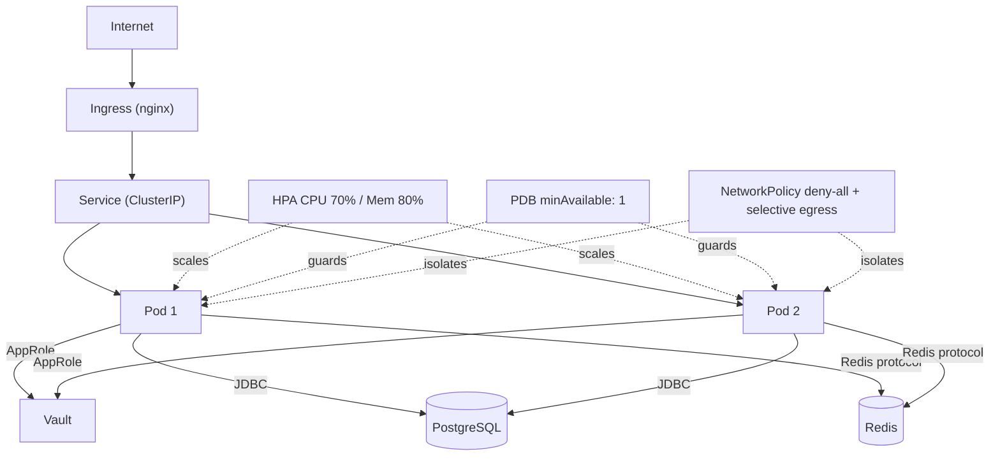
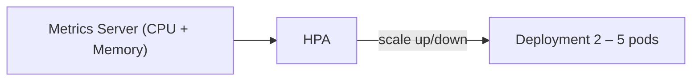
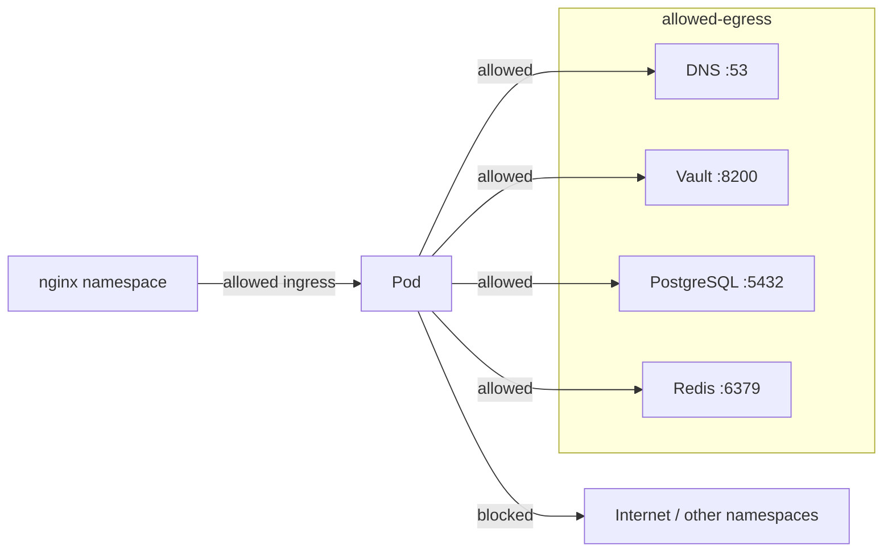
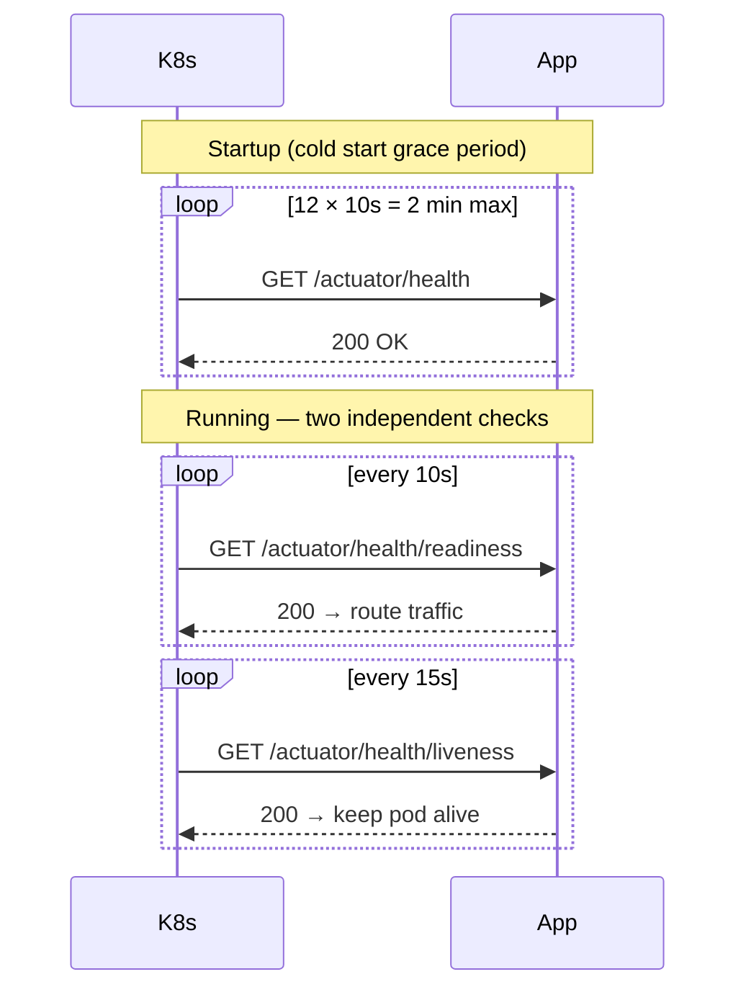

# Kubernetes

> What Kubernetes objects are used, why each was chosen, and what the trade-offs are.

---

## Cluster view



---

## Objects

### Deployment

| Setting | Value | Why |
|---|---|---|
| `strategy.type` | `RollingUpdate` | Zero-downtime rollouts |
| `maxSurge` | `1` | One extra pod during rollout |
| `maxUnavailable` | `0` | Never kill a pod before its replacement is ready |
| `terminationGracePeriodSeconds` | `60` | Drain in-flight requests + Hikari pool teardown |
| `preStop` sleep | `5 s` | Load balancer removes pod from rotation before shutdown begins |

**Security context (pod + container):**

```
runAsNonRoot: true       — no root processes
runAsUser/Group: 1000    — non-privileged UID
readOnlyRootFilesystem   — immutable container FS (only /tmp is writable via emptyDir)
capabilities.drop: ALL   — no Linux capabilities
seccompProfile: RuntimeDefault — node's default syscall filter
```

**Trade-off:** `readOnlyRootFilesystem` requires an explicit `emptyDir` volume mounted at `/tmp` (Spring Boot's embedded Tomcat writes temp files there). Without it the app crashes on startup.

---

### Service

`ClusterIP` — reachable only inside the cluster. External traffic enters via Ingress only.

**Why not `LoadBalancer`?** LoadBalancer provisions a cloud LB per service; cost and IP sprawl grow with service count. Ingress consolidates all external routing behind a single LB.

---

### Ingress (nginx)

- Single entry point for HTTP(S) traffic
- TLS termination at the Ingress; plain HTTP inside the cluster
- `proxy-body-size: 10m`, `proxy-read-timeout: 60s` — tuned for banking payload sizes

**Trade-off:** The nginx Ingress controller is a cluster-wide singleton. A misconfiguration here affects all services sharing it. Use separate Ingress classes or namespaces if isolation is critical.

---

### HPA (Horizontal Pod Autoscaler)



| Threshold | Value | Reasoning |
|---|---|---|
| CPU target | 70% | Leaves headroom before requests queue |
| Memory target | 80% | JVM heap grows gradually; 80% gives GC time to reclaim |
| Min replicas | 2 | Ensures PDB (`minAvailable: 1`) can always be satisfied |
| Max replicas | 5 | Caps DB connection pool exhaustion (Hikari: 20 max) |

**Trade-off:** HPA reacts to sustained load, not spikes. A sudden burst can cause latency before new pods become Ready (JVM cold start ~30–60 s). KEDA or predictive autoscaling would help for bursty workloads.

---

### PDB (PodDisruptionBudget)

`minAvailable: 1` — during voluntary disruptions (node drain, cluster upgrade), Kubernetes will not evict a pod if doing so would leave zero pods running.

**Why `minAvailable` not `maxUnavailable`?** `minAvailable: 1` is absolute; it works correctly even when HPA scales down to 2 pods. `maxUnavailable: 1` is relative and would allow *all* pods to be evicted if `replicas` is 1.

**Trade-off:** Cluster upgrades take longer because nodes must be drained one at a time. Acceptable for a banking workload.

---

### NetworkPolicy



Default: **deny-all**. Explicit allow rules:
- **Ingress:** from the nginx ingress controller namespace only
- **Egress:** DNS (53), Vault (8200), PostgreSQL (5432), Redis (6379)

**Trade-off:** Any new dependency (e.g. Kafka, SMTP) requires a NetworkPolicy update or the app silently hangs on connection. This is intentional — the policy enforces least-privilege by design.

---

### Probes



| Probe | Path | Trigger on failure |
|---|---|---|
| Startup | `/actuator/health` | Marks pod not-ready; keeps trying up to 2 min |
| Readiness | `/actuator/health/readiness` | Removes pod from Service endpoints (no traffic) |
| Liveness | `/actuator/health/liveness` | Restarts the container |

**Why separate liveness and readiness?** A pod can be alive (JVM running) but not ready (DB connection not yet acquired, Vault not bootstrapped). Separate probes prevent premature traffic routing without triggering unnecessary restarts.

---

### ServiceAccount

- Dedicated `ServiceAccount` per release (not the `default` SA)
- `automountServiceAccountToken: false` — the app never calls the Kubernetes API; mounting the token is a liability
- AppRole credentials from Vault are the only secret the pod receives

---

### Affinity

Soft anti-affinity (`preferredDuringSchedulingIgnoredDuringExecution`) — Kubernetes *prefers* to place pods on different nodes.

**Why soft, not hard?** Hard anti-affinity would block scheduling if there are fewer nodes than replicas (common in dev clusters or during node failures). Soft degrades gracefully.

---

## Helm chart layout

```
helm/
├── Chart.yaml
├── values.yaml          # defaults (prod-safe)
├── values-dev.yaml      # E2: 1–2 replicas, relaxed resources, soft affinity
├── values-prod.yaml     # E1: 3 replicas, TLS, hard anti-affinity
└── templates/
    ├── deployment.yaml
    ├── service.yaml
    ├── ingress.yaml
    ├── hpa.yaml
    ├── pdb.yaml
    ├── networkpolicy.yaml
    └── serviceaccount.yaml
```

**Deploy command:**
```bash
helm upgrade --install ebank-monolith helm/ \
  --namespace ebank --create-namespace \
  -f helm/values-prod.yaml \
  --set image.tag=1.2.3 \
  --atomic --timeout 5m
```

`--atomic` rolls back automatically if pods don't become Ready within the timeout.

---

## Trade-off summary

| Decision | Benefit | Cost |
|---|---|---|
| Helm over raw manifests | Parameterised, rollback via `helm rollback` | Learning curve; Helm 3 drift detection is weak |
| ClusterIP + Ingress | Single LB, lower cost | Ingress controller is SPOF if not HA |
| Soft anti-affinity | Schedules on any topology | Pods may land on same node under pressure |
| `readOnlyRootFilesystem` | Immutable container; limits blast radius | Requires explicit emptyDir for /tmp |
| PDB `minAvailable: 1` | Survives voluntary disruptions | Slower cluster drain / upgrades |
| HPA CPU+Mem | Handles most load patterns | Slow to react to sudden spikes; JVM warm-up lag |
| No Vault Agent sidecar | Simpler; Spring Cloud Vault handles it | Vault reads block startup; no secret hot-reload |
