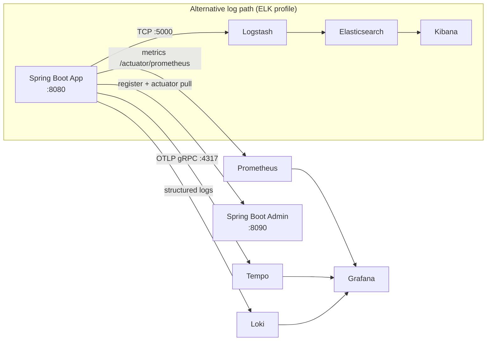
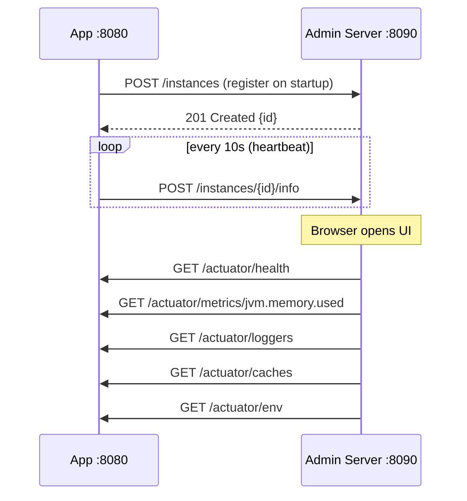
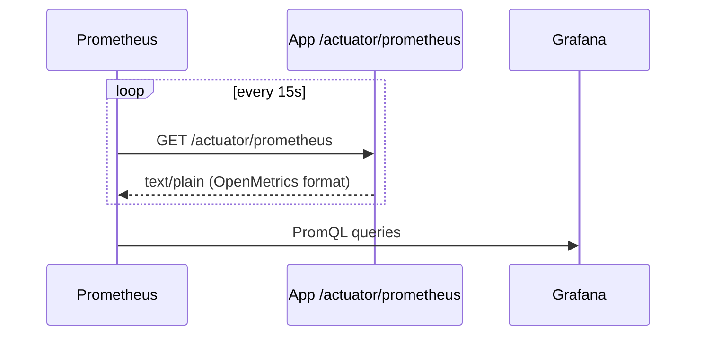
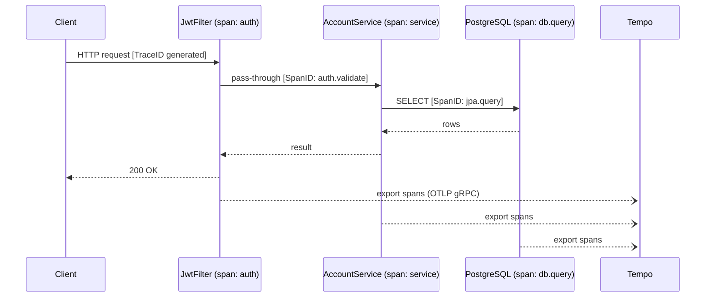

# Observability

> What signals are collected, which tools handle them, and why.

---

## Stack



Four observability tools covering different use cases:

| Tool | Use case | Access |
|---|---|---|
| **Spring Boot Admin** | Interactive monitoring, log-level changes, thread dump, real-time health | `localhost:8090` |
| **Grafana** | Metrics dashboards, trace inspection, log correlation | `localhost:3000` |
| **Prometheus** | Metric storage + alerting rules | `localhost:9090` |
| **Kibana** | Full-text log search (ELK profile) | `localhost:5601` |

---

## Spring Boot Admin



**What the admin server provides:**

| Panel | Data source | What you can do |
|---|---|---|
| Health | `/actuator/health` | See DB, Redis, disk status at a glance |
| JVM | `/actuator/metrics` | Heap, non-heap, GC pause, thread count live |
| HTTP traffic | `/actuator/metrics` | Request rate, error rate, latency per endpoint |
| Loggers | `/actuator/loggers` | Change `com.ebank` to DEBUG at runtime — no restart |
| Environment | `/actuator/env` | Browse active properties (values redacted) |
| Caches | `/actuator/caches` | Redis cache names and hit/miss counts |
| Thread dump | `/actuator/threaddump` | Snapshot of all live threads |
| Flyway | `/actuator/flyway` | DB migration history and status |
| Mappings | `/actuator/mappings` | All HTTP endpoints registered in the app |

**Security:** Form login + HTTP Basic. Credentials from `.env` (`ADMIN_UI_USER` / `ADMIN_UI_PASSWORD`) or Vault for dev/prod. The `/actuator/**` endpoints are open on the internal Docker/K8s network and protected by NetworkPolicy in production.

---

## Metrics (Prometheus + Micrometer)

**What:** Counters, gauges, histograms for HTTP, JVM, Hikari pool, and cache.

**How:** Micrometer is the vendor-neutral metrics facade. Spring Boot's actuator auto-registers JVM, HTTP, and data-source metrics. The app exposes them at `/actuator/prometheus` (Prometheus pull model).



**Key metrics auto-collected:**

| Metric | What it shows |
|---|---|
| `http_server_requests_seconds` | Latency histogram per endpoint |
| `jvm_memory_used_bytes` | Heap / non-heap consumption |
| `hikaricp_connections_active` | Live DB connections |
| `cache_gets_total{result="hit|miss"}` | Redis cache hit rate |
| `spring_security_authentications_total` | Login success/failure rate |

**Decision:** Pull (Prometheus scrape) over push (StatsD, Telegraf).
- Pro: Prometheus controls the scrape rate; targets don't need to know where metrics go.
- Con: Requires Prometheus to reach every pod. Works naturally inside a cluster; needs federation or remote-write for multi-cluster.

---

## Tracing (Tempo + OpenTelemetry)

**What:** Distributed traces — a tree of spans showing exactly where time is spent across calls (HTTP → service → JPA → DB).

**How:** Micrometer Tracing bridges Spring Boot's instrumentation to OpenTelemetry. The OTLP exporter sends spans to Tempo over gRPC (port 4317).



Every request gets a `TraceID`. All log lines for that request include `correlationId` (set by `RequestLoggingFilter` in MDC). In Grafana, jump from a slow trace in Tempo to the correlated logs in Loki using the trace/log correlation feature.

**Decision:** Tempo (trace storage) over Jaeger/Zipkin.
- Pro: Grafana-native; seamless correlation with Prometheus and Loki in one UI; cheaper storage (object storage backend).
- Con: Query language (TraceQL) is newer and less documented than Jaeger UI.

---

## Logging

**What:** Structured request logs with correlation IDs.

**How:** `RequestLoggingFilter` (highest priority, `@Order(MIN_VALUE)`) runs on every request. It:
1. Generates a short `correlationId` and puts it in MDC.
2. Logs `METHOD path → status (Xms)` at INFO after the request completes.
3. Clears MDC in `finally` to prevent leaks across virtual threads.


**Logback → Logstash (ELK):** Logstash appender ships JSON logs over TCP to Logstash → Elasticsearch.
**Logback → Loki:** Configure Loki's Logback appender to ship logs directly to Loki for the lighter-weight monitoring-only stack.

**Decision:** Structured logs (key=value) over free-text.
- Pro: Filterable and indexable in any log backend.
- Con: Slightly more verbose; developers must remember to use structured fields in log statements.

**Decision:** MDC correlation IDs over distributed tracing IDs in logs.
- Pro: Zero external dependency; works even without Tempo running.
- Con: Not the same ID as the OTLP `TraceID`, so Grafana's trace↔log correlation requires Tempo to be active.

---

## Grafana dashboards

| Panel | Source | PromQL / query |
|---|---|---|
| Request rate | Prometheus | `rate(http_server_requests_seconds_count[1m])` |
| P99 latency | Prometheus | `histogram_quantile(0.99, rate(http_server_requests_seconds_bucket[5m]))` |
| Error rate | Prometheus | `rate(http_server_requests_seconds_count{status=~"5.."}[1m])` |
| Cache hit rate | Prometheus | `rate(cache_gets_total{result="hit"}[1m]) / rate(cache_gets_total[1m])` |
| Active DB connections | Prometheus | `hikaricp_connections_active` |
| Recent traces | Tempo | TraceQL: `{ http.status_code >= 400 }` |
| Logs | Loki | LogQL: `{app="ebank-monolith"} |= "ERROR"` |

---

## ELK vs Loki trade-off

| | ELK | Loki |
|---|---|---|
| Storage | High (indexes all fields) | Low (index labels only) |
| Query power | Full-text search, aggregations | Label-based + grep |
| Ops cost | Elasticsearch cluster management | Minimal (object store backend) |
| When to use | Compliance logging, audit trails | Dev/staging, correlated with metrics |

This project ships both. Default: Loki (lighter). ELK: activate with `docker compose --profile elk up`.

---

## Docker Compose profiles

```bash
# Monitoring stack (Prometheus + Grafana + Tempo)
docker compose --profile monitoring up -d
# → Grafana: http://localhost:3000  (admin/admin)
# → Prometheus: http://localhost:9090
# → Tempo: http://localhost:3200

# ELK stack (Elasticsearch + Logstash + Kibana)
docker compose --profile elk up -d
# → Kibana: http://localhost:5601
```

---

## Trade-off summary

| Decision | Benefit | Cost |
|---|---|---|
| Spring Boot Admin (separate server) | Isolated from app; survives app crash | Extra service to deploy and secure |
| Open `/actuator/**` on internal network | Simple; no per-endpoint credential plumbing | Relies entirely on network controls (NetworkPolicy / Docker bridge) |
| Pull-based metrics (Prometheus) | Prometheus owns scrape schedule | Needs network access to every pod |
| Micrometer facade | Swap backends without code changes | Extra abstraction layer |
| Tempo over Jaeger | Grafana-native; single UI | TraceQL is less mature than Jaeger UI |
| MDC correlationId | Works without Tempo | Different ID from OTLP TraceID |
| Both ELK + Loki | Flexibility | Operational overhead of two log paths |
| Grafana datasource correlation | Traces ↔ logs in one click | Requires all three backends running |
