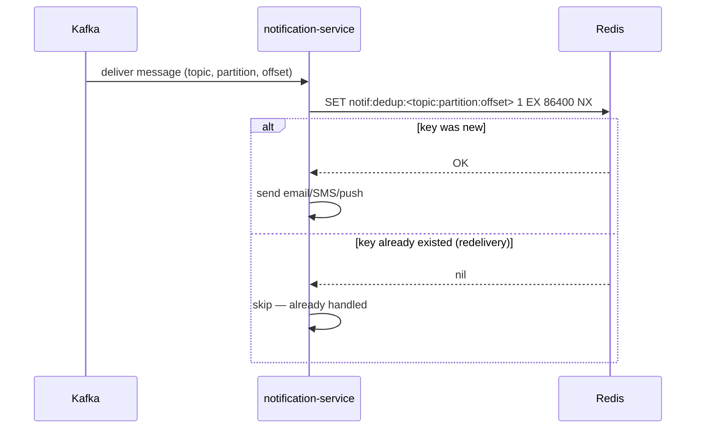

# Documentation

## Config Setup / API / Testing

```sh

## How to setup Environments (install & config):

how to install java & maven on debian:
https://greenwebpage.com/community/how-to-install-java-on-debian-12/
https://phoenixnap.com/kb/install-maven-debian

launch spring app on vscode:
https://code.visualstudio.com/docs/java/java-spring-boot

## Accounts API

POST - Create Account

curl -X POST http://localhost:8080/api/accounts \
  -H "Content-Type: application/json" \
  -d '{
    "accountNumber": "ACC123456789",
    "accountHolderName": "Jean Dupont",
    "email": "jean.dupont@email.com",
    "phoneNumber": "0612345678",
    "accountType": "SAVINGS",
    "balance": 1000.50,
    "address": "123 Rue de Paris, 75001 Paris",
    "status": "ACTIVE"
  }' | jq .

GET - Fetch All Accounts

curl -X GET http://localhost:8080/api/accounts \
  -H "Content-Type: application/json" | jq .

GET - Fetch Account by ID (Replace 1 with actual ID)

curl -X GET http://localhost:8080/api/accounts/1 \
  -H "Content-Type: application/json" | jq .

PUT - Update Account (Replace 1 with actual ID)

curl -X PUT http://localhost:8080/api/accounts/1 \
  -H "Content-Type: application/json" \
  -d '{
    "accountNumber": "ACC123456789",
    "accountHolderName": "Jean Dupont UPDATED",
    "email": "jean.dupont@email.com",
    "phoneNumber": "0612345678",
    "accountType": "CHECKING",
    "balance": 2500.75,
    "address": "456 Avenue Lyon, 75002 Paris",
    "status": "ACTIVE"
  }' | jq .

DELETE - Delete Account (Replace 1 with actual ID)
curl -X DELETE http://localhost:8080/api/accounts/1 \
  -H "Content-Type: application/json"

### Transactions API:

GET toutes les transactions

curl -X GET http://localhost:8083/api/transactions

GET une transaction par ID

curl -X GET http://localhost:8083/api/transactions/{id}

GET transactions d'un compte

curl -X GET http://localhost:8083/api/transactions/account/{accountId}

POST créer une transaction (TRANSFER)

curl -X POST http://localhost:8083/api/transactions \
  -H "Content-Type: application/json" \
  -d '{
    "fromAccountId": "acc-001",
    "toAccountId": "acc-002",
    "amount": 150.00,
    "type": "TRANSFER",
    "description": "Virement mensuel"
  }'

POST créer un dépôt

curl -X POST http://localhost:8083/api/transactions \
  -H "Content-Type: application/json" \
  -d '{
    "toAccountId": "acc-001",
    "amount": 500.00,
    "type": "DEPOSIT",
    "description": "Dépôt initial"
  }'

POST créer un retrait

curl -X POST http://localhost:8083/api/transactions \
  -H "Content-Type: application/json" \
  -d '{
    "fromAccountId": "acc-001",
    "amount": 50.00,
    "type": "WITHDRAWAL"
  }'

swagger API:

access  all service documentation:
http://localhost:8081/swagger-ui/index.html

Java Melody: (monitoring)

JavaMelody is a lightweight performance monitoring tool for Java applications. It helps track memory usage, SQL queries, HTTP requests, and more in real-time via a simple web UI.
http://localhost:8081/monitoring
check these metrics:
Memory Usage, Database Query Performance, Slow HTTP Requests, Garbage Collection Performance.

Spring ADMIN

access to spring admin
http://localhost:8081/admin

#### Testing

Unit Test (ONLY):

mvn clean test

Unit + integration Tests + coverage:

mvn clean test

Check coverage:

xdg-open target/site/jacoco/index.html
file:///home/sam/Desktop/ebank/accounts/target/site/jacoco/index.html

### Gateway

// 200
curl http://localhost:8080/actuator/health

### AUTH service

Test 1 Register:

curl -s -X POST http://localhost:8080/api/auth/register \
  -H "Content-Type: application/json" \
  -d '{"username":"alice","email":"alice@test.comh","password":"Secret123!"}' | jq

curl -s -X POST http://localhost:8080/api/auth/login \
  -H "Content-Type: application/json" \
  -d '{"username":"bob","email":"bob@test.com","password":"Secret123!"}' | jq

Test Login:

TOKEN=$(curl -s -X POST http://localhost:8080/api/auth/login \
  -H "Content-Type: application/json" \
  -d '{"email":"alice@test.com","password":"Secret123!"}' | jq -r '.accessToken')
echo $TOKEN

curl -s http://localhost:8080/api/accounts \
  -H "Authorization: Bearer $TOKEN" | jq

Logout:

curl -s -X POST http://localhost:8080/api/auth/logout \
  -H "Authorization: Bearer $TOKEN"

Test error 401:

curl -s -o /dev/null -w "%{http_code}" http://localhost:8080/api/accounts \
  -H "Authorization: Bearer $TOKEN"

Validation error format:

curl -s -X POST http://localhost:8080/api/auth/register \
  -H "Content-Type: application/json" \
  -d '{"email":"bad"}' | jq

````

## Docker / Docker compose

```sh
docker-compose up --build

Verify Config Server is serving config

curl http://localhost:8888/gateway/docker
curl http://localhost:8888/auth-service/docker
curl http://localhost:8888/accounts-service/docker
curl http://localhost:8888/transaction-service/docker

Verify Vault secrets were seeded

curl -H "X-Vault-Token: root" http://localhost:8200/v1/secret/data/ebank/auth-service

Verify each service picked up its config

curl http://localhost:8080/actuator/health   # gateway
curl http://localhost:8081/actuator/health   # auth
curl http://localhost:8082/actuator/health   # accounts
curl http://localhost:8083/actuator/health   # transactions
curl http://localhost:8888/actuator/env      # config server — shows all resolved properties

### Vault

access vault:
http://localhost:8200/ui/vault/secrets
root (token)

### Notification service

lauch services

docker compose up

test notification service up

curl http://localhost:3002/health

check logs notification service:

docker logs notification_service

Kafka UI:

Via Kafka UI (http://localhost:8090) → Topics → notification-events → Produce message :
{
  "type": "EMAIL",
  "recipient": "test@example.com",
  "subject": "Test notification",
  "body": "pCeci est un test/p",
  "occurredAt": "2026-04-04T12:00:00Z"
}

check emails:

Open http://localhost:8025 → email appear there.

## Caching

Redis (`redis:7-alpine`, already deployed as the `redis` service in
`docker-compose.yml` / the Bitnami `redis` subchart in Helm) backs every
caching use case in this system. This section covers where caching is used,
why, and the trade-offs made — split into what already existed
(accounts/transactions/auth) and what this branch adds (gateway, notifications).

### Where caching is used

| Service | What's cached | Pattern | TTL |
|---|---|---|---|
| accounts | account-by-id, all-accounts list | cache-aside (read-through on miss, write/evict on command) | 10 min / 5 min |
| transactions | transaction-by-id, transactions-by-account | cache-aside | 10 min / 5 min |
| auth | refresh tokens, revoked-token blacklist | source of truth in Redis (not a cache-aside layer) | refresh TTL / until token expiry |
| **gateway** *(new)* | JWT validation result (username + role) | cache-aside in front of `auth-service` | ≤ 60s, capped by token's own remaining lifetime |
| **gateway** *(new)* | per-client-IP request budget | Redis-backed token bucket (`RedisRateLimiter`) | rolling |
| **notifications** *(new)* | "this Kafka message was already processed" marker | idempotency / dedup guard | 24h |

### 1. Gateway — JWT validation cache

**Problem.** The gateway already shipped with a Redis dependency and a
`JwtUtil` capable of validating a JWT locally (signature + expiry) — but
neither was wired up. Every single request to a protected route
(`/api/accounts/**`, `/api/transactions/**`) triggered a synchronous HTTP call
from the gateway to `auth-service`'s `POST /api/auth/validate` to re-verify a
token that may have already been validated a second ago. That makes
auth-service a hard dependency and a load multiplier for the entire API
surface — every other service's traffic funnels through it on every request.

**Strategy — cache-aside, blacklist-checked on every request:**

1. Cheap local checks first: is the header present, does the JWT's signature
   and expiry check out (`JwtUtil`, zero I/O)? Reject garbage tokens without
   touching Redis or auth-service at all.
2. Check the **blacklist** Redis keyspace that `auth-service` already writes
   to on logout (`blacklist:<token>`) — done on **every** request, cache hit
   or miss. This is what keeps revocation immediate even with a populated
   cache: a single Redis `EXISTS` is far cheaper than the HTTP round-trip it
   replaces, so paying it unconditionally is worth it.
3. Look up the **validation cache** (`gateway:token-validation:<sha256(token)>`
   → `{username, role}`). On a hit, the request proceeds immediately — no
   network call to auth-service.
4. On a cache miss only, fall back to the original behaviour (call
   auth-service), then populate the cache for subsequent requests bearing the
   same token.

```mermaid
sequenceDiagram
    participant C as Client
    participant G as Gateway
    participant R as Redis
    participant A as auth-service

    C->>G: Request + Bearer token
    G->>G: JwtUtil.isValid(token) (local, no I/O)
    alt token malformed/expired
        G-->>C: 401
    else token well-formed
        G->>R: EXISTS blacklist:<token>
        alt blacklisted
            R-->>G: true
            G->>R: DEL gateway:token-validation:<hash>
            G-->>C: 401
        else not blacklisted
            R-->>G: false
            G->>R: GET gateway:token-validation:<hash>
            alt cache hit
                R-->>G: {username, role}
                G->>G: proxy request (no auth-service call)
            else cache miss
                R-->>G: nil
                G->>A: POST /api/auth/validate
                A-->>G: {username, role}
                G->>R: SET gateway:token-validation:<hash> ttl=min(60s, token remaining life)
                G->>G: proxy request
            end
        end
        G-->>C: response
    end
```



**Key design decisions / trade-offs:**

- **Cache key is `sha256(token)`, not the raw token.** Redis keys can end up
  in logs, `MONITOR`, or slow-log output — hashing avoids persisting bearer
  credentials verbatim under a well-known prefix.
- **TTL is `min(60s, token's own remaining lifetime)`.** A cached entry can
  never outlive the JWT it represents, and 60s bounds how stale a
  role/permission change can appear to the gateway (a role change takes
  effect for a given user within one cache TTL window, not immediately —
  accepted trade-off for the throughput win).
- **Blacklist is checked unconditionally, cache is not.** This is
  deliberately asymmetric: correctness (revocation) is cheap enough to never
  skip, while the expensive path (full re-validation via auth-service) is
  the one we're trying to avoid paying on every request.
- **Fail-safe, not fail-open.** If Redis is unreachable, `getCached`/
  `isBlacklisted` swallow the error and return empty/`false` — the request
  simply falls through to the normal auth-service call path instead of being
  silently trusted or silently rejected.

### 2. Gateway — Redis-backed rate limiting

The gateway's `pom.xml` already carried a `spring-boot-starter-data-redis-reactive`
dependency commented "for rate limiting", and the Helm chart's own deployment
doc-comment already claimed the gateway "handles rate limiting (Redis)" —
neither was implemented. This branch wires up Spring Cloud Gateway's built-in
`RedisRateLimiter` (a token bucket implemented as an atomic Lua script against
Redis, so it works correctly across multiple gateway replicas since the
bucket state lives in Redis, not in-process memory):

- `/api/auth/**` (login/register — the one route reachable without a token)
  gets a tight limit: 5 req/s replenish, burst 10. This is the route most
  worth protecting against credential-stuffing/brute-force traffic.
- `/api/accounts/**` and `/api/transactions/**` get a more generous limit
  (20 req/s replenish, burst 40) as a defense-in-depth safety net against a
  runaway or abusive client — not the primary access control (the JWT
  validation above is).

Both are keyed by the **real socket remote address**, not a client-supplied
`X-Forwarded-For` header — this gateway is the single point of ingress (see
`helm/ebank/templates/gateway-ingress.yaml`), so trusting a spoofable header
here would let a client bypass the limiter simply by rotating the header
value.

One known ordering nuance: the custom `AuthenticationFilter` runs before the
built-in rate-limiter filter regardless of the order they're declared in
`GatewayConfig` (Spring orders gateway filters by `Ordered.getOrder()`, and
`AuthenticationFilter` explicitly claims `HIGHEST_PRECEDENCE + 10`). This
means an unauthenticated flood still pays the (now cache-backed, cheap) auth
check before being rejected by the limiter — acceptable, since the limiter's
job here is protecting downstream services and absorbing abusive volume, not
minimizing gateway-side CPU for rejected requests.

### 3. Notifications — Kafka redelivery dedup

**Problem.** `notifications` consumes from Kafka with KafkaJS's default
auto-commit behaviour: the offset commits after `eachMessage` resolves. If
the process crashes (or a consumer-group rebalance happens) between sending
a notification and that commit landing, Kafka redelivers the message on
restart — normal at-least-once semantics. Sending an email/SMS/push
notification is **not** an idempotent operation, so without a guard a
customer receives duplicate "your transfer of $500 completed" messages.

**Strategy.** Every message is deduplicated by `topic:partition:offset` —
the physical coordinates Kafka assigns a message, which are stable and unique
regardless of what's in the (possibly missing) business payload. A single
atomic `SET notif:dedup:<key> 1 EX 86400 NX` call decides, without a race
between concurrent consumers in the same group, whether this is the first
time the message is seen:



**Trade-offs:**

- **Dedup key is the Kafka coordinate, not a business field** (e.g.
  `transactionId`). `NotificationEvent` payloads don't all carry a stable
  unique id, but every Kafka message does — this keeps the guard correct
  regardless of what topic/event shape is added later.
- **24h TTL** comfortably outlasts any realistic redelivery window (consumer
  restart, rebalance) without keeping dedup keys forever.
- **Fails open, not closed.** If Redis is unreachable, the dedup check logs a
  warning and treats the message as new (processes it) rather than throwing.
  For a notification service, a rare duplicate email is a much smaller
  problem than silently dropping every notification because a cache was
  briefly down.

### Not cached (and why)

- **`chatbot`** — currently commented out in `docker-compose.yml` and backed
  by a mock LLM (no real inference cost or latency to amortize). Caching LLM
  responses is a legitimate pattern once a real model is wired in, but adding
  it now would cache mock data behind a disabled service — left as a future
  item once the service is actually turned on.

### Verifying it locally

No `minikube`/`docker` daemon was available in the sandbox this branch was
developed in, so validation was done at the component level instead of a
full `docker compose up`:

- `mvn test` passes for `gateway` (context loads, all beans wire correctly).
- Manual verification against a real local `redis-server` + a running
  gateway instance: seeded a valid token-validation cache entry directly in
  Redis and confirmed the gateway proxied the request **without** calling
  auth-service (verified via the `gateway_token_validation_cache_total`
  Prometheus counter and by observing no outbound call to auth-service);
  seeded a `blacklist:<token>` entry and confirmed a cached-but-revoked token
  is rejected immediately and its cache entry evicted; confirmed
  `/api/auth/**` and `/api/accounts/**` enforce independent rate limits via
  the `X-RateLimit-*` response headers.
- `tsc`/`npm run build` passes for `notifications`; the dedup guard
  (`markIfNew`) was exercised directly against a local `redis-server`,
  confirming a redelivered `topic:partition:offset` is correctly skipped
  while a different offset is processed normally.
- `docker compose config` validates the updated `docker-compose.yml` (Redis
  env vars added to `notification-service`).

Before deploying, run a full `docker compose up --build` (or the minikube
flow below) to confirm the whole stack together — the above only proves each
new code path in isolation.

### Docker compose version

docker compose up --build

Auth via gateway:

curl -s -X POST http://localhost:8080/api/auth/register \
  -H "Content-Type: application/json" \
  -d '{"username":"joe","email":"joe@test.com","password":"Secret123!"}' | jq

TOKEN=$(curl -s -X POST http://localhost:8080/api/auth/login \
  -H "Content-Type: application/json" \
  -d '{"email":"alice@test.com","password":"Secret123!"}' | jq -r '.accessToken')
echo $TOKEN

curl http://localhost:8080/api/accounts \
  -H "Authorization: Bearer $TOKEN"

curl http://localhost:8080/api/transactions \
  -H "Authorization: Bearer $TOKEN"

notifications:
http://localhost:8025

kafka ui:

Via Kafka UI (http://localhost:8090) → Topics → notification-events → Produce message :
{
  "type": "EMAIL",
  "recipient": "test@example.com",
  "subject": "Test notification",
  "body": "pCeci est un test/p",
  "occurredAt": "2026-04-04T12:00:00Z"
}

vault:
http://localhost:8200

curl http://localhost:8081/actuator/health  # auth
curl http://localhost:8082/actuator/health  # accounts
curl http://localhost:8083/actuator/health  # transactions
``

## Minikube version:

```sh
## Prerequisites

# Install tools
minikube start --driver=docker --cpus=4 --memory=8192 --disk-size=40g
minikube addons enable ingress
minikube addons enable metrics-server

# Install Helm
helm repo add bitnami https://charts.bitnami.com/bitnami
helm repo update

## build docker image inside minikube

# Point Docker CLI at minikube's daemon (CRITICAL — do this in every terminal)
eval $(minikube docker-env)

# Build all service images
docker build -t ebank-auth:local        ./auth
docker build -t ebank-accounts:local    ./accounts
docker build -t ebank-transactions:local ./transactions
docker build -t ebank-gateway:local     ./gateway
docker build -t ebank-notification:local ./notifications
docker build -t ebank-frontend:local    ./frontend

# Verify they're in minikube
docker images | grep ebank

# create namespace
kubectl create namespace ebank-local

# deploy vault
kubectl apply -f k8s/vault-dev.yaml -n ebank-local
kubectl wait --for=condition=ready pod -l app=vault -n ebank-local --timeout=60s

## deploy infra (postgres, mongo, redis, kafka)
kubectl apply -f k8s/infra-local.yaml -n ebank-local

# Wait for all infra to be ready
kubectl wait --for=condition=ready pod -l tier=infra -n ebank-local --timeout=180s

## deploy helm chart
helm upgrade --install ebank ./helm/ebank \
  -f helm/ebank/values.yaml \
  -f helm/ebank/values-local.yaml \
  --namespace ebank-local \
  --timeout 15m

## check pods, jobs, services, ... are RUNNING
kubectl get pods -n ebank-local
kubectl get jobs -n ebank-local
kubectl get all -n ebank-local

## Test API
# Open a port-forward to the gateway
kubectl port-forward svc/ebank-ebank-gateway -n ebank-local 8080:8080 &

# Register a user
curl -X POST http://localhost:8080/api/auth/register \
  -H "Content-Type: application/json" \
  -d '{"username":"alice","email":"alice@bank.com","password":"Test1234!","firstName":"Alice","lastName":"Smith"}'

# Login
TOKEN=$(curl -s -X POST http://localhost:8080/api/auth/login \
  -H "Content-Type: application/json" \
  -d '{"email":"alice@bank.com","password":"Test1234!"}' | python3 -c "import sys,json; print(json.load(sys.stdin)['accessToken'])")

# Create a bank account (protected route)
curl -X POST http://localhost:8080/api/accounts \
  -H "Content-Type: application/json" \
  -H "Authorization: Bearer $TOKEN" \
  -d '{"accountNumber":"ACCT00000001","accountHolderName":"Alice Smith","email":"alice@bank.com","phoneNumber":"0601020304","accountType":"SAVINGS","balance":500.00,"status":"ACTIVE"}'

# Get bank accounts  
curl -X GET http://localhost:8080/api/accounts \
  -H "Content-Type: application/json" \
  -H "Authorization: Bearer $TOKEN"

## Access Frontend
# Get minikube IP
minikube ip   # e.g. 192.168.49.2

# Add to /etc/hosts
echo "$(minikube ip) ebank.local api.ebank.local" | sudo tee -a /etc/hosts

# Open browser at http://ebank.local
```

## Scale up/down:

```sh
## Scaler UP/DOWN

# Scale a deployment up
kubectl scale deployment ebank-ebank-auth -n ebank-local --replicas=3
# Scale down
kubectl scale deployment ebank-ebank-auth -n ebank-local --replicas=1

# Check
kubectl get pods -n ebank-local | grep auth

## Auto Scaler UP/DOWN
helm upgrade ebank ./helm/ebank -f helm/ebank/values.yaml -f helm/ebank/values-local.yaml -n ebank-local

# Trigger load to see HPA in action
kubectl run -it load-gen --image=busybox --rm -n ebank-local -- /bin/sh -c \
  "while true; do wget -qO- http://ebank-ebank-gateway:8080/actuator/health; done"

# Watch HPA
kubectl get hpa -n ebank-local -w

```

```sh
# CPU and memory per pod
kubectl top pods -n ebank-local

# Node resource pressure
kubectl top nodes

# HPA status
kubectl get hpa -n ebank-local
```