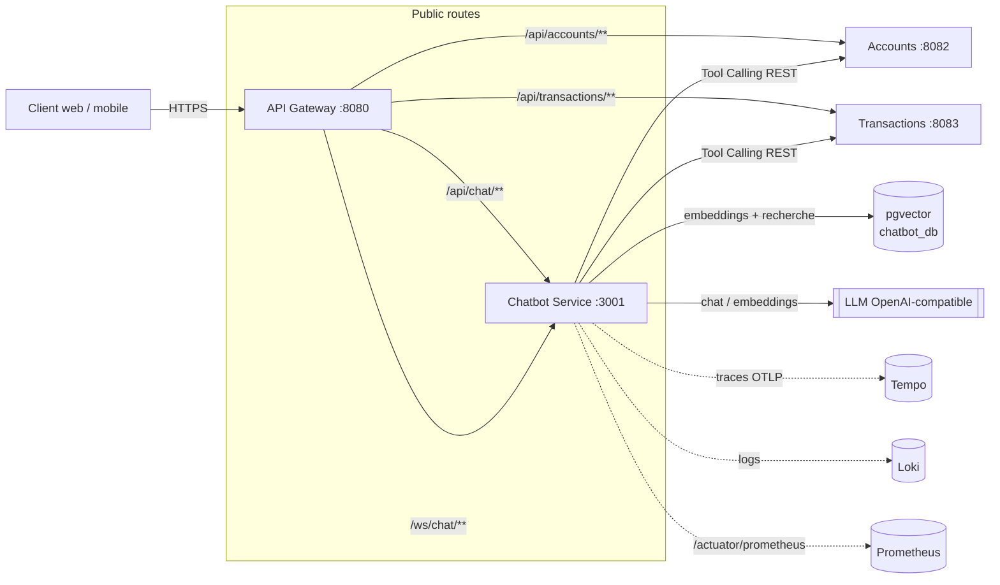
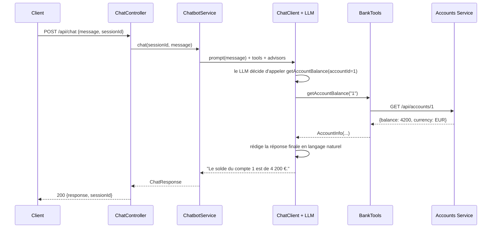
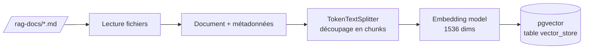
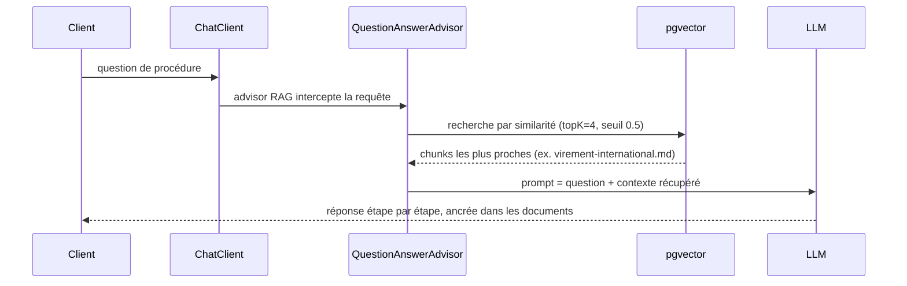

# Chatbot Service — Conception & Fonctionnement

> Microservice **assistant bancaire IA** de la plateforme eBank.
> Stack : **Spring Boot 3.5 · Java 21 · Spring AI 1.1 · PostgreSQL/pgvector**.
> Deux capacités derrière un seul `ChatClient` : **Tool Calling** (données live des
> comptes/transactions) et **RAG** (réponses sur les procédures complexes à partir
> d'une base documentaire).

Inspiré du projet de référence `ebank-bot` (Spring AI + MCP) de M. Youssfi, ce service
en reprend le fonctionnement (un `ChatClient` qui appelle des *tools* bancaires) et y
**ajoute un moteur RAG** pour répondre aux questions de procédure (« comment faire un
virement international ? », « comment contester une opération ? »…) à partir de
documents internes.

---

## 1. Objectifs

| # | Objectif | Réponse apportée |
|---|----------|------------------|
| 1 | Répondre en langage naturel aux questions clients | `ChatClient` Spring AI + LLM OpenAI-compatible |
| 2 | Donner des **données réelles** (solde, transactions) | **Tool Calling** vers accounts-service & transaction-service |
| 3 | Expliquer les **procédures complexes** | **RAG** sur une base de connaissances (pgvector) |
| 4 | Streaming de la réponse | **SSE** (`/api/chat/stream`) et **WebSocket** (`/ws/chat`) |
| 5 | Rester cohérent avec la plateforme | Actuator, tracing OTLP → Tempo, logs → Loki, image Docker, Helm |
| 6 | Fonctionner en **Docker Compose** et **Minikube** | Compose + manifests k8s + templates Helm fournis |

---

## 2. Stack technique

| Élément | Choix | Pourquoi |
|---------|-------|----------|
| Runtime | Spring Boot **3.5.10** / Java 21 | Ligne supportée par Spring AI 1.1 (le reste de la plateforme est en Boot 4 ; le chatbot est isolé, cette divergence est sans impact) |
| Orchestration LLM | **Spring AI 1.1.2** (`ChatClient`, advisors, tools) | Tool-calling typé, advisors RAG/mémoire, streaming natif |
| LLM | Endpoint **OpenAI-compatible** (`OPENAI_BASE_URL`) | Fonctionne avec OpenAI, Groq ou un **Ollama** local (`/v1`) |
| Embeddings | `text-embedding-3-small` (1536 dims) | Bon rapport qualité/coût pour le RAG |
| Vector store | **pgvector** (extension PostgreSQL) | Pas de service vectoriel dédié ; réutilise Postgres (`chatbot_db`) |
| RAG advisor | `QuestionAnswerAdvisor` | Récupère les chunks pertinents et les injecte dans le prompt |
| Mémoire | `MessageChatMemoryAdvisor` (fenêtre 20 msg) | Dialogue multi-tours par `sessionId` |
| Transport | REST + **SSE** + **WebSocket** | Réponse complète ou streamée token par token |
| Observabilité | Actuator, Micrometer Tracing → OTLP (Tempo), Loki | Identique aux services Java existants |

---

## 3. Place dans l'architecture



Le chatbot **n'accède jamais** aux bases des autres services : il appelle leurs API REST
publiques, ce qui préserve le pattern **Database-per-Service**. Il possède sa propre base
`chatbot_db` (extension `vector`) pour le RAG.

---

## 4. Composants internes

```mermaid
flowchart TB
    subgraph API
      CC[ChatController<br/>/api/chat, /api/chat/stream]
      WS[ChatWebSocketHandler<br/>/ws/chat]
    end
    CC --> SVC[ChatbotService]
    WS --> SVC
    SVC --> CLIENT[ChatClient<br/>Spring AI]

    CLIENT --> SYS[System prompt<br/>persona + garde-fous]
    CLIENT --> MEM[MessageChatMemoryAdvisor<br/>mémoire par session]
    CLIENT --> QA[QuestionAnswerAdvisor<br/>RAG]
    CLIENT --> TOOLS[BankTools<br/>@Tool]

    QA --> VS[(VectorStore pgvector)]
    TOOLS --> AC[RestClient accounts]
    TOOLS --> TC[RestClient transactions]

    ING[DocumentIngestionService<br/>ApplicationRunner] -->|au démarrage| VS
    DOCS[/rag-docs/*.md/] --> ING
```

| Classe | Rôle |
|--------|------|
| `ChatController` | Endpoints REST `POST /api/chat` (bloquant) et `POST /api/chat/stream` (SSE) |
| `ChatWebSocketHandler` / `ChatWebSocketConfig` | Canal `/ws/chat` streamé token par token |
| `ChatbotService` | Orchestration : lie chaque message à un `sessionId` et appelle le `ChatClient` |
| `ChatClientConfig` | Assemble le `ChatClient` : system prompt + tools + advisors RAG & mémoire |
| `BankTools` | Fonctions `@Tool` `getAccountBalance` / `getRecentTransactions` (RestClient vers les services) |
| `DownstreamClientsConfig` | `RestClient` (timeouts courts) vers accounts & transactions |
| `DocumentIngestionService` | ETL RAG : lit `rag-docs/*.md` → chunks → embeddings → pgvector (idempotent) |
| `GlobalExceptionHandler` | Dégrade proprement une panne LLM en HTTP 503 + message clair |

---

## 5. Fonctionnement — Tool Calling (données live)

Exemple : *« Quel est le solde du compte 1 ? »*



Le LLM choisit **seul** le tool à appeler d'après sa description (`@Tool(description=...)`).
Si un service est indisponible, le tool renvoie une valeur de repli et l'assistant le
signale au lieu d'inventer un chiffre.

---

## 6. Fonctionnement — RAG (procédures complexes)

### 6.1 Ingestion (au démarrage)



`DocumentIngestionService` s'exécute au démarrage. Il est **idempotent** : si la table
`vector_store` contient déjà des lignes, l'ingestion est ignorée (pas de doublons). En cas
d'erreur (ex. clé LLM absente), il log un avertissement mais **ne bloque pas** le démarrage.

### 6.2 Interrogation

Exemple : *« Comment faire un virement international ? »*



Le `QuestionAnswerAdvisor` transforme la question en vecteur, récupère les 4 chunks les
plus similaires (au-dessus d'un seuil de 0.5), les injecte dans le prompt et laisse le LLM
formuler une réponse **fondée sur ces documents**. Si aucun contexte pertinent n'est trouvé,
le system prompt demande à l'assistant de le dire honnêtement plutôt que d'inventer.

### 6.3 Base de connaissances

`src/main/resources/rag-docs/` :

| Fichier | Sujet |
|---------|-------|
| `virement-international.md` | Virements SEPA / SWIFT, IBAN/BIC, frais, délais, annulation |
| `contestation-transaction.md` | Litiges, fraude, délais légaux, remboursement |
| `blocage-carte.md` | Blocage/déblocage carte, opposition, cartes virtuelles |
| `ouverture-compte-kyc.md` | Ouverture de compte, documents KYC, motifs de refus |
| `plafonds-et-limites.md` | Plafonds par défaut, modification, augmentation temporaire |
| `securite-phishing.md` | Sécurité du compte, 2FA/SCA, anti-phishing |

**Ajouter un document** : déposez un `.md` dans ce dossier et redémarrez le service
(ou videz la table `vector_store` pour forcer une ré-ingestion).

---

## 7. API

| Méthode | Endpoint | Description |
|---------|----------|-------------|
| `POST` | `/api/chat` | Message → réponse complète `{sessionId, response, timestamp}` |
| `POST` | `/api/chat/stream` | Idem en **SSE**, réponse streamée token par token |
| `WS` | `/ws/chat` | WebSocket : frames `{type: token/done/error}` |
| `GET` | `/actuator/health` | Sonde liveness/readiness |
| `GET` | `/chatbot-api-ui` | Swagger UI |

Corps de requête :

```json
{ "message": "Quel est mon solde ?", "sessionId": "optionnel-pour-le-multi-tours" }
```

`sessionId` est facultatif : s'il est absent, le serveur en génère un et le renvoie, à
réutiliser pour conserver le contexte de la conversation.

---

## 8. Configuration (variables d'environnement)

| Variable | Défaut | Rôle |
|----------|--------|------|
| `SPRING_PROFILES_ACTIVE` | `local` | `local` \| `docker` |
| `PORT` | `3001` | Port HTTP |
| `OPENAI_API_KEY` | *placeholder* | Clé du LLM (OpenAI/Groq). **À fournir** pour un chat réel |
| `OPENAI_BASE_URL` | `https://api.openai.com` | Endpoint compatible (ex. `http://ollama:11434/v1`) |
| `CHATBOT_MODEL` | `gpt-4o-mini` | Modèle de chat |
| `CHATBOT_EMBEDDING_MODEL` | `text-embedding-3-small` | Modèle d'embedding (1536 dims) |
| `CHATBOT_DB_URL` | `jdbc:postgresql://localhost:5432/chatbot_db` | Base pgvector |
| `CHATBOT_DB_USER` / `CHATBOT_DB_PASSWORD` | `postgres` / `postgres` | Identifiants DB |
| `CHATBOT_RAG_INGEST` | `true` | Ingestion RAG au démarrage |
| `ACCOUNTS_SERVICE_URL` | `http://localhost:8082` | Cible du tool solde |
| `TRANSACTION_SERVICE_URL` | `http://localhost:8083` | Cible du tool transactions |
| `OTLP_ENDPOINT` | `http://localhost:4318/v1/traces` | Export des traces |

> Sans clé LLM valide, le service **démarre quand même** (health `UP`) : les endpoints de
> chat renvoient un message « temporairement indisponible » et le RAG saute l'ingestion.
> C'est voulu pour ne jamais casser le `docker compose up` de démonstration.

---

## 9. Tester en Docker Compose

```bash
cd microservices

# 1. Fournir une clé LLM (OpenAI, Groq… ou pointer OPENAI_BASE_URL vers un Ollama local)
export OPENAI_API_KEY=sk-VOTRE-CLE

# 2. Démarrer Postgres (pgvector), le chatbot et ses dépendances
docker compose up -d postgres chatbot-service

# 3. Vérifier la santé
curl http://localhost:3001/actuator/health         # {"status":"UP"}

# 4. Question de procédure (RAG)
curl -s -X POST http://localhost:3001/api/chat \
  -H 'Content-Type: application/json' \
  -d '{"message":"Comment contester une transaction frauduleuse ?"}' | jq

# 5. Question sur des données live (Tool Calling) — nécessite accounts-service up
docker compose up -d accounts-service transaction-service
curl -s -X POST http://localhost:3001/api/chat \
  -H 'Content-Type: application/json' \
  -d '{"message":"Quel est le solde du compte 1 ?"}' | jq

# 6. Streaming SSE
curl -N -X POST http://localhost:3001/api/chat/stream \
  -H 'Content-Type: application/json' \
  -d '{"message":"Explique-moi les plafonds de virement"}'
```

Via la **gateway** (routes déjà configurées) : `http://localhost:8080/api/chat`.

Vérifier le RAG en base :

```bash
docker exec -it ebank_postgres psql -U postgres -d chatbot_db \
  -c "SELECT count(*) FROM vector_store;"
```

---

## 10. Tester sur Minikube

### Option A — manifest autonome (le plus rapide)

```bash
minikube start --cpus=4 --memory=6g

# Construire l'image directement dans le démon Docker de minikube
eval $(minikube docker-env)
docker build -t ebank-chatbot:1.0.0 ./chatbot

# Déployer pgvector + chatbot (+ namespace ebank)
kubectl apply -f k8s/chatbot.yaml

# Injecter la vraie clé LLM
kubectl -n ebank create secret generic ebank-chatbot-secrets \
  --from-literal=openai-api-key=sk-VOTRE-CLE \
  --dry-run=client -o yaml | kubectl apply -f -
kubectl -n ebank rollout restart deploy/chatbot

# Attendre puis tester
kubectl -n ebank rollout status deploy/chatbot
kubectl -n ebank port-forward svc/chatbot-service 3001:3001 &
curl -s -X POST http://localhost:3001/api/chat \
  -H 'Content-Type: application/json' \
  -d '{"message":"Comment bloquer ma carte ?"}' | jq
```

### Option B — via le chart Helm

```bash
eval $(minikube docker-env)
docker build -t ebank-chatbot:1.0.0 ./chatbot

kubectl create namespace ebank-dev
kubectl -n ebank-dev create secret generic ebank-chatbot-secrets \
  --from-literal=openai-api-key=sk-VOTRE-CLE

helm upgrade --install ebank ./helm/ebank -n ebank-dev \
  --set global.registry="" \
  --set global.imageTag=1.0.0 \
  --set chatbot.enabled=true

kubectl -n ebank-dev port-forward svc/ebank-chatbot 3001:3001
```

Le chart déploie un pod **chatbot-pgvector** (RAG store) et le pod **chatbot**, sondes
`/actuator/health` incluses.

---

## 11. Observabilité

- **Health** : `/actuator/health` (sondes k8s startup/liveness/readiness).
- **Metrics** : `/actuator/prometheus` (tag `service=chatbot-service`).
- **Traces** : Micrometer Tracing → OTLP → **Tempo** (échantillonnage 100 % en dev).
- **Logs** : profil `docker` → format logfmt + push **Loki** (labels `service,level,env`).

---

## 12. Décisions de conception & compromis

| Décision | Alternative | Raison |
|----------|-------------|--------|
| Spring AI **Tool Calling** local | Client **MCP** vers des serveurs MCP par service | Service auto-portant, aucun serveur MCP à déployer ; même mécanisme fonctionnel. Migration MCP possible plus tard |
| **pgvector** | Qdrant / Weaviate dédié | Réutilise Postgres, pas d'infra vectorielle supplémentaire |
| Config **par variables d'env** | Vault (comme les autres services Java) | La seule donnée sensible est la clé LLM → Secret k8s ; démarrage découplé de Vault, démo plus simple |
| Boot **3.5** | Boot 4 (comme le reste) | Compatibilité GA avec Spring AI 1.1 ; service isolé |
| LLM **OpenAI-compatible** | Ollama embarqué | Image légère ; l'utilisateur branche OpenAI/Groq **ou** un Ollama via `OPENAI_BASE_URL` |
| Mémoire **in-memory** | Redis/JDBC ChatMemory | Suffisant pour la démo mono-instance ; à externaliser pour scaler horizontalement |

---

## 13. Limites connues / évolutions

- Mémoire de conversation en mémoire → à porter sur Redis/JDBC pour le multi-instance.
- Ingestion RAG au démarrage → prévoir un endpoint d'ingestion à chaud et le versioning des documents.
- Pas encore d'authentification sur `/api/chat` (route publique via la gateway, comme prévu) → ajouter un contexte utilisateur pour restreindre les tools au compte du client connecté.
- Ajout possible de tools : `getCardStatus`, `blockCard` (cf. card-service) et de canaux (Telegram/Discord) comme dans le projet de référence.
```
