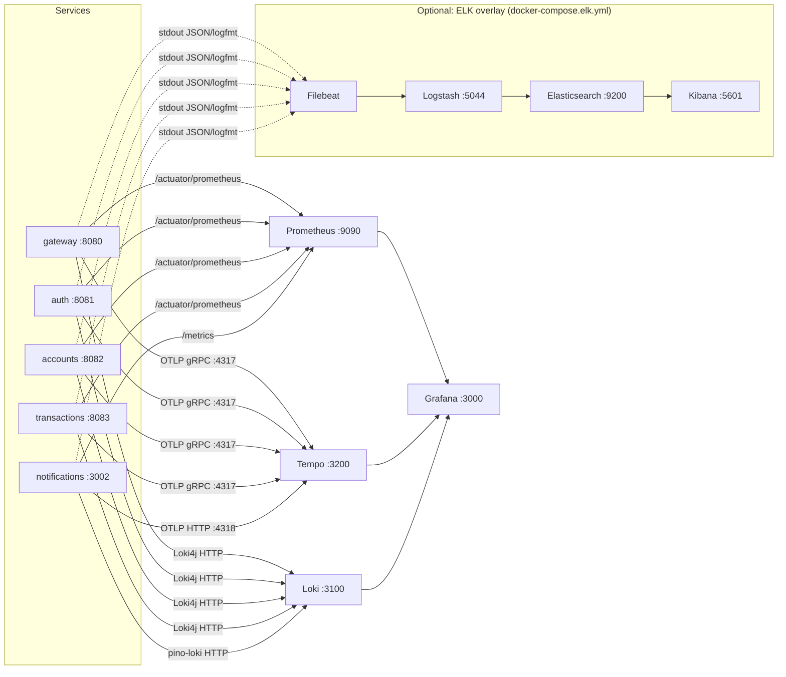

# Observability — eBank Microservices

This document covers the full observability stack for the `microservices/`
app: what's in it, how to bring it up in Docker Compose and in
Minikube, and — the part most guides skip — how to actually *use* Prometheus,
Grafana, Tempo, Loki and ELK to find the root cause of a real production
problem instead of just staring at a dashboard.

It does **not** cover `monolith/` (a separate app in this repo with its own
`doc/OBSERVABILITY.md`) or the `ebank-monolith`/`ebank-microservices`
folders (stale duplicates from an earlier rename, unrelated to this stack).

---

## 1. What was done

The services already shipped with metrics/tracing *dependencies* declared
and a partial docker-compose stack. The gaps closed here:

| Gap | Fix |
|---|---|
| `notification-service` (Node) had no `/metrics` endpoint | Added `prom-client` + `/metrics`, scraped by Prometheus |
| `notification-service` had no distributed tracing | Added an OpenTelemetry SDK bootstrap exporting to Tempo, same as the Java services |
| `notification-service` logs had no `traceId`/`spanId` | pino `mixin` now pulls them from the active OTel span |
| No ELK stack at all | Added `docker-compose.elk.yml` (Elasticsearch, Logstash, Kibana, Filebeat) as an opt-in overlay alongside the default Loki stack |
| Minikube: Tempo was referenced (`k8s/grafana-datasources.yaml`) but never deployed | Added `k8s/tempo-local.yaml` |
| Minikube: Java services' Vault-seeded config had `tracing.sampling.probability` but no `otlp.tracing.endpoint` | `helm/ebank/templates/vault-init-job.yaml` now seeds the Tempo OTLP endpoint for all 4 Java services (gateway was missing tracing config entirely) |
| Minikube: the shared `ServiceMonitor` scraped `/actuator/prometheus` on notification-service too (404 — it's Node, path is `/metrics`) | Split into `notification-servicemonitor.yaml` (`/metrics`) + excluded notification from the generic one |
| Minikube: `notification-deployment.yaml` had no OTLP/Loki env vars | Added `OTEL_SERVICE_NAME`, `OTEL_EXPORTER_OTLP_ENDPOINT`, `LOKI_URL` |
| README's Minikube walkthrough never installed Prometheus/Grafana/Loki, despite manifests assuming they exist | Added the missing `helm install` steps in the correct order |

Everything else (Java services' Micrometer/OTel wiring, the Prometheus/
Tempo/Loki/Grafana docker-compose services, the Grafana datasource
provisioning, the `infra-local.yaml`/`vault-dev.yaml` minikube plumbing) was
already there and works as designed.

---

## 2. Architecture



Every log line, every trace span and (where labeled) every metric carries a
`service` name and, where a trace is active, a `traceId`/`spanId` — that's
what makes it possible to jump from "P99 latency spiked" (Grafana/Prometheus)
to "here's the exact slow request" (Tempo) to "here's every log line it
produced, across every service it touched" (Loki or Kibana) without manually
grepping five different `docker logs` streams.

---

## 3. Tech stack

| Layer | Tool | Role |
|---|---|---|
| Metrics | **Prometheus** | Pulls `/actuator/prometheus` (Java, Micrometer) and `/metrics` (Node, `prom-client`) every 15–30s |
| Metrics UI / alerting | **Grafana** | Dashboards, PromQL, alerting; also the query UI for Loki and Tempo |
| Tracing | **Tempo** | Stores distributed traces sent via OTLP; generates a service graph |
| Tracing instrumentation | **Micrometer Tracing + OTel bridge** (Java), **OpenTelemetry SDK + auto-instrumentations-node** (Node) | Creates spans for HTTP, DB, Kafka, and propagates trace context across service calls |
| Logs (default) | **Loki** + **Loki4j** (Java) / **pino-loki** (Node) | Lightweight, label-indexed log storage; Grafana-native |
| Logs (optional, full-text) | **ELK**: Elasticsearch + Logstash + Kibana, fed by **Filebeat** | Full-text search and aggregation over the same stdout logs, no code changes needed |
| Kafka visibility | **Kafka UI** (`:8090`) | Topics, partitions, consumer group lag |
| Email interception (dev) | **MailHog** (`:8025`) | Every email the notification-service sends |
| Config/secrets | **HashiCorp Vault** | Also where `management.otlp.tracing.endpoint` and friends are seeded per environment |

---

## 4. Getting started — Docker Compose

```bash
cd microservices

# Core stack: all 5 services + Postgres/Mongo/Redis/Kafka/Vault +
# Prometheus + Grafana + Tempo + Loki
docker compose up -d

# Wait for everything healthy
docker compose ps

# Optional: also bring up ELK (Elasticsearch/Logstash/Kibana/Filebeat)
# alongside the default Loki stack — no service restart needed, Filebeat
# just starts tailing the same stdout logs.
docker compose -f docker-compose.yml -f docker-compose.elk.yml up -d
```

**Access:**

| Tool | URL | Notes |
|---|---|---|
| Grafana | http://localhost:3000 | `admin` / `admin` |
| Prometheus | http://localhost:9090 | |
| Tempo | http://localhost:3200 | Query via Grafana → Explore, not directly |
| Loki | http://localhost:3100 | Query via Grafana → Explore |
| Kibana (ELK profile) | http://localhost:5601 | Index pattern: `ebank-microservices-*` |
| Kafka UI | http://localhost:8090 | |
| MailHog | http://localhost:8025 | |
| Vault | http://localhost:8200 | token `root` |
| Gateway (API entrypoint) | http://localhost:8080 | |

**Sanity check the pipeline end-to-end:**

```bash
# Generate some traffic
curl -s http://localhost:8080/actuator/health
curl -X POST http://localhost:8080/api/auth/register -H "Content-Type: application/json" \
  -d '{"username":"alice","email":"alice@bank.com","password":"Test1234!","firstName":"Alice","lastName":"Smith"}'

# Metrics arrived?
curl -s http://localhost:8081/actuator/prometheus | grep http_server_requests_seconds_count | head -3
curl -s http://localhost:3002/metrics | grep kafka_messages_consumed_total

# Traces arrived? (Grafana → Explore → Tempo → "Search" → service.name=auth-service)
# Logs arrived? (Grafana → Explore → Loki → {service="auth-service"})
```

If metrics/traces/logs don't show up, see [§7.9](#79-the-signal-never-shows-up-in-grafanakibana) below.

---

## 5. Getting started — Minikube

The full command sequence lives in the main [`README.md`](../README.md#minikube-version)
(kept there so there's one canonical copy). Summary of the stages, in
order — **order matters**, kube-prometheus-stack must exist before the app
chart because it provides the `ServiceMonitor` CRD:

1. `minikube start` + enable `ingress`/`metrics-server`
2. Build the 6 service images into minikube's Docker daemon
3. Deploy Vault (`k8s/vault-dev.yaml`), then the data stores (`k8s/infra-local.yaml`) and Tempo (`k8s/tempo-local.yaml`)
4. Install **kube-prometheus-stack** into the `monitoring` namespace (Prometheus + the `ServiceMonitor` CRD)
5. Install **loki-stack** into `ebank-local` (Loki + Grafana, sidecars enabled to auto-load dashboards/datasources)
6. Apply `k8s/grafana-datasources.yaml` + `k8s/grafana-dashboards.yaml` (wires Prometheus/Loki/Tempo into Grafana, loads the two pre-built dashboards)
7. `helm install ebank ./helm/ebank -f values.yaml -f values-local.yaml` — this seeds Vault (including the Tempo OTLP endpoint), deploys all 5 services + their `ServiceMonitor`s

**Access Grafana:**

```bash
echo "$(minikube ip) grafana.ebank.local" | sudo tee -a /etc/hosts
kubectl get secret loki-grafana -n ebank-local -o jsonpath='{.data.admin-password}' | base64 -d
# → http://grafana.ebank.local  (user: admin)

# No Ingress controller working? Port-forward instead:
kubectl port-forward svc/loki-grafana -n ebank-local 3000:80 &
kubectl port-forward svc/monitoring-kube-prometheus-prometheus -n monitoring 9090:9090 &
kubectl port-forward svc/tempo -n ebank-local 3200:3200 &
```

> **Chart-version caveat:** the exact Kubernetes Service names that
> `kube-prometheus-stack`/`loki-stack` create depend on the chart version
> and release name. The commands above assume release names `monitoring`
> and `loki` (as used in the README). If Grafana's datasources show
> "no data" after setup, run `kubectl get svc -n monitoring -n ebank-local`
> and adjust the URLs in `k8s/grafana-datasources.yaml` to match what's
> actually there, then re-apply it.

There is no ELK overlay for Minikube — Loki is the log backend there. If you
need full-text search in a cluster, the closest equivalent is installing the
`elastic/eck-operator` chart and pointing Filebeat's DaemonSet at it; that's
a bigger commitment than the docker-compose overlay and out of scope here.

---

## 6. Using the stack day-to-day

- **Grafana is the front door.** Prometheus/Loki/Tempo all have their own
  APIs, but you almost never need to hit them directly — Grafana → Explore
  can query all three, and clicking a trace's `traceId` in a Loki log line
  jumps you straight into that trace in Tempo (and vice versa).
- **The two pre-built dashboards** (Minikube: auto-loaded via the Grafana
  sidecar; docker-compose: import manually or build your own from the
  PromQL below) cover JVM/infra health and HTTP/API traffic.
- **Structured logs, not free text.** Every service logs `service=`,
  `traceId=`, `spanId=` (Java: logfmt; Node: JSON) — filter on those fields
  rather than grepping message text.

---

## 7. Troubleshooting playbook — real-world scenarios

This is the part that matters: given a symptom, which tool do you open
first, and what do you look for?

### 7.1 "The API feels slow" (high latency)

1. **Grafana → API dashboard** — is P99 latency actually elevated, for
   which service, since when? PromQL:
   ```promql
   histogram_quantile(0.99, sum(rate(http_server_requests_seconds_bucket[5m])) by (le, service))
   ```
2. **Narrow to an endpoint:** add `uri="..."` to the query — is it one route
   or everything?
3. **Tempo → Search** for `service.name=<the slow service>` sorted by
   duration, or use TraceQL: `{ duration > 500ms }`. Open the slowest trace
   and read the waterfall — is the time in your code, in a DB call, or in a
   downstream service call?
4. If the slow span is a DB call: check `hikaricp_connections_pending` /
   `hikaricp_connections_active` in Grafana — a pool exhausted under load
   makes every query *look* slow when the query itself is fine (see §7.4).
5. If the slow span is a downstream HTTP call: the problem isn't in the
   service you started with — follow the trace to whichever service owns
   that span and repeat from step 3 there.

### 7.2 Error rate spike (5xx / failed requests)

1. **Grafana**: `rate(http_server_requests_seconds_count{status=~"5.."}[5m]) by (service)` —
   which service, how sudden, does it correlate with a deploy or a traffic
   spike?
2. **Tempo**: `{ status = error }` — pull up a handful of failing traces.
   The span where the error `status` flips tells you exactly which service/
   call threw.
3. **Loki/Kibana**: filter `service="<name>" |= "ERROR"` around the same
   time window. Cross-reference the `traceId` from a Tempo trace to jump
   straight to the log line with the exception and stack trace — this beats
   grepping `docker logs` across 5 containers.
4. For notification-service specifically: `kafka_messages_consumed_total{status="failure"}`
   and `notifications_sent_total{status="failure"}` tell you *which channel*
   (email/SMS/push) or *which Kafka topic* is failing, without reading logs
   at all.

### 7.3 A service is down / cascading failure

1. **Grafana**: `up{job="<service>"}` = 0 means Prometheus can't scrape it
   — usually the container/pod is down or crash-looping.
2. `kubectl get pods -n ebank-local` / `docker compose ps` — check restart
   count and `kubectl describe pod` / `docker logs` for the actual crash
   reason (OOMKilled, failed health check, unhandled startup exception).
3. **Tempo service graph** (Grafana → Explore → Tempo → Service Graph) shows
   which services call the dead one — that tells you the blast radius before
   you've read a single log line. If `gateway` is up but `accounts` is down,
   expect `gateway`'s error rate to spike specifically on account routes,
   not globally.
4. Check whether Resilience4j circuit breakers tripped downstream (gateway
   has a circuit breaker per route) — a tripped breaker means downstream
   services are protected from pile-up, but the caller now needs the
   fallback response investigated too.

### 7.4 Database connection pool exhaustion

**Symptom:** latency climbs under load but CPU/memory look fine; DB queries
that are normally <10ms take seconds.

1. Grafana: `hikaricp_connections_active` vs `hikaricp_connections_max` — if
   active is pinned at max, you're pool-starved.
2. `hikaricp_connections_pending` > 0 confirms requests are queuing for a
   connection.
3. Root causes to check next: a slow query holding connections too long
   (check Tempo for `db.statement` spans with abnormal duration), a
   connection leak (pool exhausted even at low traffic — restart the
   service and watch if `active` climbs steadily with no correlated
   traffic), or the pool is just sized too small for the load
   (`spring.datasource.hikari.maximum-pool-size`).

### 7.5 Memory leak / OOMKilled

1. Grafana: `jvm_memory_used_bytes{area="heap"}` (Java) over a multi-hour
   window — a leak shows as a sawtooth that never returns to baseline after
   GC, trending up run over run. `process_resident_memory_bytes` covers the
   Node service the same way.
2. `jvm_gc_pause_seconds_count`/`_sum` climbing means GC is working harder
   for less memory reclaimed — a leading indicator before the OOM actually
   hits.
3. `kubectl describe pod <pod>` after the fact shows
   `Last State: Terminated, Reason: OOMKilled` — confirms it was a memory
   limit, not a crash.
4. Once you have a time window, correlate with Tempo/Loki for that period —
   did a specific endpoint or a specific large payload correlate with the
   climb? Leaks are usually triggered by one code path, not general traffic.

### 7.6 Kafka consumer lag (notifications arriving late or not at all)

1. **Kafka UI** (`:8090`) → Consumer Groups → `notification-group` — lag
   per partition tells you immediately if the consumer is behind or stuck.
2. If lag is growing: check `kafka_messages_consumed_total` in Prometheus —
   is the consumer processing at all, or stalled? A stalled consumer with
   growing lag and zero `status="success"`/`"failure"` increments means the
   consumer loop itself is stuck (check for an unhandled promise rejection
   or a blocking call in `kafka.consumer.ts`).
3. If it's processing but slowly: Tempo traces for `notification-service`
   show where time goes per message (SMTP call to MailHog/SendGrid is the
   usual suspect — check `notification_send_duration_seconds{channel="email"}`).

### 7.7 Intermittent / silent failures (no errors logged, but users report bugs)

This is the case structured logging + tracing was built for — a swallowed
exception or an early `return` with no failure metric is invisible to
metrics but not to a trace.

1. Get the `traceId` from the user's request (correlate by user/account ID
   and rough timestamp if you don't have it directly — search Loki/Kibana
   for the relevant account ID in that time window, then read off `traceId`).
2. Open that exact trace in Tempo. A "successful" 200 response with a
   suspiciously short span, or a span that's simply missing where you'd
   expect one (e.g., no `email` span even though a transaction should have
   triggered a notification), tells you where the logic silently bailed —
   even with no ERROR log at all.
3. This is also the fastest way to debug **notification-service** specific
   issues: `sendEmail`/`sendSms`/`sendPushNotification` all increment
   `notifications_sent_total` with a definitive `status` label
   (`success`/`failure`/`mocked`) — if a user says "I never got the email"
   and the metric shows `status="mocked"`, the real bug is that Twilio/SMTP
   credentials aren't configured for that environment, not a code bug.

### 7.8 Cache effectiveness / Redis-related slowness

1. Grafana: `rate(cache_gets_total{result="hit"}[5m]) / rate(cache_gets_total[5m])`
   — a sudden drop in hit rate means either a deploy invalidated the cache
   unexpectedly, TTLs are too short for the access pattern, or a cache key
   scheme changed.
2. If hit rate is fine but latency still spikes: check Tempo for whether
   the Redis call itself is slow (`redis` client span duration) — that's a
   Redis-side problem (undersized instance, network), not an application
   cache-strategy problem.

### 7.9 The signal never shows up in Grafana/Kibana

Fastest checklist, in order of likelihood:

1. **Wrong path/port scraped.** `curl <service>:<port>/actuator/prometheus`
   (Java) or `/metrics` (Node) directly — if that 404s or connection-refuses,
   Prometheus scraping it will fail the same way. Check
   `infra/prometheus/prometheus.yml` (compose) or the `ServiceMonitor`'s
   `port`/`path` (k8s) match.
2. **Target down in Prometheus UI** (`:9090/targets`) — shows the exact
   scrape error per target (connection refused, timeout, wrong content
   type).
3. **No traces:** the OTLP exporter is fire-and-forget by design (services
   never fail to start because Tempo is unreachable) — which means a
   misconfigured endpoint fails *silently*. Check the env var actually
   resolved: `docker exec <container> env | grep OTEL` /
   `kubectl exec <pod> -- env | grep OTEL`, and confirm Tempo itself is
   healthy (`curl tempo:3200/ready`).
4. **No logs in Loki/Kibana:** for the ELK overlay specifically, remember
   Filebeat only tails containers whose name **contains `_service`**
   (`infra/elk/filebeat/filebeat.yml`) — infra containers (postgres, kafka,
   vault, prometheus…) are deliberately excluded. Check
   `docker logs ebank_filebeat` for autodiscover/harvester errors.
5. **Grafana datasource misconfigured:** Grafana → Connections → Data
   sources → click the datasource → "Test" button gives a direct
   connectivity error, which is faster than guessing from the dashboard.

---

## 8. Reference

### Ports (docker-compose)

| Service | Port |
|---|---|
| gateway | 8080 |
| auth | 8081 |
| accounts | 8082 |
| transactions | 8083 |
| notification-service | 3002 |
| Prometheus | 9090 |
| Grafana | 3000 |
| Tempo (HTTP API / OTLP gRPC / OTLP HTTP) | 3200 / 4317 / 4318 |
| Loki | 3100 |
| Elasticsearch (ELK profile) | 9200 |
| Kibana (ELK profile) | 5601 |
| Kafka UI | 8090 |
| MailHog (web UI / SMTP) | 8025 / 1025 |
| Vault | 8200 |

### Useful PromQL

```promql
# Request rate by service
sum(rate(http_server_requests_seconds_count[1m])) by (service)

# P99 latency by service + route
histogram_quantile(0.99, sum(rate(http_server_requests_seconds_bucket[5m])) by (le, service, uri))

# Error rate
sum(rate(http_server_requests_seconds_count{status=~"5.."}[5m])) by (service)

# JVM heap usage
jvm_memory_used_bytes{area="heap"} / jvm_memory_max_bytes{area="heap"}

# DB pool saturation
hikaricp_connections_active / hikaricp_connections_max

# Notification outcomes by channel
sum(rate(notifications_sent_total[5m])) by (channel, status)

# Kafka consume outcomes
sum(rate(kafka_messages_consumed_total[5m])) by (topic, status)
```

### Useful LogQL

```logql
{service="auth-service"} |= "ERROR"
{service="notification-service"} | json | traceId="<paste a traceId>"
```

### Useful TraceQL

```traceql
{ status = error }
{ duration > 500ms }
{ service.name = "accounts-service" && span.http.status_code >= 500 }
```

---

## 9. What's not covered

- **Alerting rules** — Prometheus/Grafana can alert on any of the PromQL
  above, but no alert rules are pre-configured; the `alerting.alertmanagers`
  block in the monolith's Prometheus config is a reference if you want to
  add one here too.
- **Log/metric retention tuning** — both Loki and the ELK overlay run with
  their images' defaults, fine for dev but not sized for production volume
  or retention requirements.
- **Frontend observability** — the React frontend has no RUM/error tracking
  wired up; this document covers the backend services only.
- **`chatbot-service`** — commented out in `docker-compose.yml` and has no
  source code in this repo yet, so there's nothing to instrument.
