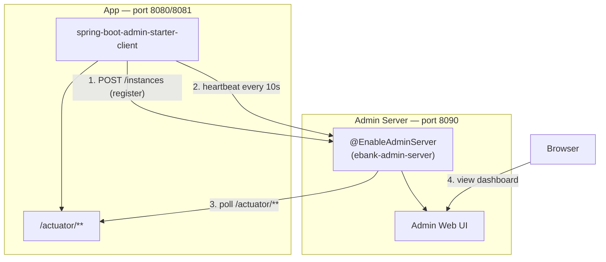

# Spring Boot Admin — Setup & Feature Guide

Everything you need to stand up Spring Boot Admin (SBA) for the eBank Monolith and use every panel in the dashboard. Read this top-to-bottom once; use [ADMIN_QUICK_REFERENCE.md](ADMIN_QUICK_REFERENCE.md) for daily commands afterwards.

---

## Table of Contents

1. [What Is Spring Boot Admin?](#1-what-is-spring-boot-admin)
2. [Architecture In This Project](#2-architecture-in-this-project)
3. [Setup](#3-setup)
4. [Logging In](#4-logging-in)
5. [Dashboard Tour](#5-dashboard-tour)
6. [Feature-by-Feature Guide](#6-feature-by-feature-guide)
7. [Enabling Extra Features (Optional)](#7-enabling-extra-features-optional)
8. [Notifications](#8-notifications)
9. [Security Model](#9-security-model)
10. [Production Best Practices](#10-production-best-practices)
11. [Related Docs](#11-related-docs)

---

## 1. What Is Spring Boot Admin?

[Spring Boot Admin](https://github.com/codecentric/spring-boot-admin) is a standalone web UI that sits on top of Spring Boot's [Actuator](https://docs.spring.io/spring-boot/reference/actuator/index.html) endpoints. Applications ("clients") register themselves with the Admin **server** on startup and send a heartbeat every few seconds; the server then polls each client's `/actuator/**` endpoints and renders them as a live dashboard — health, JVM metrics, HTTP traffic, logs, caches, thread dumps, and more, with zero code changes beyond adding a dependency and a URL.

In this project it replaces "SSH in and `curl localhost:8080/actuator/health`" with a single browser tab that shows every environment (local / dev / prod) side by side.

---

## 2. Architecture In This Project



Two separate Maven modules ship in this repo:

| Module | Path | Role |
|---|---|---|
| **Admin server** | `monolith/admin/` | Standalone Spring Boot app. `AdminServerApplication` + `@EnableAdminServer`. Owns the UI, the login page, and the registry of connected clients. |
| **Admin client** | `monolith/` (main app) | The eBank API itself. Registers with the server and exposes `/actuator/**` for the server to scrape. |

They are deployed and scaled independently — the admin server can be restarted or redeployed without affecting the running API, and vice versa.

---

## 3. Setup

### 3.1 Prerequisites

- Docker + Docker Compose (recommended path), **or** JDK 21 + Maven for a manual run.
- Ports `8090` (admin UI) and `8080`/`8081` (API) free on your machine.

### 3.2 Environment Variables

Set these in `.env` (copy from `.env.example`):

| Variable | Used by | Default | Purpose |
|---|---|---|---|
| `ADMIN_UI_USER` | admin server | `admin` | Login username for the Admin UI |
| `ADMIN_UI_PASSWORD` | admin server | `admin` (local) | Login password for the Admin UI |
| `SPRING_BOOT_ADMIN_ENABLED` | app (client) | `false` (base), `true` (local/dev/prod) | Turns client self-registration on/off |
| `SPRING_BOOT_ADMIN_URL` | app (client) | `http://localhost:8090` | Where the app registers itself |
| `SPRING_BOOT_ADMIN_USERNAME` / `SPRING_BOOT_ADMIN_PASSWORD` | app (client) | `admin` / `admin` | Credentials the client uses to call the server's `/instances` API |
| `SPRING_APP_BASE_URL` | app (client) | `http://localhost:8080` | URL the **server** uses to reach back into the app's `/actuator/**` (must be reachable from the admin container, hence `http://app:8080` in Docker Compose) |

> **Never reuse production credentials in `.env.example`.** Change `ADMIN_UI_PASSWORD` before deploying anywhere beyond your laptop.

### 3.3 Local — one-liner script (recommended)

```bash
cd monolith
./start-with-admin.sh
```

This brings up PostgreSQL, Redis, the Admin server, and the app, waits for health checks, and prints the URLs when ready. Other commands:

```bash
./start-with-admin.sh dev     # local profile + Vault (E2 seed)
./start-with-admin.sh prod    # local profile + Vault (E1 seed)
./start-with-admin.sh stop    # docker compose down
./start-with-admin.sh clean   # docker compose down -v (removes volumes too)
```

### 3.4 Local — manual Docker Compose

```bash
docker compose up -d postgres redis   # dependencies
docker compose up -d admin            # Spring Boot Admin server → http://localhost:8090
docker compose up -d --build app      # the API, registers itself with admin on boot
```

### 3.5 Local — no Docker at all

```bash
# Terminal 1 — Admin server
cd monolith/admin
./mvnw spring-boot:run

# Terminal 2 — the app (profile enables the client + points it at localhost:8090)
cd monolith
./mvnw spring-boot:run -Dspring-boot.run.profiles=local
```

### 3.6 Dev / Prod profiles (Vault-backed)

```bash
docker compose -f docker-compose.yml -f docker-compose.vault.yml --profile vault up -d vault vault-init
docker compose up -d postgres redis admin
SPRING_PROFILES_ACTIVE=dev docker compose up -d --build app   # or prod
```

The admin client URL/username/password/service-base-url for `dev` (E2) and `prod` (E1) come from Vault (`vault/seeds/E2.json` / `E1.json`, keys `spring.boot.admin.client.*`) instead of `.env`. See [doc/VAULT_CONFIG.md](doc/VAULT_CONFIG.md).

### 3.7 Kubernetes / Helm

The admin server ships the same multi-stage `Dockerfile` pattern as the main app and can be deployed as its own Helm release/Deployment behind a ClusterIP Service. See [doc/KUBERNETES.md](doc/KUBERNETES.md) for the Helm chart layout; point `SPRING_BOOT_ADMIN_URL` / `SPRING_APP_BASE_URL` at the in-cluster Service DNS names (e.g. `http://ebank-admin.ebank.svc.cluster.local:8090`).

### 3.8 Client self-registration

`monolith/pom.xml` pins `<spring-boot-admin.version>4.0.4</spring-boot-admin.version>` (matching `monolith/admin/pom.xml` and the Spring Boot `4.0.6` parent) and includes:

```xml
<dependency>
    <groupId>de.codecentric</groupId>
    <artifactId>spring-boot-admin-starter-client</artifactId>
    <version>${spring-boot-admin.version}</version>
</dependency>
```

Combined with the `spring.boot.admin.client.*` properties in `application*.yaml`, this makes the app call the server's `/instances` endpoint on startup and heartbeat every ~10s. Verified locally: on startup the app logs

```
o.s.b.a.c.r.DefaultApplicationRegistrator : Application registered itself as <instance-id>
```

and `curl -u admin:admin -H "Accept: application/json" http://localhost:8090/instances` returns the instance with `"name": "ebank-monolith"` and `"registered": true`. It also then appears under **Applications** in the Admin UI within ~10 seconds of startup.

> An earlier revision of this project shipped this dependency commented out (pinned to Spring Boot Admin `3.1.9`, incompatible with the Spring Boot `4.0.6` parent). If you're diffing against an older checkout and registration isn't working, confirm the version and dependency block above match.

---

## 4. Logging In

```
URL:      http://localhost:8090
Username: admin        (ADMIN_UI_USER)
Password: admin         (ADMIN_UI_PASSWORD — change this outside local dev!)
```

Login uses Spring Security form login (`AdminSecurityConfig` / `SecurityConfig` in `monolith/admin`). HTTP Basic is also enabled on the same endpoints so client apps can self-register without a browser session.

---

## 5. Dashboard Tour

| Screen | What it shows |
|---|---|
| **Wallboard** (`/wallboard`) | Grid of every registered instance with a status tile (UP/DOWN/OFFLINE) — good for a monitor on the wall. |
| **Applications** (left nav, home page) | List of registered instances grouped by `spring.application.name`, each with health status, version, and uptime. |
| **Instance details** | Click an instance to drill into the tabs described in section 6. |
| **Journal** | Timeline of every status change (UP → DOWN → UP) across all instances, in the order it happened — the first place to look after an incident. |
| **Events log / notifications bell** | Recent registration and status-change events. |

---

## 6. Feature-by-Feature Guide

Click an application in the list, then use the tabs across the top of its detail page. Each row below says which actuator endpoint powers it and whether it's exposed in each profile (see `management.endpoints.web.exposure.include` in `application*.yaml`).

| Tab | Actuator endpoint(s) | local | dev | prod | What you can do |
|---|---|:---:|:---:|:---:|---|
| **Details / Insights** | `info`, `health` | ✅ | ✅ | ✅ | High-level status card: build info, health indicators (DB, Redis, disk) with green/red badges. |
| **Health** | `health` (`show-details: always`) | ✅ | ✅ | ✅ | Expand each health indicator (`db`, `redis`, `diskSpace`, `livenessState`, `readinessState`) to see the exact failure reason, not just UP/DOWN. |
| **Metrics** | `metrics` | ✅ | ✅ | ✅ | Search any Micrometer metric (`jvm.memory.used`, `http.server.requests`, `hikaricp.connections.active`, `cache.gets`) and plot it live. Filter by tag (e.g. `uri`, `status`, `cache`). |
| **JVM** | `metrics` | ✅ | ✅ | ✅ | Pre-built charts for heap/non-heap memory, garbage collection pause time, thread count, and CPU usage — no query-building needed. |
| **HTTP traffic** | `metrics` (`http.server.requests`) | ✅ | ✅ | ✅ | Request-rate and latency breakdown per endpoint, derived from the same metric Prometheus scrapes. |
| **Environment** | `env` (`show-values: never`) | ✅ | ✅ | ✅ | Browse every active `Environment` property source (application.yaml, env vars, Vault-backed `PropertySource`) — actual secret **values are redacted**, only key names and origin are shown. |
| **Beans** | `beans` | ✅ | ✅ | ❌ | Full Spring `ApplicationContext` bean graph — useful for confirming a `@Bean` actually loaded (e.g. after a Vault config profile change). |
| **Configuration properties** | `configprops` | ✅ | ✅ | ❌ | Every `@ConfigurationProperties` class with its resolved values — good for confirming rate-limit or cache TTL values took effect. |
| **Conditions (auto-config report)** | `conditions` | ✅ | ✅ | ❌ | Why a Spring Boot auto-configuration class was applied or skipped — the actuator equivalent of `--debug` at startup, without a restart. |
| **Mappings** | `mappings` | ✅ | ✅ | ❌ | Every HTTP route registered by the app (`AccountController`, `TransactionController`, etc.) with its handler method — quick way to confirm a new endpoint deployed. |
| **Loggers** | `loggers` | ✅ | ✅ | ✅ | Change any package's log level (e.g. `com.ebank` → `DEBUG`, or `org.hibernate.SQL` → `TRACE`) **at runtime, no restart**. Resets on app restart unless also set in YAML. |
| **Caches** | `caches` | ✅ | ✅ | ✅ | Lists each Spring Cache name (`accounts`, `account`, `transactions`) backed by Redis, with a button to **clear** an individual cache on demand. |
| **Thread dump** | `threaddump` | ✅ | ✅ | ❌ | One-click snapshot of every live thread and its stack — use this to diagnose a request that's hanging (see [ADMIN_MONITORING_SCENARIOS.md](ADMIN_MONITORING_SCENARIOS.md)). |
| **Flyway** | `flyway` | ✅ | ✅ | ❌ | Migration history: which scripts ran, when, and whether any are pending/failed. *(Note: the `flyway-core` starter itself ships commented out in `pom.xml` — see the commented block above the admin client dependency. Re-enable it if you need this tab populated.)* |
| **Scheduled tasks** | `scheduledtasks` | ✅ | ✅ | ❌ | Lists every `@Scheduled` job (cron/fixed-rate) and its next/last execution — this project has no scheduled jobs today, so expect an empty list until one is added. |

`prod` intentionally exposes only `health,info,metrics,prometheus,loggers` (see `application-prod.yaml` and `vault/seeds/E1.json`) to minimize the attack surface of the internal actuator API in production — the ❌ tabs above will simply show "endpoint not available" there.

---

## 7. Enabling Extra Features (Optional)

Not wired up by default, but easy to add if you need them:

| Feature | What's missing | How to enable |
|---|---|---|
| **HTTP exchanges / recent traces tab** | `httpexchanges` actuator endpoint + an `HttpExchangeRepository` bean | Add `management.endpoints.web.exposure.include` entry `httpexchanges` and register an `InMemoryHttpExchangeRepository` `@Bean`. |
| **Log file viewer tab** | `management.endpoint.logfile` + a file-based logging target | Set `logging.file.name=/app/logs/ebank.log` and add `logfile` to the exposure list; SBA will then show a live tail of the file. |
| **Sessions tab** | Spring Session | Not applicable — this app is stateless JWT auth, no server-side sessions. |
| **Quartz tab** | Quartz Scheduler | Not applicable — this app uses `@Scheduled` (covered by the `scheduledtasks` endpoint above), not Quartz. |

---

## 8. Notifications

Spring Boot Admin can push a notification (email, Slack, Microsoft Teams, PagerDuty, Telegram, etc.) whenever an instance's status changes. This project does **not** configure any notifier today — the Admin UI's own Journal/event log is the only status history. To add one, add the matching `spring-boot-admin-server-notifier-*` starter to `monolith/admin/pom.xml` and configure it under `spring.boot.admin.notify.*` in `monolith/admin/src/main/resources/application.yaml`. See the [official notifier docs](https://docs.spring-boot-admin.com/current/notify.html) for the exact keys per provider.

---

## 9. Security Model

- **Form login + HTTP Basic** on the admin server (`SecurityConfig` in `monolith/admin`): a human logs in via the browser form; a registering client authenticates via Basic auth using `SPRING_BOOT_ADMIN_USERNAME`/`PASSWORD`.
- **CSRF is disabled** for `/instances/**` and `/actuator/**` only — these are called by machines (the client's registrator, the server's poller), not browsers, so a CSRF token isn't applicable.
- **`/actuator/**` on the app itself is `permitAll`** (see `SecurityConfig` in the main app) — this is intentional and relies entirely on network isolation: the Docker bridge network locally, and a Kubernetes `NetworkPolicy` in prod (see [doc/KUBERNETES.md](doc/KUBERNETES.md)). **Never expose the app's `/actuator/**` or the Admin UI's port directly to the public internet.**
- **`env` never shows secret values** (`management.endpoint.env.show-values: never`) — only property key names and their source, so a leaked Admin UI session cannot be used to exfiltrate credentials.

---

## 10. Production Best Practices

1. Change `ADMIN_UI_PASSWORD` (and `SPRING_BOOT_ADMIN_PASSWORD` on the client side) from the local defaults — never ship `admin`/`admin`.
2. Put the Admin UI behind HTTPS (a reverse proxy / ingress with TLS termination) — form-login credentials must not travel in plaintext.
3. Restrict network access to the Admin UI and to `/actuator/**` using a Kubernetes `NetworkPolicy` or security group — do not rely on the login page alone.
4. Keep prod's actuator exposure list minimal (`health,info,metrics,prometheus,loggers` — already the default in `application-prod.yaml`); don't widen it to match dev.
5. Rotate `ADMIN_UI_PASSWORD` / `SPRING_BOOT_ADMIN_PASSWORD` the same way you rotate any other credential in Vault (see [doc/VAULT_CONFIG.md](doc/VAULT_CONFIG.md)).
6. Monitor the Admin UI's Journal for unexpected `OFFLINE` flaps — they usually mean a network policy or DNS issue between the app and admin pods, not an app crash.

---

## 11. Related Docs

| Doc | What's in it |
|---|---|
| [START_HERE.md](START_HERE.md) | Entry point / 30-second quick start |
| [SPRING_BOOT_ADMIN_INDEX.md](SPRING_BOOT_ADMIN_INDEX.md) | Navigation map across all Admin docs |
| [ADMIN_QUICK_REFERENCE.md](ADMIN_QUICK_REFERENCE.md) | Copy-paste commands and curl one-liners |
| [ADMIN_MONITORING_SCENARIOS.md](ADMIN_MONITORING_SCENARIOS.md) | Step-by-step incident debugging playbooks |
| [SPRING_ADMIN_SETUP_COMPLETE.md](SPRING_ADMIN_SETUP_COMPLETE.md) | Inventory of every file this feature touches |
| [doc/OBSERVABILITY.md](doc/OBSERVABILITY.md) | Where SBA fits next to Prometheus/Grafana/Tempo/Loki |
| [doc/VAULT_CONFIG.md](doc/VAULT_CONFIG.md) | How dev/prod admin credentials are sourced from Vault |
| [doc/KUBERNETES.md](doc/KUBERNETES.md) | Deploying the admin server alongside the app in K8s |
